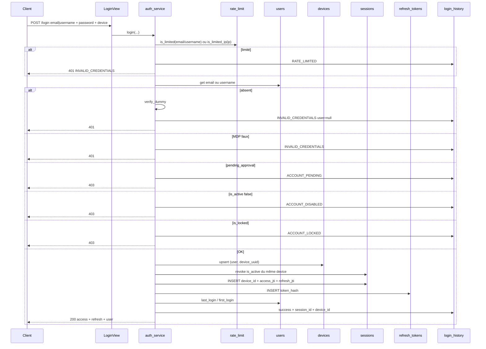

# AUTH-A — Connexion locale (AUTH-01 … AUTH-12)

**Statut :** clos (jour 1, 2026-09-08).  
**Produit :** YAS Connect uniquement (pas le SIRH).  
**Préalable :** Phase 0 [00-application-A-Z.md](../00-application-A-Z.md).  
**Attributs / index :** [IAM](../../catalogues/IAM-catalogue-tables.md) · [INDEX](../../catalogues/INDEX-catalogue.md) · [Annuaire](../../catalogues/ANNUAIRE-catalogue-tables.md) · [Médias](../../catalogues/MEDIA-catalogue-tables.md).

Un **seul incrément** : login email/username + MDP, contrôles compte, anti-énumération, rate-limit, journal, `last_login`, JWT access, refresh hashé, upsert device, session liée à l’appareil.

Ancien ticket isolé AUTH-01 : fusionné ici. Ne plus implémenter le login « sans device / sans refresh ».

---


## Cartographie


| ID          | Fonctionnalité       | Comportement dans cet incrément                                                                         | Écritures                                   |
| ----------- | -------------------- | ------------------------------------------------------------------------------------------------------- | ------------------------------------------- |
| **AUTH-01** | Email + MDP          | `POST /api/v1/auth/login` avec `email`                                                                  | lecture `users.email` / `password_hash`     |
| **AUTH-02** | Username + MDP       | Même endpoint avec `username` (`YAS_LOGIN_ALLOW_USERNAME`, défaut `true`)                               | lecture `users.username`                    |
| **AUTH-03** | Compte actif         | Après MDP OK : `pending_approval=true` → **403** `ACCOUNT_PENDING` ; sinon `is_active=false` → **403** `ACCOUNT_DISABLED` | — |
| **AUTH-04** | Compte verrouillé    | Après MDP OK : `is_locked=true` → **403** `ACCOUNT_LOCKED`                                              | —                                           |
| **AUTH-05** | Erreurs génériques   | Email/username inconnu, mauvais MDP, rate-limit → **même** 401 `INVALID_CREDENTIALS`                    | dummy Argon2 si user absent                 |
| **AUTH-06** | Rate-limit           | Compteurs cache **email** (ou username) **et IP** ; Redis si `REDIS_URL`                                | `login_history.failure_reason=RATE_LIMITED` |
| **AUTH-07** | Journal              | Succès et échecs                                                                                        | `login_history` + parse UA                  |
| **AUTH-08** | `last_login`         | Succès seulement (+ `first_login` si vide)                                                              | `users`                                     |
| **AUTH-09** | JWT access HS256     | TTL 15 min ; `jti` = `sessions.access_jti`                                                              | `sessions`                                  |
| **AUTH-10** | Refresh opaque       | Hash SHA-256, **jamais** le clair en base ; renvoyé **une fois** au login ; `POST /api/v1/auth/refresh` | `refresh_tokens` + `sessions.refresh_`*     |
| **AUTH-11** | Device upsert        | UK `(user, device_uuid)`                                                                                | `devices`                                   |
| **AUTH-12** | 1 session / appareil | Révoque les sessions actives du **même** device, puis INSERT liée `device_id`                           | `sessions.device_id` NOT NULL au succès     |


**Hors incrément :** MFA ([AUTH-C](AUTH-C-mfa-otp.md)), LDAP ([AUTH-B](AUTH-B-sso-ldap.md)), inscription ([AUTH-D](AUTH-D-inscription.md)), forgot-password, logout-all, présence WS, CRUD annuaire, upload, verrouillage auto après N échecs (on rate-limit seulement).

---


## Contrat HTTP


### `POST /api/v1/auth/login` (public)

Exactement **un** identifiant : `email` **ou** `username` (pas les deux, pas zéro).  
`device` **obligatoire** (AUTH-11/12). Le client web stocke un UUID dans `localStorage` et le renvoie à chaque login.

```json
{
  "email": "jean.dupont@yas.tg",
  "password": "Secret123!",
  "device": {
    "device_uuid": "a1b2c3d4-e5f6-7890-abcd-ef1234567890",
    "device_name": "Chrome Windows",
    "platform": "WEB",
    "model": "",
    "os_version": "10.0",
    "app_version": "1.0.0",
    "push_token": "",
    "device_fingerprint": null
  }
}
```

Username (AUTH-02) : `"username": "jean.dupont"` à la place de `email`.  
`platform` : `IOS`  `ANDROID`  `WEB`  `DESKTOP`  `OTHER`.

**200**

```json
{
  "success": true,
  "data": {
    "access_token": "<jwt>",
    "refresh_token": "<opaque, une seule fois>",
    "token_type": "Bearer",
    "expires_in": 900,
    "refresh_expires_in": 604800,
    "user": { }
  }
}
```

Objet `user` : même forme que l’ancien AUTH-01 (profil, `role`, `region_id`, `segment_id`, `avatar_id`, `preferences`, `privacy`). **Jamais** `password` / hash / refresh hash.

**401** `INVALID_CREDENTIALS` — message unique : `Email ou mot de passe incorrect.` (aussi si username, aussi si rate-limit).  
**403** `ACCOUNT_PENDING` / `ACCOUNT_DISABLED` / `ACCOUNT_LOCKED` — **seulement si le MDP est bon**.  
`ACCOUNT_PENDING` : self-register hors AD non approuvé (`pending_approval=true`) — [AUTH-D](AUTH-D-inscription.md).  
**400** `VALIDATION_ERROR` — email et username tous les deux / aucun, password manquant, `device` incomplet.

### `POST /api/v1/auth/refresh` (public, AUTH-10)

```json
{ "refresh_token": "<opaque>" }
```

200 : nouveaux `access_token` + `refresh_token` (rotation) ; ancien refresh `revoked_reason=ROTATED`.  
401 si inconnu, expiré, déjà révoqué, ou session inactive. **Réutilisation d’un refresh révoqué** : révoquer **toutes** les sessions actives de l’user (vol de token).

---


## Flux login

Ordre contractuel : rate-limit → lookup → dummy/MDP → **AUTH-03/04** → device → révoquer sessions device → session + refresh + JWT → `last_login` → history succès → reset rate-limit.




---


## 0. Apps et fichiers

Même création d’apps que Phase 1 : `iam`, `media`, `annuaire`. Models : [code/iam_models.py](../code/iam_models.py), [media](../code/media_models.py), [annuaire](../code/annuaire_models.py).  
`AUTH_USER_MODEL = "iam.User"` avant `makemigrations`.  
`TrigramExtension()` **première** opération de `0001` ([INDEX](../../catalogues/INDEX-catalogue.md)).

Fichiers IAM à ajouter :

```
apps/iam/
  hashers.py
  exceptions.py
  authentication.py
  serializers.py
  urls.py
  views.py
  services/
    password_service.py
    token_service.py      # access JWT + hash/issue refresh
    rate_limit_service.py # email|username + IP
    ua_service.py
    device_service.py     # AUTH-11 upsert
    auth_service.py       # orchestration 01–12
  management/commands/seed_iam.py
```

`urls.py` :

```python
urlpatterns = [
    path("login", LoginView.as_view(), name="login"),
    path("refresh", RefreshView.as_view(), name="refresh"),
]
```

---


## 1. Settings (.env)

En plus du socle A→Z :

```env
YAS_JWT_REFRESH_TTL_SECONDS=604800
YAS_LOGIN_ALLOW_USERNAME=true
LOGIN_RATE_LIMIT_ATTEMPTS=5
LOGIN_RATE_LIMIT_IP_ATTEMPTS=20
LOGIN_RATE_LIMIT_WINDOW_SECONDS=900
```

```python
YAS_JWT_REFRESH_TTL_SECONDS = env.int("YAS_JWT_REFRESH_TTL_SECONDS", default=604800)
YAS_LOGIN_ALLOW_USERNAME = env.bool("YAS_LOGIN_ALLOW_USERNAME", default=True)
LOGIN_RATE_LIMIT_IP_ATTEMPTS = env.int("LOGIN_RATE_LIMIT_IP_ATTEMPTS", default=20)
```

---


## 2. Libs (inchangées + refresh)


| Lib                            | Rôle ici                                                        |
| ------------------------------ | --------------------------------------------------------------- |
| `argon2-cffi`                  | `YasArgon2PasswordHasher` m=65536,t=3,p=1 + dummy hash          |
| `PyJWT`                        | access **uniquement** (HS256). Refresh = opaque, **pas** un JWT |
| cache Django / `django-redis`  | AUTH-06                                                         |
| `ua-parser`                    | `login_history.browser` / `browser_version` au INSERT           |
| `hashlib` + `secrets` (stdlib) | AUTH-10                                                         |


Hasher, dummy hash, `sign_access_token` / `decode_access_token` : même code que l’ancien AUTH-01 (`iss`, `typ=access`, `sub`, `email`, `role_id`, `role`, `jti`, `iat`, `exp`).

`token_service.py` — refresh :

```python
import hashlib
import hmac
import secrets
from datetime import timedelta

from django.conf import settings
from django.utils import timezone

from apps.iam.models import RefreshToken, Session


def hash_refresh_token(raw: str) -> str:
    # HMAC-SHA256 ; secret = JWT_TOKEN_SECRET (pas le clair en base)
    return hmac.new(
        settings.JWT_TOKEN_SECRET.encode(),
        raw.encode(),
        hashlib.sha256,
    ).hexdigest()


def issue_refresh(*, session: Session, user, ip) -> str:
    raw = secrets.token_urlsafe(48)
    jti = session.refresh_jti  # déjà posé à la création session
    now = timezone.now()
    exp = now + timedelta(seconds=settings.YAS_JWT_REFRESH_TTL_SECONDS)
    digest = hash_refresh_token(raw)
    RefreshToken.objects.create(
        session=session,
        user=user,
        token_hash=digest,
        jti=jti,
        issued_at=now,
        expires_at=exp,
        created_ip=ip,
    )
    session.refresh_hash = digest
    session.save(update_fields=["refresh_hash", "updated_at"])
    return raw  # seul moment où le clair existe côté serveur
```

---


## 3. Rate-limit (AUTH-06)

Deux familles de clés, **même fenêtre** :

- identifiant : `login:attempts:email:{email}` ou `login:attempts:username:{username}`
- IP : `login:attempts:ip:{ip}` (ignoré si `ip` est `None`)

Limité si **l’un** des compteurs ≥ seuil (5 identifiant, 20 IP).  
`hit()` sur les deux à **chaque** tentative (succès ou échec). `reset(identifiant)` après succès ; on ne reset **pas** l’IP (limite partagée NAT).

Trop d’essais → history `RATE_LIMITED` + **401** AUTH-05 (pas 429 : pas d’énumération « tu es throttlé »).

---


## 4. Device (AUTH-11) + session (AUTH-12)

`apps/iam/services/device_service.py` :

```python
from django.utils import timezone

from apps.iam.models import Device, Session


def upsert_device(*, user, spec: dict, ip) -> Device:
    now = timezone.now()
    device, _created = Device.objects.update_or_create(
        user=user,
        device_uuid=spec["device_uuid"],
        defaults={
            "device_name": spec.get("device_name") or "",
            "model": spec.get("model") or "",
            "platform": spec["platform"],
            "os_version": spec.get("os_version") or "",
            "app_version": spec.get("app_version") or "",
            "device_fingerprint": spec.get("device_fingerprint"),
            "push_token": spec.get("push_token") or "",
            "ip_address": ip,
            "last_seen": now,
            # trusted / compromised / jailbreak : inchangés si ligne existante
        },
    )
    if not _created:
        device.last_seen = now
        device.ip_address = ip
        device.save(update_fields=["last_seen", "ip_address", "updated_at",
                                   "device_name", "model", "platform", "os_version",
                                   "app_version", "push_token", "device_fingerprint"])
    return device


def revoke_active_sessions_for_device(*, device) -> None:
    now = timezone.now()
    Session.objects.filter(device=device, is_active=True).update(
        is_active=False,
        revoked_at=now,
        revoke_reason="NEW_LOGIN_SAME_DEVICE",
    )
```

`update_or_create` + `if not created` : simplifier en un seul `update_or_create` dont `defaults` contient toujours `last_seen` / IP / champs client. Ne **pas** écraser `trusted` / `compromised` / `jailbreak` (hors 01–12).

```python
device, _ = Device.objects.update_or_create(
    user=user,
    device_uuid=spec["device_uuid"],
    defaults={...champs client + ip + last_seen, sans trusted},
)
```

Pour une ligne existante, `update_or_create` n’envoie que `defaults` : **omettre** `trusted` des defaults.

---


## 5. Orchestration `login()` (AUTH-01 … 12)

```python
def login(*, email, username, password, ip, user_agent: str, device_spec: dict) -> dict:
    email = normalize_email(email) if email else None
    username = username.strip() if username else None

    ident_key = email or username
    if rate_limit_service.is_limited(ident_key) or rate_limit_service.is_limited_ip(ip):
        _history(user=None, email=ident_key, ip=ip,
                 success=False, reason="RATE_LIMITED", user_agent=user_agent)
        raise AuthAPIError(401, "INVALID_CREDENTIALS", MSG_INVALID)

    rate_limit_service.hit(ident_key, ip)

    user = _get_user(email=email, username=username)
    if user is None:
        verify_dummy(password)
        _history(user=None, email=ident_key, ip=ip, success=False,
                 reason="INVALID_CREDENTIALS", user_agent=user_agent)
        raise AuthAPIError(401, "INVALID_CREDENTIALS", MSG_INVALID)

    if not verify_password(password, user.password):
        _history(user=user, email=user.email, ip=ip, success=False,
                 reason="INVALID_CREDENTIALS", user_agent=user_agent)
        raise AuthAPIError(401, "INVALID_CREDENTIALS", MSG_INVALID)

    if user.pending_approval:
        _history(user=user, email=user.email, ip=ip, success=False,
                 reason="ACCOUNT_PENDING", user_agent=user_agent)
        raise AuthAPIError(403, "ACCOUNT_PENDING", "Compte en attente de validation.")

    if not user.is_active:
        _history(user=user, email=user.email, ip=ip, success=False,
                 reason="ACCOUNT_DISABLED", user_agent=user_agent)
        raise AuthAPIError(403, "ACCOUNT_DISABLED", "Compte désactivé.")

    if user.is_locked:
        _history(user=user, email=user.email, ip=ip, success=False,
                 reason="ACCOUNT_LOCKED", user_agent=user_agent)
        raise AuthAPIError(403, "ACCOUNT_LOCKED", "Compte verrouillé.")

    return complete_login(
        user=user, ip=ip, user_agent=user_agent, device_spec=device_spec,
        ident_key=ident_key, login_method=LoginMethod.PASSWORD,
    )


def complete_login(*, user, ip, user_agent, device_spec, ident_key, login_method) -> dict:
    # Queue commune AUTH-A / AUTH-B / AUTH-C (device, session, JWT). AUTH-C l’appelle seulement après TOTP OK.
    device = upsert_device(user=user, spec=device_spec, ip=ip)
    revoke_active_sessions_for_device(device=device)

    now = timezone.now()
    access_jti = uuid.uuid4()
    refresh_jti = uuid.uuid4()
    session = Session.objects.create(
        user=user,
        device=device,
        access_jti=access_jti,
        refresh_jti=refresh_jti,
        ip_address=ip,
        user_agent=user_agent or "",
        last_activity=now,
        expires_at=now + timedelta(seconds=settings.YAS_JWT_ACCESS_TTL_SECONDS),
        is_active=True,
        login_method=login_method,
    )
    raw_refresh = issue_refresh(session=session, user=user, ip=ip)

    user.last_login = now
    if user.first_login is None:
        user.first_login = now
    user.save(update_fields=["last_login", "first_login", "updated_at"])

    _history(user=user, email=user.email, ip=ip, success=True, session=session,
             user_agent=user_agent, device=device, login_method=login_method)
    rate_limit_service.reset(ident_key)

    token = sign_access_token(
        user_id=user.id, email=user.email, role_id=user.role_id,
        role_code=user.role.code, jti=access_jti,
    )
    return {
        "access_token": token,
        "refresh_token": raw_refresh,
        "token_type": "Bearer",
        "expires_in": settings.YAS_JWT_ACCESS_TTL_SECONDS,
        "refresh_expires_in": settings.YAS_JWT_REFRESH_TTL_SECONDS,
        "user": { ... },  # même payload profil qu’avant
    }
```

`_get_user` : `select_related("role", "preferences", "privacy")` ; `get(email=…)` ou `get(username__iexact=…)`. Si `YAS_LOGIN_ALLOW_USERNAME` est false et login par username → dummy + 401 (AUTH-05), pas 400.

`_history` : passer `device=` ; colonne `login_history.device_id` renseignée au **succès** ; `NULL` aux échecs (pas d’upsert device avant MDP OK).

`email` en history si login username : toujours `user.email` une fois l’user connu ; si username inconnu, stocker le username dans `email` n’est pas valide (`EmailField`). Utiliser un email sentinelle **interdit**. Colonne `email` NOT NULL : si username inconnu, poser `email=""` seulement si le champ l’autorise — **non**. Solution : `EmailField` reste l’email tenté ; pour username inconnu écrire `invalid@username.invalid` **non**. Mieux : passer `email=username + "@lookup.invalid"` pollue. **Règle :** élargir n’est pas au catalogue. Stocker l’email vide impossible. → lookup username inconnu : `email` = valeur **si** ça ressemble à un email, sinon `noreply@invalid`… Sale.

**Catalogue :** `login_history.email` = identifiant tenté. Type PG `varchar(254)` déjà. Django `EmailField` refuse `jean.dupont`. **Changer le model** `LoginHistory.email` en `CharField(max_length=254)` pour AUTH-02 (username n’est pas un email). À faire dans `iam_models.py` : `email = models.CharField(max_length=254)` — toujours l’identifiant tenté (email **ou** username).

**AUTH-C :** après `is_locked` OK, `login()` / `login_ldap()` font `return begin_mfa(...)` au lieu de `complete_login`. Voir [AUTH-C-mfa-otp.md](AUTH-C-mfa-otp.md).

---


## 6. Serializer + vues

```python
class DeviceSpecSerializer(serializers.Serializer):
    device_uuid = serializers.CharField(max_length=128)
    device_name = serializers.CharField(max_length=128, required=False, allow_blank=True, default="")
    platform = serializers.ChoiceField(choices=["IOS", "ANDROID", "WEB", "DESKTOP", "OTHER"])
    model = serializers.CharField(max_length=128, required=False, allow_blank=True, default="")
    os_version = serializers.CharField(max_length=64, required=False, allow_blank=True, default="")
    app_version = serializers.CharField(max_length=32, required=False, allow_blank=True, default="")
    push_token = serializers.CharField(required=False, allow_blank=True, default="")
    device_fingerprint = serializers.CharField(max_length=255, required=False, allow_null=True, default=None)


class LoginSerializer(serializers.Serializer):
    email = serializers.EmailField(max_length=254, required=False)
    username = serializers.CharField(max_length=64, required=False)
    password = serializers.CharField(write_only=True, min_length=1, max_length=128, trim_whitespace=False)
    device = DeviceSpecSerializer()

    def validate(self, attrs):
        has_email = bool(attrs.get("email"))
        has_user = bool(attrs.get("username"))
        if has_email == has_user:
            raise serializers.ValidationError("Fournir email ou username, pas les deux.")
        return attrs
```

`LoginView` / `RefreshView` : `authentication_classes = []`, `AllowAny`. Refresh body `{ "refresh_token": "..." }`.

`YasJWTAuthentication` : inchangé (access + session `is_active` + `access_jti`).

---


## 7. Seed

Inchangé : rôle `USER` (`is_system=true`), `jean.dupont@yas.tg` / `jean.dupont` / `Secret123!`, prefs + privacy + **`notification_preferences`** (`provision_user_rows`). **Pas** de device en seed (créé au 1er login).  
Rôle `ADMIN`, catalogue permissions et matrice : [AUTH-R](AUTH-R-roles-permissions.md).

---


## 8. Tests (couverture par ID)


| ID  | Cas                          | Attendu                                                            |
| --- | ---------------------------- | ------------------------------------------------------------------ |
| 01  | email + MDP + device         | 200, JWT, `user.email`                                             |
| 02  | username + MDP + device      | 200, même user                                                     |
| 02  | email **et** username        | 400                                                                |
| 03  | `pending_approval=true` + bon MDP | 403 `ACCOUNT_PENDING` |
| 03  | `is_active=false` + bon MDP  | 403 `ACCOUNT_DISABLED`                                             |
| 04  | `is_locked=true` + bon MDP   | 403 `ACCOUNT_LOCKED`                                               |
| 05  | email inconnu vs mauvais MDP | **même** body 401                                                  |
| 05  | username inconnu             | même 401                                                           |
| 06  | 6e essai même email          | 401 + history `RATE_LIMITED`                                       |
| 07  | 401 et 200                   | 1 `login_history` ; UA → `browser` si header                       |
| 08  | 200                          | `last_login` posé ; 401 ne le change pas                           |
| 09  | 200                          | JWT `jti` = `Session.access_jti`                                   |
| 10  | 200                          | 1 `refresh_tokens` ; hash ≠ clair ; `refresh_token` dans JSON      |
| 10  | `POST /refresh`              | nouvel access ; ancien refresh ROTATED                             |
| 11  | 2e login même `device_uuid`  | **1** ligne `devices` (upsert)                                     |
| 12  | 2e login même device         | ancienne session `is_active=false` ; nouvelle `device_id` NOT NULL |
| —   | JSON 200 sans `password`     | assert                                                             |


Fixture `device` minimale : `{ "device_uuid": "test-web-1", "platform": "WEB" }`.  
Header test UA : Chrome/128 comme avant.

---


## 9. Acceptation AUTH-A

- [x] Login email **et** username
- [x] 401 unique (inconnu / MDP / rate-limit)
- [x] 403 distincts inactif / lock **après** MDP OK
- [x] Rate-limit identifiant + IP
- [x] `login_history` succès/échec ; UA parsé
- [x] `last_login` / `first_login` au succès seulement
- [x] Access JWT HS256 15 min
- [x] Refresh opaque hashé + endpoint `/refresh` + rotation
- [x] Upsert `devices` ; 1 session active par appareil
- [x] `ATOMIC_REQUESTS` : pas de session sans history / refresh au succès
- [x] Tests verts ; `/api/docs` login + refresh
- [x] SIRH non modifié

---


## 10. Vérif manuelle

```powershell
curl -s -X POST http://127.0.0.1:8000/api/v1/auth/login -H "Content-Type: application/json" -d "{\"email\":\"jean.dupont@yas.tg\",\"password\":\"Secret123!\",\"device\":{\"device_uuid\":\"dev-1\",\"platform\":\"WEB\"}}"
```

Relancer le même curl : 1 device, 1 session active, l’ancienne révoquée.  
`POST /api/v1/auth/refresh` avec le `refresh_token` du 200.