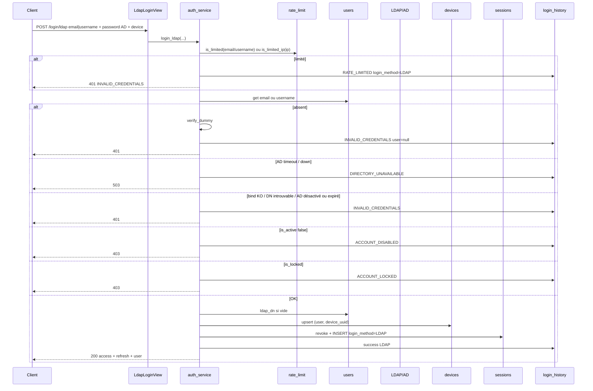

# AUTH-B — LDAP / Active Directory (AUTH-13 + AUTH-16)

**Statut :** clos (jour 3, 2026-09-08).  
**Produit :** YAS Connect uniquement (pas le SIRH).  
**Préalable :** Phase 0 + **AUTH-A** [AUTH-A-connexion-locale.md](AUTH-A-connexion-locale.md) + **AUTH-D** (`register/ad` déjà livré le même jour, **avant** cet incrément HTTP).  
**Ordre lab :** [00-jour-3-auth-b.md](../00-jour-3-auth-b.md) — `ldap_service` → AUTH-D → `login/ldap`. **Pas** de seed `users.ldap_dn`.  
**Attributs / index :** [IAM](../../catalogues/IAM-catalogue-tables.md) · [CONFIG](../../catalogues/CONFIG-catalogue-tables.md) · [INDEX](../../catalogues/INDEX-catalogue.md).  
**Models :** [code/iam_models.py](../code/iam_models.py) · [code/config_models.py](../code/config_models.py).

**Périmètre unique :** se connecter avec le mot de passe **AD** **ou** le mot de passe **applicatif** (AUTH-A) ; **sync périodique** pour couper l’accès YAS si le compte AD n’est plus **loggable** (absent, UAC bloquant, `accountExpires`).

Sur le chemin **login** LDAP : le compte YAS **existe déjà** via **AUTH-D `register/ad`** (ou création RH plus tard). AUTH-13 **n’invente pas** l’utilisateur et **ne change pas** son rôle / profil / matricule.  
**Interdit :** poser `ldap_dn` en seed (`jean.dupont` / `admin` restent MDP-only). La **création** d’un user lié AD = [AUTH-D](AUTH-D-inscription.md) uniquement.

---


## Cartographie


| ID          | Statut       | Comportement dans cet incrément                                                                 | Écritures                                      |
| ----------- | ------------ | ----------------------------------------------------------------------------------------------- | ---------------------------------------------- |
| **AUTH-13** | **Gardé**    | `POST /api/v1/auth/login/ldap` : bind LDAPS, user YAS déjà en base, puis `complete_login` AUTH-A | `users.ldap_dn` si vide ; session `LDAP`       |
| **AUTH-16** | **Gardé**    | Job : `is_active=false` si DN absent **ou** AD non loggable (`userAccountControl` / `accountExpires`) | `users.is_active` ; `audit_logs`             |
| **AUTH-14** | **Abandonné** (login) | Pas de JIT au **login**. Self-register AD = **AUTH-D** (UPN / sAMAccountName / DN seulement) | — |
| **AUTH-15** | **Abandonné** | Pas de mapping groupe AD → `role_id`. Changement de rôle = **AUTH-R09** (admin) | — |
| **AUTH-17** | **Abandonné** | Pas de « SSO only » : le MDP applicatif **reste** utilisable                                    | —                                              |
| **AUTH-18** | **Abandonné** | Pas de fallback `system_settings`. AD down → login LDAP 503 ; login MDP AUTH-A continue         | —                                              |


Pas d’OIDC / SAML. Pas de table `ldap_group_role_maps`. Pas de colonne `auth_source`.

Le hash Argon2 **n’est pas lu** sur le chemin LDAP. Il **reste utilisable** sur `POST /auth/login`.

**Compte AD loggable** (AUTH-13 search + AUTH-16) — lecture seule, **pas** de colonnes `users` :

| Attribut AD | Règle YAS |
|-------------|-----------|
| Existence du DN sous `search_base` | Absent → non loggable (`DN_MISSING`) |
| `userAccountControl` | Masque `ADS_USER_FLAG_ENUM`. Bits **bloquants** ci-dessous. Autres bits **ignorés**. Masque **jamais** stocké. |
| `accountExpires` | `0` ou `0x7FFFFFFFFFFFFFFF` = jamais. Date ≤ maintenant UTC → non loggable (`EXPIRED`) |

`userAccountControl` — un seul statut, **premier bit matché** (priorité haute → basse) :

| Bit | Hex | Statut | Effet |
|-----|-----|--------|--------|
| `ACCOUNTDISABLE` | `0x0002` | `DISABLED` | Compte AD désactivé |
| `LOCKOUT` | `0x0010` | `LOCKED` | Verrouillage AD (temporaire ; le job réactive quand le bit tombe) |
| `SMARTCARD_REQUIRED` | `0x40000` | `SMARTCARD` | Logon MDP AD impossible |
| Type ≠ `NORMAL_ACCOUNT` | masque `0x3B00` vs `0x0200` | `WRONG_TYPE` | Machine / trust / duplicate — pas un user |
| `PASSWORD_EXPIRED` | `0x800000` | `PWD_EXPIRED` | MDP AD expiré (changement obligatoire) |

Masque de type : `TEMP_DUPLICATE (0x100) \| NORMAL (0x200) \| INTERDOMAIN_TRUST (0x800) \| WORKSTATION_TRUST (0x1000) \| SERVER_TRUST (0x2000)`. Exigé : `(uac & mask) == NORMAL_ACCOUNT (0x200)`.

**Ignorés** (n’entrent pas dans le statut) : `SCRIPT` `0x1`, `HOMEDIR_REQUIRED` `0x8`, `PASSWD_NOTREQD` `0x20`, `PASSWD_CANT_CHANGE` `0x40`, `ENCRYPTED_TEXT_PWD_ALLOWED` `0x80`, `DONT_EXPIRE_PASSWORD` `0x10000`, `MNS_LOGON_ACCOUNT` `0x20000`, `TRUSTED_FOR_DELEGATION` `0x80000`, `NOT_DELEGATED` `0x100000`, `USE_DES_KEY_ONLY` `0x200000`, `DONT_REQ_PREAUTH` `0x400000`, `TRUSTED_TO_AUTH_FOR_DELEGATION` `0x1000000`, `PARTIAL_SECRETS_ACCOUNT` `0x4000000`.

UAC OK **et** `accountExpires` OK → `USABLE`. Login LDAP non loggable → **401** (jamais 403 : on ne révèle pas quel bit). Sync → `is_active=false` (users avec `ldap_dn` seulement), `reason` = le statut. MDP app : coupure via `is_active` au job 02:00.

---


## Contrat HTTP


### `POST /api/v1/auth/login/ldap` (public)

Même body qu’AUTH-A (`LoginSerializer`) : exactement **un** identifiant `email` **ou** `username`, `password` = mot de passe **AD** (jamais stocké), `device` **obligatoire**.

```json
{
  "email": "jean.dupont@yas.tg",
  "password": "<mdp AD>",
  "device": {
    "device_uuid": "a1b2c3d4-e5f6-7890-abcd-ef1234567890",
    "device_name": "Chrome Windows",
    "platform": "WEB",
    "model": "",
    "os_version": "10.0",
    "app_version": "1.0.0",
    "push_token": "",
    "device_fingerprint": null
  }
}
```

Username : `"username": "jean.dupont"` à la place de `email` (souvent = `sAMAccountName`).

**200** — même JSON qu’AUTH-A (`access_token`, `refresh_token`, `user`). Session / history : `login_method=LDAP`.

**401** `INVALID_CREDENTIALS` — message unique AUTH-05 : `Email ou mot de passe incorrect.` (user YAS absent, bind KO, entrée AD introuvable, UAC non loggable / `accountExpires`, rate-limit).  
**403** `ACCOUNT_DISABLED` / `ACCOUNT_LOCKED` — **seulement si le bind AD est OK** (flags **YAS** `is_active` / `is_locked`, pas les bits AD `ACCOUNTDISABLE` / `LOCKOUT`).  
**400** `VALIDATION_ERROR` — même règles qu’AUTH-A (identifiant, password, `device`).  
**503** `DIRECTORY_UNAVAILABLE` — timeout / socket AD / URI non TLS. **Pas** un fallback AUTH-18 : le client bascule sur `POST /auth/login` (MDP app) s’il le souhaite.

`POST /api/v1/auth/refresh` : inchangé (AUTH-10).

---


## Flux login LDAP

Ordre contractuel : rate-limit → lookup YAS → dummy si absent → search AD (DN + `userAccountControl` + `accountExpires`) → si AD non loggable **401** → bind → **AUTH-03/04** (`pending_approval` / `is_active` / `is_locked` **après** bind OK) → poser `ldap_dn` si vide → `complete_login` AUTH-A (`login_method=LDAP`).



---


## 0. Apps et fichiers

`apps.config` n’existe pas en AUTH-A. La créer ici. Models : [code/config_models.py](../code/config_models.py).  
`INSTALLED_APPS` : ajouter `"apps.config"`. `makemigrations config`.

Fichiers à ajouter / étendre :

```
apps/config/
  models.py                                    # coller code/config_models.py
  apps.py
  management/commands/seed_config.py
  management/commands/run_scheduled_jobs.py
apps/iam/
  services/ldap_service.py                     # search + bind + état logon AD (DN / UAC / expires)
  jobs.py                                      # sync_ldap_accounts
  serializers.py                               # réutiliser LoginSerializer
  urls.py                                      # + login/ldap
  views.py                                     # LdapLoginView
  services/auth_service.py                     # + login_ldap() ; complete_login déjà AUTH-A
```

`urls.py` (étendre AUTH-A) :

```python
urlpatterns = [
    path("login", LoginView.as_view(), name="login"),
    path("login/ldap", LdapLoginView.as_view(), name="login-ldap"),
    path("refresh", RefreshView.as_view(), name="refresh"),
]
```

Delta IAM : `users.ldap_dn` (UK, NULL) déjà dans [iam_models.py](../code/iam_models.py).  
`LoginHistory.FailureReason` : ajouter `DIRECTORY_UNAVAILABLE` (AD down).

---


## 1. Settings (.env)

Pas de secret LDAP dans `.env` (ils vivent dans `system_settings`, `is_sensitive=true`).  
Optionnel : URI de secours locale **uniquement** pour les tests si la table n’est pas seedée — **interdit en prod**.

```env
# rien d’obligatoire. LDAP = system_settings (seed_config)
```

`settings.py` : aucune clé `LDAP_*` à ajouter. Lecture runtime = `get_ldap_settings()` ci-dessous.

---


## 2. Libs


| Lib         | Rôle ici                                                                 |
| ----------- | ------------------------------------------------------------------------ |
| `ldap3`     | Search + bind LDAPS / STARTTLS. **Pas** `authlib` / OIDC                 |
| `croniter`  | Calcul `next_execution` du job AUTH-16                                   |
| AUTH-A      | `complete_login`, rate-limit, dummy Argon2, device, JWT, refresh, history |


`requirements.txt` : ajouter `ldap3` et `croniter`.

Bind en deux temps, **TLS obligatoire** : URI `ldaps://…` **ou** `ldap://…` + STARTTLS. `ldap://` sans STARTTLS → 503 (mauvaise conf, pas un login).

---


## 3. Lecture `system_settings`

`apps/iam/services/ldap_service.py` — ne jamais logger `bind_password`.

```python
from dataclasses import dataclass

from apps.config.models import SystemSetting


class DirectoryUnavailable(Exception):
    pass


class LdapBindFailed(Exception):
    pass


@dataclass(frozen=True)
class LdapSettings:
    uri: str
    bind_dn: str
    bind_password: str
    search_base: str
    timeout_seconds: int


def _setting(key: str):
    row = SystemSetting.objects.filter(category="ldap", setting_key=key).first()
    if row is None:
        raise DirectoryUnavailable()
    return row.setting_value


def get_ldap_settings() -> LdapSettings:
    timeout = _setting("timeout_seconds")
    return LdapSettings(
        uri=str(_setting("uri")),
        bind_dn=str(_setting("bind_dn")),
        bind_password=str(_setting("bind_password")),
        search_base=str(_setting("search_base")),
        timeout_seconds=int(timeout),
    )
```

Clés seed (UK `category` + `setting_key`) :

| category | setting_key       | setting_value (exemple)        | is_sensitive |
| -------- | ----------------- | ------------------------------ | ------------ |
| `ldap`   | `uri`             | `"ldaps://dc1.yas.tg:636"`     | false        |
| `ldap`   | `bind_dn`         | `"CN=svc-connect,OU=…"`        | false        |
| `ldap`   | `bind_password`   | `"…"`                          | **true**     |
| `ldap`   | `search_base`     | `"OU=Users,DC=yas,DC=tg"`      | false        |
| `ldap`   | `timeout_seconds` | `5`                            | false        |

---


## 4. `ldap_service` — search + bind

```python
from datetime import datetime, timedelta, timezone

from ldap3 import ALL, SUBTREE, Connection, Server, Tls
from ldap3.core.exceptions import LDAPException, LDAPSocketOpenError
from ldap3.utils.conv import escape_filter_chars


def _server(cfg: LdapSettings) -> Server:
    use_ssl = cfg.uri.startswith("ldaps://")
    start_tls = cfg.uri.startswith("ldap://")
    if not use_ssl and not start_tls:
        raise DirectoryUnavailable()
    return Server(cfg.uri, get_info=ALL, connect_timeout=cfg.timeout_seconds, use_ssl=use_ssl)


def _service_bind(cfg: LdapSettings) -> Connection:
    server = _server(cfg)
    if cfg.uri.startswith("ldaps://"):
        return Connection(
            server,
            user=cfg.bind_dn,
            password=cfg.bind_password,
            auto_bind=True,
            receive_timeout=cfg.timeout_seconds,
        )
    conn = Connection(
        server,
        user=cfg.bind_dn,
        password=cfg.bind_password,
        auto_bind=False,
        receive_timeout=cfg.timeout_seconds,
    )
    conn.open()
    if not conn.start_tls() or not conn.bind():
        raise DirectoryUnavailable()  # compte service / TLS : infra, pas 401 user
    return conn


# ADS_USER_FLAG_ENUM — bits lus pour le statut logon. Masque jamais stocké.
ADS_UF_ACCOUNTDISABLE = 0x0002
ADS_UF_LOCKOUT = 0x0010
ADS_UF_TEMP_DUPLICATE_ACCOUNT = 0x0100
ADS_UF_NORMAL_ACCOUNT = 0x0200
ADS_UF_INTERDOMAIN_TRUST_ACCOUNT = 0x0800
ADS_UF_WORKSTATION_TRUST_ACCOUNT = 0x1000
ADS_UF_SERVER_TRUST_ACCOUNT = 0x2000
ADS_UF_SMARTCARD_REQUIRED = 0x40000
ADS_UF_PASSWORD_EXPIRED = 0x800000
ADS_UF_ACCOUNT_TYPE_MASK = (
    ADS_UF_TEMP_DUPLICATE_ACCOUNT
    | ADS_UF_NORMAL_ACCOUNT
    | ADS_UF_INTERDOMAIN_TRUST_ACCOUNT
    | ADS_UF_WORKSTATION_TRUST_ACCOUNT
    | ADS_UF_SERVER_TRUST_ACCOUNT
)
ACCOUNT_NEVER_EXPIRES = {0, 0x7FFFFFFFFFFFFFFF}
FILETIME_EPOCH = datetime(1601, 1, 1, tzinfo=timezone.utc)

# Bits UAC hors statut (SCRIPT, DONT_EXPIRE_PASSWORD, délégation, DES, …) : ignorés.
# On ne copie rien sur users (AUTH-14 abandonné).


def _int_uac(value) -> int:
    if value is None:
        return 0
    if isinstance(value, list):
        value = value[0] if value else 0
    return int(value)


def is_account_expired(account_expires) -> bool:
    """accountExpires AD : 0 / 0x7FFFFFFFFFFFFFFF = jamais. Sinon FILETIME ou datetime ldap3."""
    if account_expires is None:
        return False
    if isinstance(account_expires, list):
        account_expires = account_expires[0] if account_expires else None
        if account_expires is None:
            return False
    if isinstance(account_expires, datetime):
        exp = account_expires if account_expires.tzinfo else account_expires.replace(tzinfo=timezone.utc)
        return exp <= datetime.now(timezone.utc)
    ticks = int(account_expires)
    if ticks in ACCOUNT_NEVER_EXPIRES:
        return False
    exp = FILETIME_EPOCH + timedelta(microseconds=ticks / 10)
    return exp <= datetime.now(timezone.utc)


def ad_logon_status(*, user_account_control, account_expires) -> str:
    """Un seul statut. Ordre : DISABLED > LOCKED > SMARTCARD > WRONG_TYPE > PWD_EXPIRED > EXPIRED > USABLE."""
    uac = _int_uac(user_account_control)
    if uac & ADS_UF_ACCOUNTDISABLE:
        return "DISABLED"
    if uac & ADS_UF_LOCKOUT:
        return "LOCKED"
    if uac & ADS_UF_SMARTCARD_REQUIRED:
        return "SMARTCARD"
    if (uac & ADS_UF_ACCOUNT_TYPE_MASK) != ADS_UF_NORMAL_ACCOUNT:
        return "WRONG_TYPE"
    if uac & ADS_UF_PASSWORD_EXPIRED:
        return "PWD_EXPIRED"
    if is_account_expired(account_expires):
        return "EXPIRED"
    return "USABLE"


def search_user_dn(*, email: str, username: str) -> str:
    """DN AD du compte. Introuvable ou non loggable → LdapBindFailed (même 401 que bind KO)."""
    cfg = get_ldap_settings()
    mail = escape_filter_chars(email)
    sam = escape_filter_chars(username)
    flt = f"(|(mail={mail})(userPrincipalName={mail})(sAMAccountName={sam}))"
    try:
        conn = _service_bind(cfg)
        ok = conn.search(
            search_base=cfg.search_base,
            search_filter=flt,
            search_scope=SUBTREE,
            attributes=["distinguishedName", "userAccountControl", "accountExpires"],
            size_limit=1,
        )
        if not ok or not conn.entries:
            raise LdapBindFailed()
        entry = conn.entries[0]
        status = ad_logon_status(
            user_account_control=entry.userAccountControl.value,
            account_expires=entry.accountExpires.value,
        )
        if status != "USABLE":
            raise LdapBindFailed()
        return str(entry.entry_dn)
    except LdapBindFailed:
        raise
    except LDAPSocketOpenError as exc:
        raise DirectoryUnavailable() from exc
    except LDAPException as exc:
        raise DirectoryUnavailable() from exc


def bind_user_dn(*, dn: str, password: str) -> None:
    cfg = get_ldap_settings()
    try:
        conn = Connection(
            _server(cfg),
            user=dn,
            password=password,
            receive_timeout=cfg.timeout_seconds,
        )
        if cfg.uri.startswith("ldap://"):
            conn.open()
            if not conn.start_tls():
                raise DirectoryUnavailable()
        if not conn.bind():
            raise LdapBindFailed()
    except LdapBindFailed:
        raise
    except DirectoryUnavailable:
        raise
    except LDAPSocketOpenError as exc:
        raise DirectoryUnavailable() from exc
    except LDAPException as exc:
        raise DirectoryUnavailable() from exc


def iter_ad_logon_state() -> dict[str, str]:
    """AUTH-16 : DN → statut ad_logon_status. Absent du dict = plus dans search_base."""
    cfg = get_ldap_settings()
    conn = _service_bind(cfg)
    state: dict[str, str] = {}
    for entry in conn.extend.standard.paged_search(
        search_base=cfg.search_base,
        search_filter="(objectClass=user)",
        search_scope=SUBTREE,
        attributes=["distinguishedName", "userAccountControl", "accountExpires"],
        paged_size=500,
        generator=True,
    ):
        dn = entry.get("dn")
        if not dn:
            continue
        attrs = entry.get("attributes") or {}
        state[dn] = ad_logon_status(
            user_account_control=attrs.get("userAccountControl"),
            account_expires=attrs.get("accountExpires"),
        )
    return state
```

Règles :

- MDP AD **jamais** en log, en `login_history`, en `audit_logs`.
- `escape_filter_chars` obligatoire (injection filtre LDAP).
- Si `users.ldap_dn` est déjà posé : bind **ce** DN d’abord ; si bind KO, search + bind (le DN a pu bouger). Ne **pas** écraser `ldap_dn` s’il est déjà rempli (lien sync AUTH-16).
- `userAccountControl` : bits bloquants `ACCOUNTDISABLE` / `LOCKOUT` / `SMARTCARD_REQUIRED` / type ≠ `NORMAL_ACCOUNT` / `PASSWORD_EXPIRED`. Autres bits ignorés. Masque **jamais** copié en base.
- `accountExpires` : jamais = `0` ou `0x7FFFFFFFFFFFFFFF` ; sinon comparé à **maintenant UTC**. Attribut absent → traité comme jamais (pas de désactivation de masse).
- Compte AD non loggable au search (UAC ou expire) → **401** (pas 403) : on ne révèle pas le bit ni l’expiration.

---


## 5. Orchestration `login_ldap()` (AUTH-13)

Réutilise `_get_user`, `_history`, `verify_dummy`, rate-limit, `complete_login` d’AUTH-A.  
`_history(..., login_method=LoginMethod.LDAP)` sur **toutes** les issues (succès et échecs).

```python
def login_ldap(*, email, username, password, ip, user_agent: str, device_spec: dict) -> dict:
    email = normalize_email(email) if email else None
    username = username.strip() if username else None

    ident_key = email or username
    if rate_limit_service.is_limited(ident_key) or rate_limit_service.is_limited_ip(ip):
        _history(user=None, email=ident_key, ip=ip, success=False,
                 reason="RATE_LIMITED", user_agent=user_agent,
                 login_method=LoginMethod.LDAP)
        raise AuthAPIError(401, "INVALID_CREDENTIALS", MSG_INVALID)

    rate_limit_service.hit(ident_key, ip)

    user = _get_user(email=email, username=username)
    if user is None:
        verify_dummy(password)  # timing AUTH-05 ; on ne contacte pas AD
        _history(user=None, email=ident_key, ip=ip, success=False,
                 reason="INVALID_CREDENTIALS", user_agent=user_agent,
                 login_method=LoginMethod.LDAP)
        raise AuthAPIError(401, "INVALID_CREDENTIALS", MSG_INVALID)

    try:
        dn = user.ldap_dn or search_user_dn(email=user.email, username=user.username)
        bind_user_dn(dn=dn, password=password)
    except DirectoryUnavailable:
        _history(user=user, email=user.email, ip=ip, success=False,
                 reason="DIRECTORY_UNAVAILABLE", user_agent=user_agent,
                 login_method=LoginMethod.LDAP)
        raise AuthAPIError(503, "DIRECTORY_UNAVAILABLE", "Annuaire indisponible.")
    except LdapBindFailed:
        _history(user=user, email=user.email, ip=ip, success=False,
                 reason="INVALID_CREDENTIALS", user_agent=user_agent,
                 login_method=LoginMethod.LDAP)
        raise AuthAPIError(401, "INVALID_CREDENTIALS", MSG_INVALID)

    if user.pending_approval:
        _history(user=user, email=user.email, ip=ip, success=False,
                 reason="ACCOUNT_PENDING", user_agent=user_agent,
                 login_method=LoginMethod.LDAP)
        raise AuthAPIError(403, "ACCOUNT_PENDING", "Compte en attente de validation.")

    if not user.is_active:
        _history(user=user, email=user.email, ip=ip, success=False,
                 reason="ACCOUNT_DISABLED", user_agent=user_agent,
                 login_method=LoginMethod.LDAP)
        raise AuthAPIError(403, "ACCOUNT_DISABLED", "Compte désactivé.")

    if user.is_locked:
        _history(user=user, email=user.email, ip=ip, success=False,
                 reason="ACCOUNT_LOCKED", user_agent=user_agent,
                 login_method=LoginMethod.LDAP)
        raise AuthAPIError(403, "ACCOUNT_LOCKED", "Compte verrouillé.")

    if not user.ldap_dn:
        user.ldap_dn = dn
        user.save(update_fields=["ldap_dn", "updated_at"])

    return complete_login(
        user=user, ip=ip, user_agent=user_agent, device_spec=device_spec,
        ident_key=ident_key, login_method=LoginMethod.LDAP,
    )
```

`complete_login` : défini dans AUTH-A §5. Ne **pas** recopier device / session / JWT ici.  
**AUTH-C :** ce `return complete_login` devient `return begin_mfa(..., login_method=LoginMethod.LDAP)` — [AUTH-C-mfa-otp.md](AUTH-C-mfa-otp.md).

Si `user.ldap_dn` est posé et `bind_user_dn` échoue : **un** retry `search_user_dn` + bind (DN déplacé **ou** compte devenu non loggable). Toujours 401 si le 2e bind / search échoue. Ne pas mettre à jour `ldap_dn` (AUTH-16 s’appuie sur la valeur déjà liée).

---


## 6. Serializer + vues

Réutiliser `LoginSerializer` + `DeviceSpecSerializer` d’AUTH-A. Pas de champ `identifier` distinct.

```python
class LdapLoginView(APIView):
    authentication_classes = []
    permission_classes = [AllowAny]

    def post(self, request):
        ser = LoginSerializer(data=request.data)
        ser.is_valid(raise_exception=True)
        data = ser.validated_data
        try:
            payload = login_ldap(
                email=data.get("email"),
                username=data.get("username"),
                password=data["password"],
                ip=get_client_ip(request),
                user_agent=request.META.get("HTTP_USER_AGENT", ""),
                device_spec=data["device"],
            )
        except AuthAPIError as exc:
            return error_response(exc)
        return Response({"success": True, "data": payload}, status=200)
```

`LoginView` AUTH-A **inchangée** (appelle `login()`, pas `login_ldap()`).

---


## 7. AUTH-16 — job `sync_ldap_accounts`

Ne **crée** pas de users, ne **copie** pas d’attributs (`userAccountControl` / `accountExpires` **lus**, jamais stockés), ne **touche pas** `role_id` / nom / matricule / `is_locked`.

Un compte AD compte comme **loggable** seulement si tout est vrai :

| Condition | Sinon |
|-----------|--------|
| DN encore sous `search_base` | `DN_MISSING` |
| Pas `ACCOUNTDISABLE` (`0x0002`) | `DISABLED` |
| Pas `LOCKOUT` (`0x0010`) | `LOCKED` |
| Pas `SMARTCARD_REQUIRED` (`0x40000`) | `SMARTCARD` |
| `(uac & type_mask) == NORMAL_ACCOUNT` (`0x0200`) | `WRONG_TYPE` |
| Pas `PASSWORD_EXPIRED` (`0x800000`) | `PWD_EXPIRED` |
| `accountExpires` jamais **ou** date future (UTC) | `EXPIRED` |

`apps/iam/jobs.py` :

```python
import uuid

from apps.iam.models import AuditLog, User
from apps.iam.services.ldap_service import DirectoryUnavailable, iter_ad_logon_state


def sync_ldap_accounts() -> None:
    state = iter_ad_logon_state()  # dn → USABLE | DISABLED | LOCKED | SMARTCARD | WRONG_TYPE | PWD_EXPIRED | EXPIRED
    qs = User.objects.exclude(ldap_dn__isnull=True).exclude(ldap_dn="")
    for user in qs.iterator():
        status = state.get(user.ldap_dn)  # None = plus dans AD
        usable = status == "USABLE"
        reason = "DN_MISSING" if status is None else status
        if not usable and user.is_active:
            user.is_active = False
            user.save(update_fields=["is_active", "updated_at"])
            _audit(user, "USER_LDAP_DISABLE", old=True, new=False, reason=reason)
        elif usable and (not user.is_active) and (not user.is_locked):
            user.is_active = True
            user.save(update_fields=["is_active", "updated_at"])
            _audit(user, "USER_LDAP_ENABLE", old=False, new=True, reason="USABLE")


def _audit(user, action: str, *, old: bool, new: bool, reason: str) -> None:
    AuditLog.objects.create(
        trace_id=uuid.uuid4(),
        module="IAM",
        action=action,
        entity_type="users",
        entity_id=user.id,
        old_values={"is_active": old},
        new_values={"is_active": new},
        metadata={"ldap_dn": user.ldap_dn, "reason": reason},
        severity="WARNING" if action.endswith("DISABLE") else "INFO",
        success=True,
        user=None,  # job système
    )
```

Users **sans** `ldap_dn` : **intouchés** (comptes MDP-only, jamais liés).  
AD down pendant le job : `DirectoryUnavailable` → le runner marque `last_status=ERROR` ; **aucune** désactivation de masse.

AUTH-A (MDP app) : pas d’appel AD. La coupure UAC / expire passe par `is_active` au plus tard au run **02:00** (même délai qu’un départ). `LOCKOUT` / `PASSWORD_EXPIRED` sont temporaires AD : le job **réactive** (`USER_LDAP_ENABLE`) dès que le bit est retiré et que `is_locked` YAS est false.

---


## 8. Runner `run_scheduled_jobs`

`apps/config/management/commands/run_scheduled_jobs.py` :

```python
import importlib
from datetime import datetime, timedelta

from croniter import croniter
from django.core.management.base import BaseCommand
from django.utils import timezone

from apps.config.models import ScheduledJob


class Command(BaseCommand):
    help = "Exécute les scheduled_jobs dont next_execution <= now."

    def handle(self, *args, **options):
        now = timezone.now()
        due = ScheduledJob.objects.filter(enabled=True, next_execution__lte=now)
        for job in due:
            module_path, func_name = job.handler.rsplit(".", 1)
            try:
                fn = getattr(importlib.import_module(module_path), func_name)
                fn()
                job.last_status = "OK"
                job.last_error = ""
            except Exception as exc:
                job.last_status = "ERROR"
                job.last_error = str(exc)[:2000]
            job.last_execution = now
            if job.cron_expression:
                job.next_execution = croniter(job.cron_expression, now).get_next(datetime)
            elif job.interval_seconds:
                job.next_execution = now + timedelta(seconds=job.interval_seconds)
            job.save(update_fields=[
                "last_status", "last_error", "last_execution", "next_execution", "updated_at",
            ])
```

Cron prod (systemd / Task Scheduler) : `python manage.py run_scheduled_jobs` toutes les minutes.

---


## 9. Seed

`seed_iam` AUTH-A **inchangé** (rôle `USER`, `jean.dupont@yas.tg` / `Secret123!`). **`ldap_dn` reste NULL** sur les users seed — jamais de faux lien AD. Le 1er `ldap_dn` vient de **D02** (ou, si vide, du 1er `login/ldap` d’un user déjà créé par D02).

`apps/config/management/commands/seed_config.py` :

```python
from datetime import datetime

from croniter import croniter
from django.core.management.base import BaseCommand
from django.utils import timezone

from apps.config.models import ScheduledJob, SystemSetting


LDAP_SETTINGS = [
    ("uri", "ldaps://dc1.yas.tg:636", "string", False),
    ("bind_dn", "CN=svc-yas-connect,OU=Services,DC=yas,DC=tg", "string", False),
    ("bind_password", "CHANGE_ME", "string", True),
    ("search_base", "OU=Users,DC=yas,DC=tg", "string", False),
    ("timeout_seconds", 5, "int", False),
]


class Command(BaseCommand):
    def handle(self, *args, **options):
        for key, value, value_type, sensitive in LDAP_SETTINGS:
            SystemSetting.objects.update_or_create(
                category="ldap",
                setting_key=key,
                defaults={
                    "setting_value": value,
                    "value_type": value_type,
                    "is_sensitive": sensitive,
                    "editable": True,
                },
            )
        now = timezone.now()
        ScheduledJob.objects.update_or_create(
            job_name="ldap_sync_users",
            defaults={
                "module": "IAM",
                "cron_expression": "0 2 * * *",
                "interval_seconds": None,
                "handler": "apps.iam.jobs.sync_ldap_accounts",
                "enabled": True,
                "next_execution": croniter("0 2 * * *", now).get_next(datetime),
            },
        )
```

`feature_flags` : **0 ligne**.

---


## 10. Tests (couverture par ID)


| ID  | Cas                                      | Attendu                                                              |
| --- | ---------------------------------------- | -------------------------------------------------------------------- |
| 13  | bind OK + user YAS existant + device     | 200, JWT, `Session.login_method=LDAP`, `users.ldap_dn` posé (AUTH-C : 200 `mfa_required` d’abord) |
| 13  | 2e login LDAP même user                  | `ldap_dn` **inchangé**                                               |
| 13  | bind OK + pas de user YAS                | 401 même body AUTH-05 ; **0** appel AD (mock)                        |
| 13  | user YAS + bind KO                       | 401                                                                  |
| 13  | `is_active=false` + bind OK              | 403 `ACCOUNT_DISABLED`                                               |
| 13  | `is_locked=true` + bind OK               | 403 `ACCOUNT_LOCKED`                                                 |
| 13  | AD timeout / socket                      | 503 `DIRECTORY_UNAVAILABLE` ; history `DIRECTORY_UNAVAILABLE`        |
| 13  | même user `POST /auth/login` MDP app     | 200 AUTH-A, `login_method=PASSWORD`                                  |
| 13  | 6e essai LDAP même email                 | 401 + history `RATE_LIMITED`                                         |
| 13  | search : `ACCOUNTDISABLE` (514)           | 401 (pas 403) ; **pas** de session                                   |
| 13  | search : `LOCKOUT` (512\|0x10)            | 401 (pas 403)                                                        |
| 13  | search : `PASSWORD_EXPIRED`               | 401                                                                  |
| 13  | search : `SMARTCARD_REQUIRED`             | 401                                                                  |
| 13  | search : type `WORKSTATION_TRUST` (4096)  | 401                                                                  |
| 13  | search : `accountExpires` passé           | 401 (pas 403)                                                        |
| 13  | JSON 200 sans `password`                 | assert                                                               |
| 16  | `ldap_dn` plus dans AD                   | `is_active=False` ; audit `reason=DN_MISSING`                        |
| 16  | DN encore là + `ACCOUNTDISABLE`          | `is_active=False` ; `reason=DISABLED`                                |
| 16  | DN encore là + `LOCKOUT`                 | `is_active=False` ; `reason=LOCKED`                                  |
| 16  | DN encore là + `PASSWORD_EXPIRED`        | `is_active=False` ; `reason=PWD_EXPIRED`                             |
| 16  | DN encore là + `SMARTCARD` / `WRONG_TYPE` | `is_active=False` ; `reason` matching                                |
| 16  | DN encore là + `accountExpires` passé    | `is_active=False` ; `reason=EXPIRED`                                 |
| 16  | `accountExpires` never (0 / max)         | inchangé si USABLE                                                   |
| 16  | 66048 (`NORMAL` + `DONT_EXPIRE_PASSWORD`) | `USABLE` (bit ignoré)                                                |
| 16  | date rallongée / bits bloquants retirés + pas `is_locked` | `is_active=True` ; `USER_LDAP_ENABLE`          |
| 16  | DN réapparaît + `is_locked`              | `is_active` reste false                                              |
| 16  | user **sans** `ldap_dn`                  | inchangé même si l’email existe en AD                                |
| 16  | `iter_ad_logon_state` lève `DirectoryUnavailable` | aucun `is_active` modifié ; job `ERROR`                     |
| —   | `is_account_expired(0)` / max FILETIME    | `False`                                                              |
| —   | `ad_logon_status` 514 + expire            | `DISABLED` (prioritaire)                                             |
| —   | `ad_logon_status` 512\|0x10               | `LOCKED`                                                             |
| —   | `ad_logon_status` 512                     | `USABLE`                                                             |
| —   | rôle / nom / matricule après login LDAP  | **non** modifiés                                                     |
| —   | `bind_password` absent des logs / JSON   | assert                                                               |


Mocks : patcher `search_user_dn` / `bind_user_dn` / `iter_ad_logon_state` — **ne pas** viser un vrai DC dans pytest.  
Fixture `device` minimale AUTH-A : `{ "device_uuid": "test-web-1", "platform": "WEB" }`.

---


## 11. Acceptation AUTH-B

- [x] Login AD **et** login MDP applicatif pour le même user
- [x] 401 unique (inconnu YAS / bind KO / AD désactivé ou expiré / rate-limit) ; 503 seulement si AD down
- [x] 403 inactif / lock **après** bind OK
- [x] `ldap_dn` posé à AUTH-D register/ad (puis éventuellement au 1er `login/ldap` si encore vide) ; jamais de création de compte au **login** ni mapping de rôle ; **0** user AD en seed
- [x] Job de sync : `is_active=false` si DN absent **ou** AD désactivé **ou** AD expiré (users déjà liés seulement)
- [x] Secrets bind absents des logs / API (`is_sensitive`)
- [x] `complete_login` AUTH-A réutilisé (`login_method=LDAP`)
- [x] Tests verts ; `/api/docs` documente `POST /api/v1/auth/login/ldap`
- [x] AUTH-A inchangé fonctionnellement (`POST /login` + `/refresh`) jusqu’à **AUTH-C** (alors 200 login = `mfa_required`)
- [x] SIRH non modifié

---


## 12. Vérif manuelle

```powershell
# User = celui créé par POST /register/ad (pas jean.dupont seed).
curl -s -X POST http://127.0.0.1:8000/api/v1/auth/login/ldap -H "Content-Type: application/json" -d "{\"email\":\"<upn-issu-de-D02>\",\"password\":\"<mdp-AD>\",\"device\":{\"device_uuid\":\"dev-1\",\"platform\":\"WEB\"}}"
```

Même user en MDP app (AUTH-A) :

```powershell
curl -s -X POST http://127.0.0.1:8000/api/v1/auth/login -H "Content-Type: application/json" -d "{\"email\":\"jean.dupont@yas.tg\",\"password\":\"Secret123!\",\"device\":{\"device_uuid\":\"dev-1\",\"platform\":\"WEB\"}}"
```

Les deux doivent renvoyer 200. Relancer le LDAP : 1 device, 1 session active `login_method=LDAP`.  
Job : `python manage.py run_scheduled_jobs` (forcer `next_execution` dans le shell si besoin).
