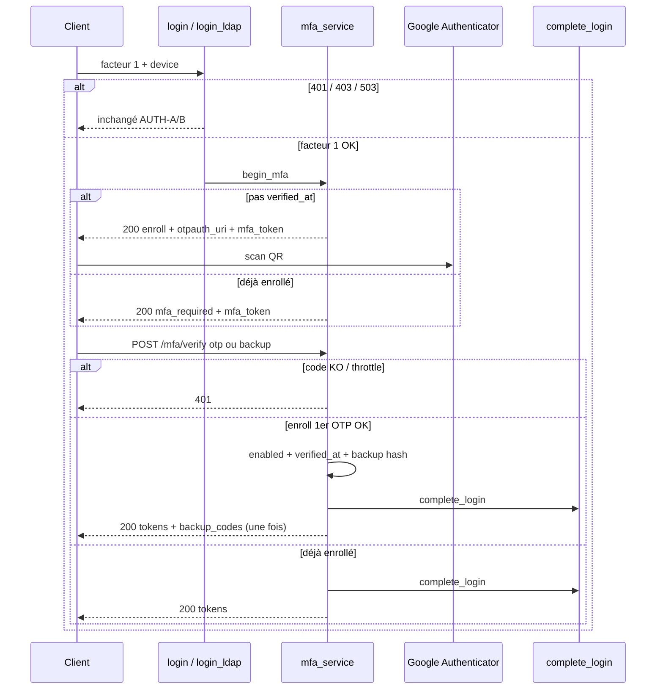

# AUTH-C — MFA TOTP obligatoire (AUTH-19 … 24)

**Statut :** clos (2026-09-08) — lab [00-jour-4-auth-c.md](../00-jour-4-auth-c.md).  
**Produit :** YAS Connect uniquement (pas le SIRH).  
**Préalable :** Phase 0 + **AUTH-A** + **AUTH-D** + **AUTH-B** (jours 1–3 clos). Enchaînement aussi après **AUTH-D** `register/ad` (`complete_login` → `begin_mfa`).  
**Attributs / index :** [IAM](../../catalogues/IAM-catalogue-tables.md) · [INDEX](../../catalogues/INDEX-catalogue.md).  
**Models :** [code/iam_models.py](../code/iam_models.py) (`otp_secrets`).

**Périmètre unique :** Google Authenticator (**TOTP RFC 6238**) **obligatoire pour tous**, **à chaque nouveau login** (MDP app **et** LDAP) **et à la fin de l’inscription AD** ([AUTH-D](AUTH-D-inscription.md)). Pas de SMS, pas d’e-mail OTP, pas d’exception rôle / appareil trusted / « MFA optionnel ».

Le refresh AUTH-10 **ne** redemande **pas** d’OTP (protège l’ouverture de session, pas chaque appel API).

---


## Cartographie


| ID          | Statut         | Comportement dans cet incrément                                                                 | Écritures                                      |
| ----------- | -------------- | ----------------------------------------------------------------------------------------------- | ---------------------------------------------- |
| **AUTH-19** | **Gardé**      | Enroll : secret TOTP chiffré + **QR obligatoire** (`otpauth_uri`). Pas de skip.                  | `otp_secrets` (secret, algo, issuer)           |
| **AUTH-20** | **Gardé**      | **Valider = code Google Authenticator** (6 chiffres). 1er TOTP OK → `enabled=true` ; codes secours une fois | `otp_secrets` + hash `backup_codes`            |
| **AUTH-21** | **Gardé (durci)** | Après facteur 1 OK : **jamais** de JWT. Challenge OTP **toujours** (tous rôles, trusted ignoré) | cache challenge ; puis `complete_login`        |
| **AUTH-22** | **Gardé**      | Codes de secours usage unique (perte de téléphone). **Jamais** envoyés mail/SMS                 | consommation d’un hash                         |
| **AUTH-23** | **Gardé**      | Régénération : invalide les anciens, affiche les nouveaux **une fois** (session déjà MFA)       | `backup_codes`                                 |
| **AUTH-24** | **Redéfini**   | Pas de désactivation user. **Reset admin** : suppression `otp_secrets` → ré-enroll au login     | DELETE `otp_secrets` ; `audit_logs`            |
| **AUTH-25** | **Abandonné**  | Politique par rôle inutile : **tous** les users = même règle                                    | —                                              |
| **AUTH-26** | **Abandonné**  | `devices.trusted` **n’allège pas** le MFA. Colonne inchangée, non lue au login                  | —                                              |


Pas de step-up générique (re-OTP pour une action déjà connecté) dans AUTH-C. **Exception :** lier un 2ᵉ appareil = [AUTH-J](AUTH-J-lier-appareil-qr.md) (QR + TOTP).

---

## Décisions figées

| Sujet | Choix |
|-------|--------|
| Enroll | L’app **affiche un QR** (et l’URI `otpauth://`). L’utilisateur le **scanne** dans **Google Authenticator** (ou compatible TOTP). |
| Activation | **Uniquement** après un code à 6 chiffres Authenticator valide. Pas de skip, pas d’activation « plus tard ». |
| Login suivant | Plus de QR Authenticator. Demander le **même type de code** Authenticator (ou un code de secours). Relier un 2ᵉ écran sans MDP = [AUTH-J](AUTH-J-lier-appareil-qr.md) (autre QR). |
| Ce QR n’est pas | Le QR « lier un ordi » ([AUTH-J](AUTH-J-lier-appareil-qr.md) : `yasconnect://device-link/…`, scanné par **YAS Connect**, puis code Authenticator). |

---


## Contrat HTTP

### Facteur 1 inchangé, réponse **changée** (delta AUTH-A / AUTH-B)

`POST /api/v1/auth/login` et `POST /api/v1/auth/login/ldap` : même body (`device` obligatoire).  
401 / 403 / 503 **identiques** jusqu’à AUTH-03/04 (et bind AD).

**Plus de JWT** si facteur 1 OK. **200** :

```json
{
  "success": true,
  "data": {
    "mfa_required": true,
    "mfa_token": "<opaque, TTL 5 min>",
    "enroll": false,
    "expires_in": 300
  }
}
```

Premier login (pas encore `verified_at`) : `"enroll": true` + `"otpauth_uri": "otpauth://totp/YAS%20Connect:jean.dupont%40yas.tg?secret=…&issuer=YAS%20Connect"`.  
Le client **doit** afficher le **QR** (scan Google Authenticator). Champ secret en manuel optionnel (copie de l’URI). **Pas** de codes de secours dans cette réponse.  
**Pas de JWT** tant que `POST /mfa/verify` n’a pas reçu un **`otp` Authenticator** valide.

`mfa_token` et le secret TOTP **jamais** dans `login_history` / logs.

### `POST /api/v1/auth/mfa/verify` (public)

Exactement **un** : `otp` **ou** `backup_code` (pas les deux, pas zéro). Enroll (`enroll` du challenge) : **uniquement** `otp` (pas de backup avant AUTH-20).

```json
{
  "mfa_token": "<opaque>",
  "otp": "123456"
}
```

**200** — même JSON tokens qu’AUTH-A (`access_token`, `refresh_token`, `user`).  
**Enroll seulement** : champ additionnel `"backup_codes": ["A7K9-2M4P", …]` **une fois**. Le client **doit** les afficher ; l’API ne les renverra plus.

**401** `INVALID_CREDENTIALS` — code TOTP / backup faux **ou** rate-limit OTP (même body AUTH-05).  
**401** `MFA_CHALLENGE_EXPIRED` — `mfa_token` inconnu / expiré. Refaire le facteur 1.  
**400** — `otp` et `backup_code` ensemble / aucun ; backup alors que enroll.

### `POST /api/v1/auth/mfa/backup-codes/regenerate` (authentifié, session déjà MFA)

`required_permission = iam.mfa.regenerate` ([AUTH-R](AUTH-R-roles-permissions.md)).

```json
{ "otp": "123456" }
```

**200** : `{ "backup_codes": [ … ] }` une fois. Anciens codes **invalides**.  
**401** TOTP faux. **403** si pas de `otp_secrets` vérifié.

### `POST /api/v1/admin/users/{id}/mfa/reset` (admin)

`HasPermission` `iam.mfa.reset` ([AUTH-R](AUTH-R-roles-permissions.md) R05/R10). **Pas** de fallback rôle `ADMIN`.  
Pas de body. Supprime `otp_secrets`. Prochain login = enroll. Audit `MFA_RESET`.  
**Pas** d’endpoint user « désactiver le MFA ».

`POST /api/v1/auth/refresh` : **inchangé** (pas d’OTP).

---


## Flux



`devices.trusted` : **non lu**. `complete_login` AUTH-A **uniquement** après verify OK.

---


## 0. Apps et fichiers

```
apps/iam/
  services/mfa_service.py      # begin_mfa, verify_mfa, backup regen, encrypt secret
  services/auth_service.py     # login / login_ldap → begin_mfa (plus complete_login direct)
  serializers.py               # MfaVerifySerializer, BackupRegenSerializer
  views.py                     # MfaVerifyView, BackupRegenView
  urls.py
apps/iam/views_admin.py        # MfaResetAdminView (HasPermission iam.mfa.reset)
```

```python
urlpatterns = [
    path("login", LoginView.as_view(), name="login"),
    path("login/ldap", LdapLoginView.as_view(), name="login-ldap"),
    path("refresh", RefreshView.as_view(), name="refresh"),
    path("mfa/verify", MfaVerifyView.as_view(), name="mfa-verify"),
    path("mfa/backup-codes/regenerate", BackupRegenView.as_view(), name="mfa-backup-regen"),
]
```

Delta AUTH-A / AUTH-B : après `is_locked` OK, **`return begin_mfa(...)`** au lieu de `complete_login(...)`.  
`complete_login` inchangé (toujours `login_method=PASSWORD` ou `LDAP`).

`LoginHistory.FailureReason` : `MFA_INVALID`, `MFA_CHALLENGE_EXPIRED`.

---


## 1. Settings (.env)

```env
YAS_MFA_CHALLENGE_TTL_SECONDS=300
YAS_MFA_OTP_ATTEMPTS=5
YAS_MFA_OTP_WINDOW_SECONDS=900
YAS_MFA_FERNET_KEY=<32 bytes urlsafe-base64>
YAS_MFA_BACKUP_COUNT=10
```

```python
YAS_MFA_CHALLENGE_TTL_SECONDS = env.int("YAS_MFA_CHALLENGE_TTL_SECONDS", default=300)
YAS_MFA_OTP_ATTEMPTS = env.int("YAS_MFA_OTP_ATTEMPTS", default=5)
YAS_MFA_OTP_WINDOW_SECONDS = env.int("YAS_MFA_OTP_WINDOW_SECONDS", default=900)
YAS_MFA_FERNET_KEY = env.str("YAS_MFA_FERNET_KEY")  # obligatoire prod
YAS_MFA_BACKUP_COUNT = env.int("YAS_MFA_BACKUP_COUNT", default=10)
YAS_MFA_ISSUER = "YAS Connect"
```

`YAS_MFA_FERNET_KEY` : `python -c "from cryptography.fernet import Fernet; print(Fernet.generate_key().decode())"`.  
Pas de clé LDAP-like dans `system_settings` : secret appli, rotation = ré-enroll de tous (documenter).

---


## 2. Libs


| Lib             | Rôle                                      |
| --------------- | ----------------------------------------- |
| `pyotp`         | TOTP 6 chiffres, période 30 s, SHA1       |
| `cryptography`  | Fernet : `otp_secrets.secret` (bytea)     |
| AUTH-A          | `complete_login`, rate-limit facteur 1    |


Backup : `hashlib.sha256` + `hmac.compare_digest` (comme refresh). Clair **jamais** en base.

---


## 3. Secret TOTP + codes de secours

`apps/iam/services/mfa_service.py` :

```python
import hashlib
import hmac
import secrets

import pyotp
from cryptography.fernet import Fernet
from django.conf import settings
from django.core.cache import cache


def _fernet() -> Fernet:
    return Fernet(settings.YAS_MFA_FERNET_KEY.encode())


def encrypt_totp_secret(b32: str) -> bytes:
    return _fernet().encrypt(b32.encode())


def decrypt_totp_secret(blob: bytes) -> str:
    return _fernet().decrypt(bytes(blob)).decode()


def hash_backup_code(raw: str) -> str:
    normalized = raw.strip().upper().replace("-", "")
    return hashlib.sha256(normalized.encode()).hexdigest()


def generate_backup_codes(*, n: int) -> list[str]:
    # Affichage user : XXXX-XXXX. Stockage = hash de la forme sans tiret.
    out = []
    for _ in range(n):
        raw = secrets.token_hex(4).upper()  # 8 hex
        out.append(f"{raw[:4]}-{raw[4:]}")
    return out


def hash_mfa_token(raw: str) -> str:
    return hmac.new(
        settings.JWT_TOKEN_SECRET.encode(),
        raw.encode(),
        hashlib.sha256,
    ).hexdigest()
```

`otp_secrets.backup_codes` = **liste de hash SHA-256** (jsonb), jamais le clair.

---


## 4. `begin_mfa` (AUTH-19 + 21)

Appelé par `login()` et `login_ldap()` **à la place** de `complete_login`.  
Pas d’upsert device, pas de session, pas de `last_login` ici.

```python
def _mfa_ready(user) -> bool:
    otp = getattr(user, "otp_secret", None)
    return bool(otp and otp.verified_at and otp.enabled)


def begin_mfa(*, user, ip, user_agent, device_spec, ident_key, login_method) -> dict:
    raw = secrets.token_urlsafe(32)
    cache.set(
        f"mfa:challenge:{hash_mfa_token(raw)}",
        {
            "user_id": str(user.id),
            "login_method": login_method,
            "device_spec": device_spec,
            "ip": ip,
            "user_agent": user_agent or "",
            "ident_key": ident_key,
        },
        timeout=settings.YAS_MFA_CHALLENGE_TTL_SECONDS,
    )
    enroll = not _mfa_ready(user)
    data = {
        "mfa_required": True,
        "mfa_token": raw,
        "enroll": enroll,
        "expires_in": settings.YAS_MFA_CHALLENGE_TTL_SECONDS,
    }
    if enroll:
        data["otpauth_uri"] = provision_qr(user)
    return data


def provision_qr(user) -> str:
    """Nouveau secret à chaque begin_mfa tant que verified_at is None (QR abandonné = rotate)."""
    b32 = pyotp.random_base32()
    otp, _ = OtpSecret.objects.update_or_create(
        user=user,
        defaults={
            "secret": encrypt_totp_secret(b32),
            "algorithm": "SHA1",
            "digits": 6,
            "period": 30,
            "issuer": settings.YAS_MFA_ISSUER,
            "backup_codes": [],
            "enabled": False,
            "verified_at": None,
        },
    )
    totp = pyotp.TOTP(b32, digits=6, interval=30)
    return totp.provisioning_uri(name=user.email, issuer_name=settings.YAS_MFA_ISSUER)
```

Si `verified_at` est déjà posé : **ne pas** tourner le secret au login.

---


## 5. `verify_mfa` (AUTH-20 + 21 + 22)

```python
def verify_mfa(*, mfa_token: str, otp: str | None, backup_code: str | None, ip) -> dict:
    key = f"mfa:challenge:{hash_mfa_token(mfa_token)}"
    payload = cache.get(key)
    if not payload:
        raise AuthAPIError(401, "MFA_CHALLENGE_EXPIRED", "Session MFA expirée. Reconnectez-vous.")

    user = User.objects.select_related("otp_secret", "role").get(id=payload["user_id"])
    ident = f"mfa:{user.id}"
    if rate_limit_service.is_limited(ident) or rate_limit_service.is_limited_ip(ip):
        _history(user=user, email=user.email, ip=ip, success=False,
                 reason="RATE_LIMITED", user_agent=payload["user_agent"],
                 login_method=payload["login_method"])
        raise AuthAPIError(401, "INVALID_CREDENTIALS", MSG_INVALID)

    rate_limit_service.hit(ident, ip)

    enroll = not _mfa_ready(user)
    if enroll and backup_code:
        raise AuthAPIError(400, "VALIDATION_ERROR", "Enroll : fournir otp, pas un code de secours.")

    ok = False
    if otp:
        ok = _verify_totp(user, otp)
    elif backup_code:
        ok = _consume_backup(user, backup_code)
    if not ok:
        _history(user=user, email=user.email, ip=ip, success=False,
                 reason="MFA_INVALID", user_agent=payload["user_agent"],
                 login_method=payload["login_method"])
        raise AuthAPIError(401, "INVALID_CREDENTIALS", MSG_INVALID)

    extra = {}
    now = timezone.now()
    if enroll:
        codes = generate_backup_codes(n=settings.YAS_MFA_BACKUP_COUNT)
        rec = user.otp_secret
        rec.enabled = True
        rec.verified_at = now
        rec.backup_codes = [hash_backup_code(c) for c in codes]
        rec.save(update_fields=["enabled", "verified_at", "backup_codes", "updated_at"])
        extra["backup_codes"] = codes  # seul moment où le clair sort (AUTH-20/22)

    cache.delete(key)
    tokens = complete_login(
        user=user,
        ip=payload["ip"],
        user_agent=payload["user_agent"],
        device_spec=payload["device_spec"],
        ident_key=payload["ident_key"],
        login_method=payload["login_method"],
    )
    tokens.update(extra)
    return tokens


def _verify_totp(user, otp: str) -> bool:
    rec = user.otp_secret
    if rec is None:
        return False
    totp = pyotp.TOTP(decrypt_totp_secret(rec.secret), digits=rec.digits, interval=rec.period)
    return bool(totp.verify(otp.strip(), valid_window=1))  # ±30 s


def _consume_backup(user, raw: str) -> bool:
    rec = user.otp_secret
    if rec is None or not rec.backup_codes:
        return False
    digest = hash_backup_code(raw)
    hashes = list(rec.backup_codes)
    for i, stored in enumerate(hashes):
        if hmac.compare_digest(stored, digest):
            hashes.pop(i)
            rec.backup_codes = hashes
            rec.save(update_fields=["backup_codes", "updated_at"])
            return True
    return False
```

`valid_window=1` : une période de dérive horloge. Pas plus (replay).

`MSG_INVALID` facteur 2 : **même texte AUTH-05** (`Email ou mot de passe incorrect.`) pour ne pas révéler « mauvais OTP ». Acceptable ; alternative UI-only côté client (« code incorrect ») sans changer le `code` API.

Recommandation plan : message API unique AUTH-05 ; le front MFA affiche « Code incorrect » d’après `mfa_required` du flux, pas d’après un code HTTP distinct (sauf challenge expiré).

---


## 6. AUTH-23 — régénération

Session JWT **déjà** obtenue après MFA. Body `{ "otp": "…" }` (pas un backup, pour ne pas brûler le dernier code).

```python
def regenerate_backup_codes(*, user, otp: str) -> list[str]:
    if not _mfa_ready(user):
        raise AuthAPIError(403, "MFA_NOT_ENROLLED", "MFA non configuré.")
    if not _verify_totp(user, otp):
        raise AuthAPIError(401, "INVALID_CREDENTIALS", MSG_INVALID)
    codes = generate_backup_codes(n=settings.YAS_MFA_BACKUP_COUNT)
    rec = user.otp_secret
    rec.backup_codes = [hash_backup_code(c) for c in codes]
    rec.save(update_fields=["backup_codes", "updated_at"])
    AuditLog.objects.create(
        trace_id=uuid.uuid4(), module="IAM", action="MFA_BACKUP_REGEN",
        entity_type="users", entity_id=user.id, severity="INFO", success=True, user=user,
        old_values=None, new_values=None, metadata=None,
    )
    return codes
```

---


## 7. AUTH-24 — reset admin

```python
def admin_reset_mfa(*, target: User, actor) -> None:
    OtpSecret.objects.filter(user=target).delete()
    AuditLog.objects.create(
        trace_id=uuid.uuid4(), module="IAM", action="MFA_RESET",
        entity_type="users", entity_id=target.id, severity="WARNING", success=True,
        user=actor, metadata={"reason": "ADMIN_RESET"},
    )
```

Sessions actives du `target` : **révoquer** (`is_active=false`, `revoke_reason=MFA_RESET`) pour forcer un nouvel enroll.  
Pas d’API user `DELETE /mfa`.

---


## 8. Delta `login()` / `login_ldap()`

Remplacer le `return complete_login(...)` final par :

```python
    return begin_mfa(
        user=user, ip=ip, user_agent=user_agent, device_spec=device_spec,
        ident_key=ident_key, login_method=LoginMethod.PASSWORD,  # LDAP sur login_ldap
    )
```

`rate_limit_service.reset(ident_key)` reste dans `complete_login` (après OTP OK), **pas** après facteur 1.

---


## 9. Serializers + vues

```python
class MfaVerifySerializer(serializers.Serializer):
    mfa_token = serializers.CharField(min_length=16, max_length=128)
    otp = serializers.CharField(min_length=6, max_length=8, required=False)
    backup_code = serializers.CharField(min_length=8, max_length=16, required=False)

    def validate(self, attrs):
        has_otp = bool(attrs.get("otp"))
        has_b = bool(attrs.get("backup_code"))
        if has_otp == has_b:
            raise serializers.ValidationError("Fournir otp ou backup_code, pas les deux.")
        return attrs


class MfaVerifyView(APIView):
    authentication_classes = []
    permission_classes = [AllowAny]

    def post(self, request):
        ser = MfaVerifySerializer(data=request.data)
        ser.is_valid(raise_exception=True)
        try:
            payload = verify_mfa(
                mfa_token=ser.validated_data["mfa_token"],
                otp=ser.validated_data.get("otp"),
                backup_code=ser.validated_data.get("backup_code"),
                ip=get_client_ip(request),
            )
        except AuthAPIError as exc:
            return error_response(exc)
        return Response({"success": True, "data": payload}, status=200)
```

`BackupRegenView` : `YasJWTAuthentication` (session déjà MFA).

---


## 10. Seed / tests manuels

Seed AUTH-A **sans** ligne `otp_secrets` : le user test `jean.dupont` passe par enroll au 1er login.  
Tests : TOTP via `pyotp.TOTP(decrypt...).now()` après avoir mocké / lu le secret de test (fixture enroll).

Ne **pas** committer `YAS_MFA_FERNET_KEY` de prod. Tests : clé Fernet fixe dans `conftest` / `.env.test`.

---


## 11. Tests (couverture par ID)


| ID  | Cas                                         | Attendu                                                              |
| --- | ------------------------------------------- | -------------------------------------------------------------------- |
| 21  | `POST /login` MDP OK                        | **200** `mfa_required` ; **pas** de `access_token`                   |
| 21  | `POST /login/ldap` bind OK                  | idem                                                                 |
| 21  | `devices.trusted=true`                      | **toujours** `mfa_required`                                          |
| 21  | rôle `USER` et `ADMIN`                      | même comportement                                                    |
| 19  | 1er login (`verified_at` vide)              | `enroll=true` + `otpauth_uri` ; 1 `otp_secrets` `enabled=false`      |
| 19  | 2e `begin_mfa` avant verify                 | nouveau secret (rotate)                                              |
| 20  | `verify` TOTP OK enroll                     | `enabled` / `verified_at` ; `backup_codes` **dans JSON** ; JWT       |
| 20  | 2e `verify` enroll                          | JSON **sans** `backup_codes`                                         |
| 21  | TOTP OK déjà enrollé                        | JWT ; pas de `backup_codes`                                          |
| 21  | TOTP faux                                   | 401 AUTH-05 ; pas de session                                         |
| 21  | `mfa_token` périmé                          | 401 `MFA_CHALLENGE_EXPIRED`                                          |
| 21  | 6e OTP faux                                 | 401 + history `RATE_LIMITED`                                         |
| 22  | backup valide                               | 200 JWT ; hash retiré de `backup_codes`                              |
| 22  | même backup 2e fois                         | 401                                                                  |
| 22  | backup pendant enroll                       | 400                                                                  |
| 22  | codes absents des logs / `GET` user         | assert                                                               |
| 23  | regen + TOTP OK                             | nouveaux codes JSON ; anciens refusés au login                       |
| 24  | admin reset                                 | plus de `otp_secrets` ; sessions révoquées ; enroll au login suivant |
| 24  | user `DELETE` MFA                           | **pas** de route                                                     |
| 10  | `POST /refresh` après MFA                   | 200 **sans** OTP                                                     |
| —   | SMS / e-mail OTP                            | **pas** d’endpoint                                                   |


Fixture : Fernet de test + `pyotp.TOTP(b32).now()`.

---


## 12. Acceptation AUTH-C

- [x] Aucun JWT sans TOTP (ou backup) après facteur 1, **tous** les users
- [x] `devices.trusted` et le rôle **n’exemptent pas**
- [x] Enroll : **QR affiché** (`otpauth_uri`) ; scan Google Authenticator ; **aucun JWT** sans `otp` TOTP valide
- [x] QR enroll ≠ QR 2ᵉ appareil ([AUTH-J](AUTH-J-lier-appareil-qr.md))
- [x] Login LDAP et login MDP : même challenge
- [x] Refresh sans OTP
- [x] Reset = JWT + rôle ADMIN (palier D05) ; AUTH-R → `iam.mfa.reset` ; pas de désactivation user
- [x] Secret TOTP chiffré ; backup hashés
- [x] Tests verts ; `/api/docs` : `/mfa/verify`, regen, reset admin
- [x] AUTH-A/B : 401/403/503 facteur 1 inchangés ; **200 login = MFA required**
- [x] SIRH non modifié

---


## 13. Vérif manuelle

```powershell
# 1) facteur 1 → mfa_token + otpauth_uri
curl -s -X POST http://127.0.0.1:8000/api/v1/auth/login -H "Content-Type: application/json" -d "{\"email\":\"jean.dupont@yas.tg\",\"password\":\"Secret123!\",\"device\":{\"device_uuid\":\"dev-1\",\"platform\":\"WEB\"}}"

# 2) scanner le QR dans Google Authenticator, puis :
curl -s -X POST http://127.0.0.1:8000/api/v1/auth/mfa/verify -H "Content-Type: application/json" -d "{\"mfa_token\":\"<token>\",\"otp\":\"<6 chiffres>\"}"
```

Noter les `backup_codes` du 200 enroll. Relancer login + verify avec un code Authenticator (plus de `backup_codes` dans le JSON).

---


## 14. Écarts documents liés

- **AUTH-R** : reset MFA admin = `HasPermission` `iam.mfa.reset` ; regen codes = `iam.mfa.regenerate`. `mfa/verify` reste public.
