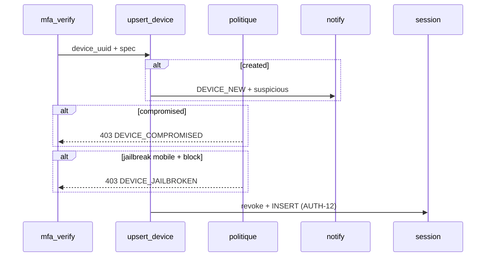

# AUTH-E — Appareils & reconnaissance (AUTH-27 … 36)

**Statut :** clos (2026-09-09) — lab [00-jour-5-auth-e.md](../00-jour-5-auth-e.md).  
**Produit :** YAS Connect uniquement (pas le SIRH).  
**Préalable :** Phase 0 + **AUTH-A** (upsert `devices`) + **AUTH-C** (MFA ; `trusted` **ne skip pas** l’OTP) — jours 1–4 **clos**.  
**Attributs / index :** [IAM](../../catalogues/IAM-catalogue-tables.md) · [INDEX](../../catalogues/INDEX-catalogue.md) · [CONFIG](../../catalogues/CONFIG-catalogue-tables.md).  
**Models :** [code/iam_models.py](../code/iam_models.py).

**Backlog produit « D. Appareils »** — le fichier AUTH-D est déjà l’**inscription**. Cet incrément = **AUTH-E** (IDs 27–36 inchangés).

**Périmètre :** fiche appareil, push token, nouveau device (alerte, pas de MFA en plus), confiance **déclarative**, jailbreak / compromis, révocation, liste / rename.

---


## Cartographie


| ID          | Fonctionnalité            | Comportement                                                                                         | Écritures                                      |
| ----------- | ------------------------- | ---------------------------------------------------------------------------------------------------- | ---------------------------------------------- |
| **AUTH-27** | Enregistrement appareil   | AUTH-11 + `jailbreak` client ; heartbeat `PATCH /me/devices/current`                                 | `devices`                                      |
| **AUTH-28** | Push token                | `PATCH` FCM/APNs **sans** re-login ; jamais renvoyé en GET                                           | `devices.push_token`                           |
| **AUTH-29** | Nouvel appareil           | 1re vue `(user, device_uuid)` : MFA **déjà** AUTH-C ; `login_history.suspicious=true` + event notif. **Nouveau pays** = [AUTH-I](AUTH-I-securite.md) AUTH-62 | history + `audit_logs`                         |
| **AUTH-30** | Marquer confiance         | `trusted=true` — **label UI uniquement**, pas de skip MFA                                            | `devices.trusted`                              |
| **AUTH-31** | Retirer confiance         | `trusted=false` ; sessions **inchangées**                                                            | `devices.trusted`                              |
| **AUTH-32** | Root / jailbreak          | Flag client ; blocage si `security.block_jailbreak` (mobile)                                         | `devices.jailbreak` ; éventuellement 403       |
| **AUTH-33** | Compromis                 | `compromised=true` → kill sessions + refresh + push vide ; login 403                                 | device + sessions                              |
| **AUTH-34** | Révoquer un appareil      | Idem kill + `trusted=false` ; ligne **conservée**                                                    | sessions, refresh, push                        |
| **AUTH-35** | Lister mes appareils      | `GET /me/devices` ; `is_current` via `session.device_id`                                             | lecture                                        |
| **AUTH-36** | Renommer                  | `PATCH` `device_name` (owner)                                                                        | `devices.device_name`                          |


**Hors incrément :** GeoIP `last_location`, attestation Play Integrity / DeviceCheck, table `trusted_devices`. Push FCM/APNs = [NOTIF-A](../notif_plans/NOTIF-A-in-app-push.md) (routage via `devices.platform`). Lier un 2ᵉ écran par QR = [AUTH-J](AUTH-J-lier-appareil-qr.md) (pas AUTH-E).

---


## Décisions figées


| Sujet | Choix |
|-------|--------|
| MFA nouvel appareil | Login MDP/LDAP : **pas** de 3ᵉ facteur — AUTH-C suffit. Lien par QR : TOTP sur le **téléphone** déjà connecté ([AUTH-J](AUTH-J-lier-appareil-qr.md)). AUTH-29 = **signal** (suspicious + notif) dans les deux cas |
| `trusted` | Marque « c’est le mien » pour l’UI / filtrage alertes. **AUTH-C inchangé** |
| Ligne `devices` | Jamais DELETE (revocation / compromis gardent l’historique) |
| `push_token` | **Write-only** API liste ; `is_sensitive` côté sérializer |
| Jailbreak WEB | Ignoré (pas de root navigateur) |
| Compromis | Owner (sauf appareil courant) **ou** admin |
| Notif NEW_DEVICE | `audit_logs` `DEVICE_NEW` + `NotificationService.emit(DEVICE_NEW)` ([NOTIF-A](../notif_plans/NOTIF-A-in-app-push.md) NOTIF-15) ; pas d’e-mail |


---


## Contrat HTTP

Tous les `/me/devices*` **et** les vues admin : `YasJWTAuthentication` + `HasPermission` ([AUTH-R](AUTH-R-roles-permissions.md) R05/R10). **Pas** de fallback rôle `ADMIN`.

### Delta login (AUTH-A `DeviceSpecSerializer`)

Ajouter :

```json
"jailbreak": false
```

Défaut `false`. `complete_login` (après MFA) applique AUTH-29 / 32 / 33.

**403** `DEVICE_COMPROMISED` — cet `device_uuid` est marqué compromis.  
**403** `DEVICE_JAILBROKEN` — mobile + `jailbreak=true` + politique bloquante.  
Message distinct (pas AUTH-05) : l’user est déjà authentifié facteur 1+2.

### `GET /api/v1/me/devices`

`required_permission = iam.device.read`.

**200** liste (sans `push_token`) :

```json
{
  "success": true,
  "data": {
    "devices": [
      {
        "id": "…",
        "device_uuid": "dev-1",
        "device_name": "iPhone de Jean",
        "platform": "IOS",
        "model": "iPhone 15",
        "app_version": "1.4.2",
        "trusted": true,
        "compromised": false,
        "jailbreak": false,
        "last_seen": "…",
        "ip_address": "196.x",
        "is_current": true
      }
    ]
  }
}
```

`is_current` = `device.id == request.auth.session.device_id`.

### `PATCH /api/v1/me/devices/current`

`required_permission = iam.device.update`.

Heartbeat / push / versions. Body partiel :

```json
{
  "push_token": "<fcm-or-apns>",
  "app_version": "1.4.3",
  "os_version": "18.0",
  "jailbreak": false
}
```

Identité appareil = celle de la **session** (pas un `device_uuid` forgé).  
**403** si `compromised` ou jailbreak bloquant.

### `PATCH /api/v1/me/devices/{id}`

`required_permission = iam.device.update`.

Owner only. Champs : `device_name` (AUTH-36), `trusted` (AUTH-30/31, bool).  
Pas de `compromised` / `jailbreak` ici (sauf heartbeat current).  
**404** si `id` d’un autre user.

### `POST /api/v1/me/devices/{id}/revoke` (AUTH-34)

`required_permission = iam.device.revoke`.

Owner. Kill sessions + refresh de **cet** appareil, `push_token=""`, `trusted=false`.  
Si c’est l’appareil **courant** : 200 puis le client n’a plus de session (équivalent logout cet appareil).  
**AUTH-54** ([AUTH-H](AUTH-H-sessions.md)) : tuer les sessions **sans** toucher push / trusted (relogin OK).

### `POST /api/v1/me/devices/{id}/compromise` (AUTH-33)

`required_permission = iam.device.compromise` (owner).

Owner, **interdit** sur `is_current` (400 `CANNOT_COMPROMISE_CURRENT` — utiliser revoke).  
Admin : `POST /api/v1/admin/devices/{id}/compromise` (`required_permission = iam.device.manage`) y compris courant (kill + 403 au prochain login).

Admin `POST /api/v1/admin/devices/{id}/clear-compromise` : même permission ; `compromised=false` (ne réactive pas `trusted`).

---


## Flux `complete_login` (delta AUTH-A)

Après MFA verify, **avant** INSERT session :



---


## 0. Apps et fichiers

```
apps/iam/
  services/device_service.py   # étendre AUTH-11
  services/notify_stub.py      # enqueue DEVICE_NEW (no-op log + audit)
  views_devices.py
  serializers.py               # DeviceOutSerializer (pas push_token)
```

```python
urlpatterns_me = [
    path("devices", DeviceListView.as_view()),
    path("devices/current", DeviceCurrentPatchView.as_view()),
    path("devices/<uuid:pk>", DevicePatchView.as_view()),
    path("devices/<uuid:pk>/revoke", DeviceRevokeView.as_view()),
    path("devices/<uuid:pk>/compromise", DeviceCompromiseView.as_view()),
]
# prefix /api/v1/me/
```

Delta IAM : `login_history.suspicious` (boolean, défaut `false`).

---


## 1. Settings

```env
# true = 403 DEVICE_JAILBROKEN sur IOS/ANDROID si spec.jailbreak
YAS_BLOCK_JAILBREAK=true
```

Ou `system_settings` `security.block_jailbreak` (bool, seed `true`). Lecture runtime comme LDAP AUTH-B.  
`.env` suffit pour AUTH-E si pas encore d’écran admin config.

```python
YAS_BLOCK_JAILBREAK = env.bool("YAS_BLOCK_JAILBREAK", default=True)
```

---


## 2. Upsert enrichi (AUTH-27 / 28 / 32)

Ne **pas** écraser `trusted` / `compromised` depuis le login.

```python
def upsert_device(*, user, spec: dict, ip) -> tuple[Device, bool]:
    now = timezone.now()
    jailbreak = bool(spec.get("jailbreak"))
    defaults = {
        "device_name": spec.get("device_name") or "",
        "model": spec.get("model") or "",
        "platform": spec["platform"],
        "os_version": spec.get("os_version") or "",
        "app_version": spec.get("app_version") or "",
        "device_fingerprint": spec.get("device_fingerprint"),
        "ip_address": ip,
        "last_seen": now,
        "jailbreak": jailbreak,
    }
    if spec.get("push_token"):
        defaults["push_token"] = spec["push_token"]
    device, created = Device.objects.update_or_create(
        user=user,
        device_uuid=spec["device_uuid"],
        defaults=defaults,
    )
    return device, created
```

`created=True` → AUTH-29 (après les 403 compromis/jailbreak : on **enregistre** quand même le device pour le SOC, mais **pas** de session).

Ordre recommandé :

1. upsert (toujours, pour tracer)
2. si `compromised` → 403 (history success=false, `DEVICE_COMPROMISED` — ajouter au `FailureReason` **ou** history succès=false + `suspicious=true` sans session)
3. si jailbreak bloquant → 403 `DEVICE_JAILBROKEN`
4. si `created` → notif + `suspicious` sur le history **succès** qui suit
5. session AUTH-12

Pour 403 après MFA : `login_history` échec, `user` connu, `device_id` posé (upsert déjà fait).

```python
class FailureReason(models.TextChoices):
    # … existants
    DEVICE_COMPROMISED = "DEVICE_COMPROMISED"
    DEVICE_JAILBROKEN = "DEVICE_JAILBROKEN"
```

---


## 3. AUTH-29 — nouvel appareil

```python
def on_new_device(*, user, device, ip) -> None:
    AuditLog.objects.create(
        trace_id=uuid.uuid4(),
        module="IAM",
        action="DEVICE_NEW",
        entity_type="devices",
        entity_id=device.id,
        severity="WARNING",
        success=True,
        user=user,
        ip_address=ip,
        metadata={"device_uuid": device.device_uuid, "platform": device.platform},
    )
    NotificationService.emit(
        user=user,
        type="DEVICE_NEW",
        title="Nouvel appareil",
        body="",
        payload={"device_id": str(device.id)},
        collapse_key=f"device:{device.id}",
    )
```

`complete_login` : `_history(..., suspicious=created)`.

`NotificationService.emit` : [NOTIF-15](../notif_plans/NOTIF-A-in-app-push.md). Push vers les **autres** appareils (`push_token` non vide, hors le nouveau). Si l’app `notifications` n’est pas encore migrée : `logger.info` + audit **suffisent**.

Appareil **déjà** `trusted` : la 1re insertion a `trusted=false` ; AUTH-29 s’applique **une fois**. Relogin même UUID : `created=False`, pas de nouvelle alerte.

---


## 4. AUTH-30 / 31 — confiance

```python
def set_trusted(*, user, device_id, trusted: bool) -> Device:
    device = Device.objects.get(id=device_id, user=user)
    if device.compromised and trusted:
        raise AuthAPIError(400, "DEVICE_COMPROMISED", "Appareil compromis.")
    device.trusted = trusted
    device.save(update_fields=["trusted", "updated_at"])
    return device
```

Pas d’impact MFA. Option UX : AUTH-29 e-mail « ce n’était pas moi » → l’user révoque (34) plutôt que untrust seul.

---


## 5. AUTH-32 — jailbreak

```python
def jailbreak_blocked(*, device: Device) -> bool:
    if device.platform not in (Device.Platform.IOS, Device.Platform.ANDROID):
        return False
    if not device.jailbreak:
        return False
    return settings.YAS_BLOCK_JAILBREAK
```

Politique `false` : login OK, flag stocké, liste UI affiche l’avertissement.

---


## 6. AUTH-33 / 34 — kill appareil

```python
def kill_device(*, device, reason: str) -> None:
    now = timezone.now()
    Session.objects.filter(device=device, is_active=True).update(
        is_active=False, revoked_at=now, revoke_reason=reason,
    )
    RefreshToken.objects.filter(session__device=device, revoked_at__isnull=True).update(
        revoked_at=now, revoked_reason=reason,
    )
    device.push_token = ""
    device.trusted = False
    if reason == "DEVICE_COMPROMISED":
        device.compromised = True
    device.save(update_fields=["push_token", "trusted", "compromised", "updated_at"])
```

`revoke` : `reason=DEVICE_REVOKED`, **sans** poser `compromised`.  
Relogin après revoke (même UUID, pas compromis) : **autorisé** (nouvel upsert, AUTH-29 si… non, ligne existante `created=False`). C’est voulu : révoquer = déconnecter, pas bannir l’install.

Après **compromise** : login 403 tant que admin `clear-compromise`.

---


## 7. Serializers (extrait)

```python
class DeviceOutSerializer(serializers.ModelSerializer):
    is_current = serializers.SerializerMethodField()

    class Meta:
        model = Device
        fields = (
            "id", "device_uuid", "device_name", "model", "platform",
            "os_version", "app_version", "trusted", "compromised",
            "jailbreak", "last_seen", "ip_address", "is_current",
        )

    def get_is_current(self, obj):
        current_id = self.context.get("current_device_id")
        return current_id is not None and obj.id == current_id


class DevicePatchSerializer(serializers.Serializer):
    device_name = serializers.CharField(max_length=128, required=False, allow_blank=True)
    trusted = serializers.BooleanField(required=False)
```

`DeviceSpecSerializer` AUTH-A : `jailbreak = BooleanField(required=False, default=False)`.

---


## 8. `complete_login` (queue AUTH-E)

```python
    device, created = upsert_device(user=user, spec=device_spec, ip=ip)

    if device.compromised:
        _history(..., success=False, reason="DEVICE_COMPROMISED", device=device)
        raise AuthAPIError(403, "DEVICE_COMPROMISED", "Appareil signalé compromis.")

    if jailbreak_blocked(device=device):
        _history(..., success=False, reason="DEVICE_JAILBROKEN", device=device)
        raise AuthAPIError(403, "DEVICE_JAILBROKEN", "Appareil non autorisé (root/jailbreak).")

    if created:
        on_new_device(user=user, device=device, ip=ip)

    revoke_active_sessions_for_device(device=device)
    # … session JWT comme AUTH-A
    _history(..., success=True, device=device, suspicious=created)
```

---


## 9. Tests


| ID  | Cas                                      | Attendu                                      |
| --- | ---------------------------------------- | -------------------------------------------- |
| 27  | 1er login MFA OK                         | 1 `devices` ; champs platform / model        |
| 27  | 2e login même uuid                       | 1 ligne ; `last_seen` MAJ                    |
| 28  | `PATCH current` push_token               | persisté ; **absent** du GET liste           |
| 29  | 1er uuid                                 | history `suspicious=true` ; audit `DEVICE_NEW` |
| 29  | 2e login même uuid                       | `suspicious=false`                           |
| 29  | `trusted=true`                           | MFA **toujours** required (AUTH-C)           |
| 30  | PATCH trusted true                       | GET `trusted=true`                           |
| 31  | PATCH trusted false                      | sessions encore actives                      |
| 32  | IOS jailbreak + block                    | 403 ; device.jailbreak true ; pas de session |
| 32  | WEB jailbreak true                       | 200 session                                  |
| 32  | block=false + ANDROID jailbreak          | 200 ; flag true                              |
| 33  | compromise autre device                  | sessions kill ; login 403                    |
| 33  | compromise current (owner)               | 400                                          |
| 34  | revoke                                   | session inactive ; relogin **OK**            |
| 35  | GET liste                                | `is_current` ; pas le device d’autrui        |
| 36  | PATCH name                               | GET reflète                                  |
| —   | GET device d’un autre user               | 404                                          |


---


## 10. Acceptation

- [x] Enregistrement = AUTH-11 enrichi ; liste / rename / push / confiance
- [x] Nouvel appareil (login MDP/LDAP) : alerte + `suspicious`, **sans** skip ni MFA extra
- [ ] Lien QR 2ᵉ écran : [AUTH-J](AUTH-J-lier-appareil-qr.md) (TOTP sur le téléphone) — lab [00-jour-6-auth-j.md](../00-jour-6-auth-j.md)
- [x] `trusted` n’ouvre **pas** de session sans TOTP
- [x] Jailbreak mobile bloquant configurable
- [x] Compromis / révocation tuent session + refresh + push
- [x] `/me/devices*` = JWT + owner ; admin = JWT + `IsAdminRole` (palier D05) ; AUTH-R → `iam.device.*`
- [x] `push_token` jamais en GET
- [x] Pas de DELETE `devices`
- [x] SIRH non modifié

---


## 11. Vérif manuelle

Login + MFA (AUTH-C) avec `device_uuid=dev-1`.  
`GET /api/v1/me/devices` → 1 ligne `is_current=true`.  
Second client `device_uuid=dev-2` → 2 lignes ; history du 2e login `suspicious=true`.  
`PATCH …/dev-1` `{ "trusted": true }` ; relogin `dev-1` → toujours `mfa_required`.
