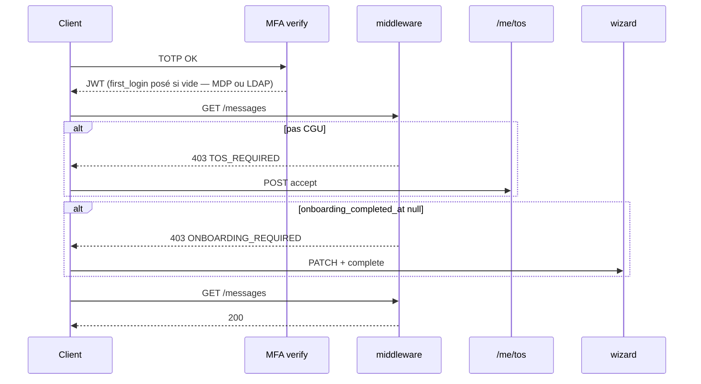

# AUTH-F — Première connexion & conformité (AUTH-37 … 42)

**Produit :** YAS Connect uniquement (pas le SIRH).  
**Préalable :** Phase 0 + **AUTH-A** + **AUTH-C** (JWT seulement après TOTP).  
**Attributs :** [IAM](../../catalogues/IAM-catalogue-tables.md) · [CONFIG](../../catalogues/CONFIG-catalogue-tables.md).  
**Models :** [code/iam_models.py](../code/iam_models.py).

**Backlog produit « Première connexion & conformité ».** AUTH-D = inscription, AUTH-E = appareils → cet incrément = **AUTH-F** (IDs 37–42).

**Périmètre :** détecter le 1er login (MDP **ou** LDAP), CGU, wizard (langue / fuseau / notifs), déblocage de l’app.

---


## Cartographie


| ID          | Statut        | Comportement                                                                 | Écritures |
| ----------- | ------------- | ---------------------------------------------------------------------------- | --------- |
| **AUTH-37** | **Gardé (adapté)** | `users.first_login` = **timestamptz**, posé dans `complete_login` (AUTH-A **et** AUTH-B / LDAP, après MFA). 1re connexion = il **était NULL**. Wizard = `onboarding_completed_at` NULL | `first_login` |
| **AUTH-38** | **Gardé (adapté)** | Wizard : langue, timezone, sons notif. **Pas** « MFA recommandé » : TOTP **déjà** obligatoire (AUTH-C). Écran = confirmation « MFA actif » | `user_preferences` + `users.language/timezone` |
| **AUTH-39** | **Abandonné** | Pas de changement MDP forcé à la 1re connexion | — |
| **AUTH-40** | **Gardé**     | Colonnes `tos_accepted_at`, `tos_version` (pas de table dédiée)              | `users` |
| **AUTH-41** | **Gardé**     | Sans acceptation (ou version périmée) : API métier **403 `TOS_REQUIRED`**. Pas de suppression de compte | — |
| **AUTH-42** | **Gardé (adapté)** | Fin wizard → `onboarding_completed_at=now()`. **Pas** `first_login=false` (ce n’est pas un booléen) | `users` |


**Hors incrément :** CMS des CGU, versioning juridique multi-langue en base, e-sign, recueil consentement cookies.

---


## Décisions figées


| Sujet | Choix |
|-------|--------|
| `first_login` | **Horodatage** posé par `complete_login` : login MDP (AUTH-A) **et** LDAP (AUTH-B). Ne **pas** en faire un booléen |
| Wizard terminé | `onboarding_completed_at` NULL = pas fini |
| CGU | `tos_accepted_at` = **quand** ; `tos_version` = **quelle** version des CGU. Courante = `legal.tos_version` |
| Refus | L’user ne POST pas `/tos/accept` ; session JWT OK mais **bloquée** (AUTH-41). Logout possible |
| Ordre des portes | **1. CGU** → **2. Wizard** → app |
| MFA dans le wizard | Déjà enrollé au login. Pas d’étape optionnelle |
| Seed `jean.dupont` | Portes **déjà fermées** (CGU + onboarding) pour ne pas casser AUTH-A |
| JWT | Émis **avant** les portes (après MFA). Le **middleware** filtre, pas un 2e login. Chaque vue JWT : `HasPermission` ([AUTH-R](AUTH-R-roles-permissions.md)) |


---


## Portes (middleware)

Après `YasJWTAuthentication`, `ComplianceMiddleware` :

```
tos_ok = tos_accepted_at IS NOT NULL AND tos_version == legal.tos_version courant
onb_ok = onboarding_completed_at IS NOT NULL
```

| Si KO | HTTP | Autorisé |
|-------|------|----------|
| `tos_ok` faux | **403** `TOS_REQUIRED` | `GET/POST /me/tos`, `GET /me`, `POST /auth/logout`, `POST /auth/logout-all`, `POST /auth/refresh`, `GET /me/sessions`, logout session/device, heartbeat |
| `onb_ok` faux | **403** `ONBOARDING_REQUIRED` | + `GET/PATCH /me/onboarding`, `POST /me/onboarding/complete` |

`GET /me` **toujours** autorisé (le client lit `gates`).  
Messagerie, annuaire, upload, `/me/devices`, etc. : **bloqués** tant que les 2 portes ne sont pas OK.

Refresh : autorisé (garder la session pendant le wizard).

---


## Contrat HTTP

JWT + `HasPermission` ([AUTH-R](AUTH-R-roles-permissions.md) R05/R10). Portes CGU/wizard **après** le check perm.

### `GET /api/v1/me` (extrait AUTH-F)

`required_permission = iam.profile.read`.

```json
{
  "success": true,
  "data": {
    "user": { },
    "gates": {
      "tos_required": true,
      "tos_current_version": "2026-08-01",
      "onboarding_required": true,
      "first_login_at": "2026-08-27T08:00:00Z"
    }
  }
}
```

`first_login_at` = `users.first_login` (posé au 1er `complete_login`, canal MDP **ou** LDAP).  
Objet `user` **complet** : [PROF-A](PROF-A-identite.md) (display_name, rôle, org, avatar).

### `GET /api/v1/me/tos`

`required_permission = iam.tos.manage`.

```json
{
  "success": true,
  "data": {
    "version": "2026-08-01",
    "url": "https://connect.yas.tg/legal/cgu/2026-08-01"
  }
}
```

Texte long : URL (front / site légal), pas un PDF en base.

**Pourquoi deux champs CGU**

| Champ | Question | Exemple |
|-------|----------|---------|
| `tos_accepted_at` | **Quand** l’user a cliqué « J’accepte » | `2026-08-27T08:05:00Z` |
| `tos_version` | **Quel texte** il a accepté | `2026-08-01` |

La version **en vigueur** est `legal.tos_version` (settings). Si YAS publie de nouvelles CGU (`2026-12-01`), l’user a encore `tos_version=2026-08-01` → `tos_ok` faux → 403 jusqu’à une nouvelle acceptation. `tos_accepted_at` seul ne suffirait pas (on ne saurait pas s’il a vu la **nouvelle** version).

### `POST /api/v1/me/tos/accept` (AUTH-40)

`required_permission = iam.tos.manage`.

```json
{ "version": "2026-08-01" }
```

`version` **doit** égaler `legal.tos_version` sinon **409** `TOS_VERSION_MISMATCH`.  
Écrit `tos_accepted_at=now()`, `tos_version`. Audit `TOS_ACCEPT`.

Pas d’endpoint « je refuse » obligatoire : ne pas appeler accept = AUTH-41. Optionnel `POST /me/tos/decline` → audit `TOS_DECLINE` seulement.

Changement de MDP **volontaire** : [AUTH-G](AUTH-G-mot-de-passe.md) `POST /me/password` (pas AUTH-39).

### `GET /api/v1/me/onboarding` (PROF-22)

`required_permission = iam.onboarding.manage`.  
JSON = [PROF-B](PROF-B-edition-preferences.md) `GET /me/preferences` (préremplissage, jamais un formulaire vide).

### `PATCH /api/v1/me/onboarding` (AUTH-38)

`required_permission = iam.onboarding.manage`.

```json
{
  "language": "fr",
  "timezone": "Africa/Lome",
  "notification_sound": true
}
```

Écrit `user_preferences` **et** `users.language` / `users.timezone` (même service que PROF-B).  
Ne pose **pas** `onboarding_completed_at`. Seuls ces 3 champs (pas `auto_download_media` / accusés / typing — réglages PROF-B).

### `POST /api/v1/me/onboarding/complete` (AUTH-42)

`required_permission = iam.onboarding.manage`.

Body vide. Exige `tos_ok` sinon 403 `TOS_REQUIRED`.  
`onboarding_completed_at=now()`. Audit `ONBOARDING_COMPLETE`.

Nouvelle version CGU plus tard : `legal.tos_version` change → `tos_ok` faux (version stockée ≠ courante) → re-acceptation, **sans** rejouer le wizard (`onboarding_completed_at` inchangé).

---


## Flux



---


## 0. Champs `users` (déjà dans `iam_models.py` / catalogue)

| Attribut | Type | Défaut | Sens |
|----------|------|--------|------|
| `first_login` | timestamptz | NULL | 1er `complete_login` (MDP ou LDAP). **Pas un booléen.** AUTH-42 ne le touche pas |
| `tos_accepted_at` | timestamptz | NULL | Quand il a accepté (AUTH-40) |
| `tos_version` | varchar(32) | NULL | Quelle version (ex. `2026-08-01`) |
| `onboarding_completed_at` | timestamptz | NULL | Wizard fini (AUTH-42). `NULL` = pas fini |

Inscription AUTH-D : les quatre restent **NULL**. Seed `jean.dupont` : CGU + onboarding **déjà** remplis (pas `first_login`).  
Pas de table `tos_acceptances` (un user = une version courante ; historique = `audit_logs`).  
Pas de `must_change_password` (AUTH-39 abandonné).

Pas de table `tos_acceptances` (un user = une version courante ; historique = `audit_logs`).

---


## 1. Settings / seed config

```env
YAS_TOS_VERSION=2026-08-01
YAS_TOS_URL=https://connect.yas.tg/legal/cgu/2026-08-01
```

Ou `system_settings` : `legal.tos_version`, `legal.tos_url`.

`seed_iam` : jean.dupont → `tos_accepted_at=now`, `tos_version=YAS_TOS_VERSION`, `onboarding_completed_at=now`.

Comptes RH / AUTH-D : CGU et wizard à faire (champs NULL).

---


## 2. Middleware (extrait)

```python
ALLOW_ALWAYS = (
    "/api/v1/me",
    "/api/v1/me/tos",
    "/api/v1/me/sessions",
    "/api/v1/auth/logout",
    "/api/v1/auth/logout-all",
    "/api/v1/auth/refresh",
)

def _path_ok(path: str, prefixes: tuple) -> bool:
    return any(path == p or path.startswith(p + "/") for p in prefixes)


class ComplianceMiddleware:
    def __init__(self, get_response):
        self.get_response = get_response

    def __call__(self, request):
        user = getattr(request, "user", None)
        if user is None or not user.is_authenticated:
            return self.get_response(request)
        path = request.path
        if _path_ok(path, ALLOW_ALWAYS):
            return self.get_response(request)

        current_tos = get_tos_version()  # settings ou system_settings
        tos_ok = bool(user.tos_accepted_at) and user.tos_version == current_tos
        if not tos_ok:
            return error_response(AuthAPIError(403, "TOS_REQUIRED", "Acceptation des CGU requise."))

        if user.onboarding_completed_at is None:
            if path.startswith("/api/v1/me/onboarding"):
                return self.get_response(request)
            return error_response(AuthAPIError(
                403, "ONBOARDING_REQUIRED", "Finalisez la configuration du compte.",
            ))

        return self.get_response(request)
```

---


## 3. Services (extrait)

```python
def accept_tos(*, user, version: str) -> None:
    current = get_tos_version()
    if version != current:
        raise AuthAPIError(409, "TOS_VERSION_MISMATCH", "Version des CGU obsolète.")
    user.tos_accepted_at = timezone.now()
    user.tos_version = version
    user.save(update_fields=["tos_accepted_at", "tos_version", "updated_at"])
    AuditLog.objects.create(
        trace_id=uuid.uuid4(), module="IAM", action="TOS_ACCEPT",
        entity_type="users", entity_id=user.id, success=True, severity="INFO",
        user=user, metadata={"version": version},
    )


def complete_onboarding(*, user) -> None:
    if user.onboarding_completed_at:
        return
    user.onboarding_completed_at = timezone.now()
    user.save(update_fields=["onboarding_completed_at", "updated_at"])
    AuditLog.objects.create(
        trace_id=uuid.uuid4(), module="IAM", action="ONBOARDING_COMPLETE",
        entity_type="users", entity_id=user.id, success=True, severity="INFO",
        user=user,
    )
```

`complete_login` : **inchangé** pour `first_login` (si NULL → now). Sert AUTH-A **et** AUTH-B. Ne touche pas aux portes AUTH-F.

---


## 4. Tests


| ID  | Cas | Attendu |
| --- | --- | -------- |
| 37  | 1er login MDP (`complete_login`) | `first_login` posé |
| 37  | 1er login **LDAP** (jamais MDP avant) | `first_login` posé pareil |
| 37  | 2e login (MDP ou LDAP) | `first_login` **inchangé** |
| 37  | JWT + `onboarding_completed_at` NULL | `gates.onboarding_required=true` |
| 38  | PATCH langue/tz/son | prefs + `users.language` |
| 38  | GET onboarding user neuf | 200 ; `language=fr`, tz Lomé, son true (PROF-22) |
| 38  | pas d’endpoint « skip MFA » | assert 404 |
| 40  | POST accept bonne version | `tos_accepted_at` posé |
| 38  | GET onboarding user neuf | 200 ; `language=fr`, tz Lomé, son true |
| 41  | pas d’accept + GET messages | 403 `TOS_REQUIRED` |
| 41  | GET /me | 200 + `tos_required` |
| 42  | complete sans CGU | 403 TOS |
| 42  | complete OK | `onboarding_completed_at` ; GET messages 200 |
| —   | seed jean.dupont | 2 portes déjà OK |
| —   | `legal.tos_version` bump | 403 TOS même si onboarding fini |


---


## 5. Acceptation

- [ ] `first_login` timestamp via `complete_login` (AUTH-A **et** AUTH-B)
- [ ] Wizard = `onboarding_completed_at` (pas un booléen `first_login`)
- [ ] CGU : `tos_accepted_at` + `tos_version` ; refus = blocage API
- [ ] Pas de changement MDP forcé (AUTH-39 abandonné)
- [ ] Wizard langue / tz / notifs ; MFA déjà AUTH-C ; GET préremplit (PROF-22)
- [ ] Middleware : CGU → onboarding
- [ ] Seed test sans régression AUTH-A
- [ ] Chaque vue JWT : `HasPermission` (AUTH-R) ; portes **après** le check perm
- [ ] SIRH non modifié

---


## 6. Vérif manuelle

Compte neuf (pas de CGU) : login MDP **ou** LDAP + MFA → JWT ; `first_login` posé.  
`GET /api/v1/me` → `tos_required` / `onboarding_required`.  
`GET /api/v1/…/messages` → 403 `TOS_REQUIRED`.  
Accept CGU → wizard PATCH + complete → messages 200.
