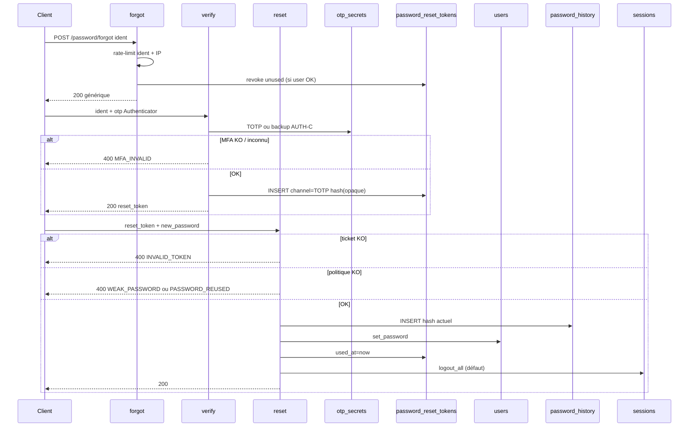

# AUTH-G — Mot de passe (AUTH-43 … 50)

**Produit :** YAS Connect uniquement (pas le SIRH).  
**Préalable :** Phase 0 + **AUTH-A** + **AUTH-C** (TOTP Google Authenticator) + **AUTH-D** (`enforce_password_policy`).  
**Attributs :** [IAM](../../catalogues/IAM-catalogue-tables.md) · [CONFIG](../../catalogues/CONFIG-catalogue-tables.md) · [INDEX](../../catalogues/INDEX-catalogue.md).  
**Models :** [code/iam_models.py](../code/iam_models.py).

**Backlog produit « Mot de passe ».** AUTH-F = CGU / wizard → cet incrément = **AUTH-G** (IDs 43–50).

**Périmètre :** changement connecté, politique `system_settings`, anti-réemploi, forgot, preuve **Google Authenticator** (même TOTP AUTH-C), token reset one-shot + TTL, logout-all, rate-limit.

---


## Cartographie


| ID | Statut | Comportement | Écritures |
|----|--------|--------------|-----------|
| **AUTH-43** | **Gardé** | JWT : ancien + nouveau MDP **applicatif**. Option `logout_others` | `users.password_hash`, `password_history`, sessions si logout |
| **AUTH-44** | **Gardé** | Complexité lue dans `system_settings` (`security.password_*`). Même règles que AUTH-D | lecture config |
| **AUTH-45** | **Gardé** | Nouveau MDP ≠ hash actuel **ni** les N derniers `password_history` | `password_history` |
| **AUTH-46** | **Gardé** | `POST /auth/password/forgot` : toujours **200** générique (anti-énumération). **Aucun** envoi | audit |
| **AUTH-47** | **Gardé (adapté)** | Canal = **TOTP Google Authenticator** (réutilise AUTH-C). **Pas** EMAIL / SMS / APPEL | — (preuve) |
| **AUTH-48** | **Gardé (adapté)** | TOTP (ou code secours AUTH-22) OK → ticket opaque hashé, TTL, **un usage**. Verify **ne consomme pas** le ticket | `password_reset_tokens` |
| **AUTH-49** | **Gardé** | Ticket + nouveau MDP + politique + historique. `logout_all` **défaut true** | hash, history, tokens `used_at`, sessions |
| **AUTH-50** | **Gardé** | Rate-limit identifiant **et** IP (forgot, verify, reset). Forgot reste **200** si throttlé | audit si limité |


**Hors incrément :** SMTP / SMS / IVR (canaux diagramme **abandonnés** pour le reset), unlock auto après reset, changement du MDP **Active Directory**, expiration MDP périodique, AUTH-39 (déjà abandonné). Reset MDP **admin** = [ADMIN-A](ADMIN-A-lifecycle-audit.md) ADM-05.

---


## Décisions figées


| Sujet | Choix |
|-------|--------|
| Secret concerné | **Uniquement** le MDP applicatif (`users.password_hash`, Argon2id). **Jamais** le MDP AD |
| User LDAP | Peut changer / reset le MDP **app**. Le bind AUTH-13 inchangé |
| Politique | **Une** source : `system_settings` catégorie `security`. AUTH-D D02/D03 appelle le **même** `enforce_password_policy` |
| Réemploi | Actuel + N lignes history (N = `password_history_n`, défaut **5**) |
| Forgot existence | Toujours **200**, même message. Pas de 404 « email inconnu » |
| Canal AUTH-47 | **Google Authenticator** uniquement (TOTP AUTH-C, 6 chiffres, ±30 s). Pas de lien mail, pas de SMS, pas d’appel |
| Codes secours | **Oui** : même `_verify_totp` / backup AUTH-C (perte de téléphone, codes déjà affichés une fois) |
| Sans enroll MFA | Pas de reset self-service (verify = même 400 que TOTP faux). Il faut s’être enrollé au 1er login |
| Envoi | **Aucun** (pas de stub SMTP). Le code est **déjà** dans l’app Authenticator |
| Ticket | AUTH-48 OK → `password_reset_tokens` `reset_channel=TOTP`, `token_hash` = SHA-256 d’un opaque (pas le TOTP) |
| Verify | **Ne pose pas** `used_at` (l’écran nouveau MDP peut se recharger) |
| Reset | Pose `used_at` ; ticket used / expiré / révoqué → **400** `INVALID_TOKEN` |
| Nouveau forgot | Révoque les tickets unused du user |
| Reset ≠ unlock | `is_locked` / disabled / pending : forgot 200 no-op ; verify 400 générique |
| Logout | AUTH-43 : `logout_others` défaut **false**. AUTH-49 : `logout_all` défaut **true** |
| MFA après reset | Prochain **login** = TOTP encore (AUTH-C). Le reset n’est **pas** un login |
| Portes AUTH-F | `/me/password` bloqué si CGU / wizard KO. Forgot / verify / reset = **public** (pas de RBAC) |
| RBAC | `POST /me/password` : `HasPermission` `iam.password.change` ([AUTH-R](AUTH-R-roles-permissions.md)) |


---


## Contrat HTTP

### `POST /api/v1/me/password` (AUTH-43, JWT)

`required_permission = iam.password.change` ([AUTH-R](AUTH-R-roles-permissions.md)).

```json
{
  "old_password": "Secret123!",
  "new_password": "SecretApp456!",
  "logout_others": false
}
```

| Code | Cas |
|------|-----|
| **200** | Hash remplacé ; history archivée |
| **400** | `INVALID_OLD_PASSWORD` / `WEAK_PASSWORD` / `PASSWORD_REUSED` / `SAME_PASSWORD` |
| **401** | pas de JWT |
| **403** | portes AUTH-F (`TOS_REQUIRED` / `ONBOARDING_REQUIRED`) |

`SAME_PASSWORD` si `new_password` = `old_password`.  
Mauvais ancien : **400**.  
`logout_others=true` : sessions **sauf** la courante (`revoke_reason=PASSWORD_CHANGE`).

### `POST /api/v1/auth/password/forgot` (AUTH-46/50, public)

Pas de JWT → pas de `HasPermission`. Toujours **200** générique.

```json
{ "email": "jean.dupont@yas.tg" }
```

`email` **ou** `username` (xor, AUTH-A). **Pas** de champ `channel`.

**Toujours 200 :**

```json
{
  "success": true,
  "message": "Si un compte correspond, saisissez le code Google Authenticator."
}
```

Rate-limit dépassé : **200** identique, audit `PASSWORD_FORGOT_RATE_LIMITED`.  
Si user envoyable : révoquer tickets unused (pas d’INSERT ici).

### `POST /api/v1/auth/password/reset/verify` (AUTH-47/48, public)

```json
{
  "email": "jean.dupont@yas.tg",
  "otp": "123456"
}
```

Identifiant obligatoire. `otp` = code Authenticator **ou** `backup_code` (xor, même règle AUTH-C).

TOTP / backup OK **et** enroll fini (`otp_secrets.enabled`) → INSERT ticket, **200** :

```json
{
  "success": true,
  "data": {
    "reset_token": "<opaque, une seule fois>",
    "expires_in": 600
  }
}
```

Sinon **400** `MFA_INVALID` — **même** body si user inconnu, pas d’enroll, TOTP faux, backup faux, pending / locked / disabled.

Verify **ne** consomme **pas** le ticket (`used_at` NULL). Un 2e verify TOTP OK **révoque** l’ancien ticket unused et en émet un nouveau.

### `POST /api/v1/auth/password/reset` (AUTH-49, public)

```json
{
  "reset_token": "<opaque>",
  "new_password": "SecretApp456!",
  "logout_all": true
}
```

Pas de TOTP ici : le ticket **est** la preuve AUTH-48.  
`logout_all` défaut **true** (`revoke_reason=PASSWORD_RESET`).

**400** `INVALID_TOKEN` / `WEAK_PASSWORD` / `PASSWORD_REUSED`.

---


## Flux



Changement connecté (AUTH-43) : `check_password(old)` → `rotate_password`, **sans** TOTP extra (JWT déjà post-MFA).

---


## 0. Tables

Pas de nouvelle colonne `users`. Pas d’e-mail en base.

| Table | Rôle AUTH-G |
|-------|-------------|
| `otp_secrets` | Preuve AUTH-47/48 (lecture ; backup éventuellement consommé) |
| `password_reset_tokens` | Ticket **après** TOTP OK. `reset_channel=TOTP` toujours |
| `password_history` | AUTH-45 |
| `users.password_hash` | Hash courant |
| `sessions` / `refresh_tokens` | Logout |
| `audit_logs` | `PASSWORD_CHANGE` / `PASSWORD_RESET` / `PASSWORD_FORGOT` |

`token_hash` : SHA-256 du **reset_token** opaque (32 bytes urlsafe), **pas** du code TOTP.  
`EMAIL` / `SMS` / `APPEL` : valeurs d’enum **non écrites** (diagramme abandonné pour ce flux).

---


## 1. Settings / seed config

```env
PASSWORD_HISTORY_N=5
PASSWORD_RESET_TTL_SECONDS=600
PASSWORD_FORGOT_RATE_LIMIT=3
PASSWORD_FORGOT_RATE_LIMIT_IP=10
PASSWORD_FORGOT_WINDOW_SECONDS=900
```

`system_settings` (AUTH-44 — **prioritaires** si présents) :

| category | setting_key | Défaut | Sens |
|----------|-------------|--------|------|
| `security` | `password_min_length` | `10` | AUTH-D inchangé |
| `security` | `password_max_length` | `128` | |
| `security` | `password_require_upper` | `true` | ≥ 1 majuscule |
| `security` | `password_require_lower` | `true` | |
| `security` | `password_require_digit` | `true` | |
| `security` | `password_require_special` | `true` | charset AUTH-D |
| `security` | `password_history_n` | `5` | AUTH-45 |
| `security` | `password_reset_ttl_seconds` | `600` | vie du ticket **après** TOTP OK |

TOTP : paramètres AUTH-C (`digits=6`, `period=30`, `valid_window=1`). Pas de 2e config.

---


## 2. Fichiers à ajouter / toucher

```
apps/iam/
  services/password_policy.py
  services/password_service.py    # rotate, forgot, verify (délègue AUTH-C), reset
  services/mfa_service.py         # _verify_totp / backup (AUTH-C) — réutiliser
  serializers_password.py
  views_password.py
  urls.py
apps/iam/models.py
apps/config/                      # seed security.password_*
```

```python
path("me/password", PasswordChangeView.as_view()),
path("auth/password/forgot", PasswordForgotView.as_view()),
path("auth/password/reset/verify", PasswordResetVerifyView.as_view()),
path("auth/password/reset", PasswordResetView.as_view()),
```

`authentication_classes = []` sur forgot / verify / reset.

---


## 3. Services (extrait)

```python
def request_reset(*, ident_email, ident_username, ip, ua) -> None:
    if is_forgot_limited(ident_email or ident_username, ip):
        audit("PASSWORD_FORGOT_RATE_LIMITED", success=False)
        return
    user = lookup_user(ident_email, ident_username)
    if user is None or user.pending_approval or not user.is_active or user.is_locked:
        return
    PasswordResetToken.objects.filter(
        user=user, used_at__isnull=True, revoked_at__isnull=True,
    ).update(revoked_at=timezone.now())
    audit("PASSWORD_FORGOT", user=user, metadata={"channel": "TOTP"})


def verify_reset_mfa(*, ident_email, ident_username, otp=None, backup_code=None, ip) -> str:
    """400 MFA_INVALID unique. Retourne reset_token clair (une fois)."""
    user = lookup_user(ident_email, ident_username)
    rec = getattr(user, "otp_secret", None) if user else None
    dummy = False
    if (
        user is None
        or user.pending_approval
        or not user.is_active
        or user.is_locked
        or rec is None
        or not rec.enabled
    ):
        dummy = True
        user_for_verify = None
    else:
        user_for_verify = user
    ok = False
    if not dummy:
        if otp:
            ok = _verify_totp(user_for_verify, otp)  # AUTH-C
        elif backup_code:
            ok = consume_backup_code(user_for_verify, backup_code)  # AUTH-C
    if dummy or not ok:
        raise AuthAPIError(400, "MFA_INVALID", "Code invalide.")
    now = timezone.now()
    PasswordResetToken.objects.filter(
        user=user, used_at__isnull=True, revoked_at__isnull=True,
    ).update(revoked_at=now)
    raw = secrets.token_urlsafe(32)
    PasswordResetToken.objects.create(
        user=user,
        token_hash=hash_token(raw),
        reset_channel=ResetChannel.TOTP,
        requested_ip=ip,
        expires_at=now + timedelta(seconds=get_reset_ttl()),
    )
    return raw
```

`rotate_password` / `revoke_sessions` : inchangés (AUTH-43 / 49).

---


## 4. Tests (acceptation)


| ID | Cas | Attendu |
|----|-----|---------|
| 43 | ancien OK + nouveau conforme | 200 ; history +1 ; login ancien → 401 |
| 43 | ancien faux | 400 `INVALID_OLD_PASSWORD` |
| 43 | `logout_others=true` | autres sessions inactives |
| 44 | trop court | 400 `WEAK_PASSWORD` |
| 45 | réemploi N derniers | 400 `PASSWORD_REUSED` |
| 46 | email inconnu | **200** même message ; 0 ticket |
| 46 | jean.dupont | 200 ; **pas** d’e-mail / SMS |
| 47 | TOTP Google Authenticator OK | 200 `reset_token` ; `reset_channel=TOTP` |
| 47 | `channel=EMAIL` dans le body | **400** validation (champ interdit) |
| 47 | pas d’enroll MFA | 400 `MFA_INVALID` (comme TOTP faux) |
| 48 | 2e verify OK | nouveau ticket ; ancien `revoked_at` |
| 48 | verify ne pose pas `used_at` | ticket encore utilisable pour 49 |
| 49 | reset OK | hash changé ; `used_at` ; 2e reset → 400 `INVALID_TOKEN` |
| 49 | `logout_all` défaut | 0 session active |
| 49 | user LDAP | hash **app** seulement |
| 49 | backup AUTH-22 à la place du TOTP | 200 puis reset OK ; hash backup retiré |
| 50 | 4e forgot / 900 s | 200 ; audit rate-limit |
| — | pending / locked / disabled | forgot 200 ; verify 400 `MFA_INVALID` |


---


## Critères d’acceptation

- [ ] Changement connecté : ancien + nouveau ; jamais le hash en JSON
- [ ] Politique = `system_settings` ; AUTH-D et AUTH-G partagent `password_policy.py`
- [ ] Anti-réemploi N hashes + hash courant
- [ ] Forgot : 200 unique ; **zéro** envoi mail/SMS/appel
- [ ] Preuve reset = Google Authenticator (TOTP AUTH-C) ou code secours
- [ ] Ticket opaque after TOTP : hashé, one-shot, TTL
- [ ] Reset : `logout_all` défaut true ; prochain login encore TOTP
- [ ] Rate-limit identifiant **et** IP ; forgot jamais 429
- [ ] Pas de changement MDP AD
- [ ] `POST /me/password` = `iam.password.change` ; forgot / verify / reset publics (AUTH-R)
- [ ] Spec seulement

---


## Écarts documents liés

- **AUTH-C** : même TOTP / backup ; AUTH-G ne crée pas un 2e secret. Reset **MFA** admin = AUTH-24 (perte d’Authenticator), distinct du reset **MDP**.
- **Diagramme** EMAIL / SMS / APPEL : **non livrés** pour le mot de passe oublié (comme pas de SMS OTP au login).
- **AUTH-D** : politique MDP partagée.
- **AUTH-A** : forgot → ce plan. Logout-all **endpoint** = [AUTH-H](AUTH-H-sessions.md) ; AUTH-G appelle le même `revoke_sessions`.
- **AUTH-F** : changement volontaire = AUTH-43.
- **AUTH-R** : `/me/password` = `iam.password.change` ; forgot/verify/reset restent publics.
- **AUTH-B** : deux secrets (app ≠ AD).
- **Tome 2** e-mail de reset / min 12 : **non repris** (TOTP ; min **10**).
