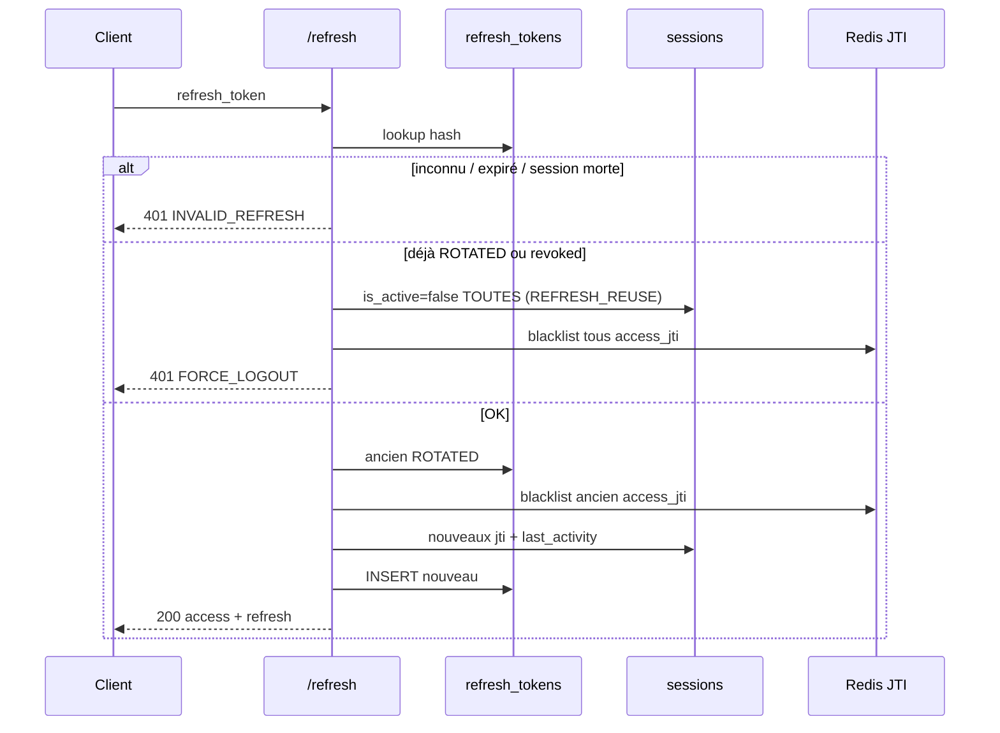

# AUTH-H — Sessions, refresh, déconnexion (AUTH-51 … 60)

**Statut :** clos (2026-09-10) — lab [00-jour-9-auth-h.md](../00-jour-9-auth-h.md).  
**Produit :** YAS Connect uniquement (pas le SIRH).  
**Préalable :** Phase 0 + **AUTH-A** (session + `POST /refresh`) + **AUTH-C** (refresh **sans** OTP).  
**Attributs :** [IAM](../../catalogues/IAM-catalogue-tables.md) · [CONFIG](../../catalogues/CONFIG-catalogue-tables.md) · [INDEX](../../catalogues/INDEX-catalogue.md).  
**Models :** [code/iam_models.py](../code/iam_models.py).

**Backlog produit « Sessions, refresh, déconnexion ».** AUTH-G = mot de passe → cet incrément = **AUTH-H** (IDs 51–60).

**Périmètre :** rotation refresh, vol de token (`FORCE_LOGOUT`), logout courant / distant / partout, liste, idle, expiration **absolue**, blacklist JTI, heartbeat `last_activity`.

---


## Cartographie


| ID | Statut | Comportement | Écritures |
|----|--------|--------------|-----------|
| **AUTH-51** | **Gardé (précisé)** | `POST /refresh` : nouvel access + nouvel refresh. Ancien refresh `ROTATED`. Pas d’OTP | `refresh_tokens`, `sessions.access_jti` / `refresh_*`, Redis JTI |
| **AUTH-52** | **Gardé (précisé)** | Réuse d’un refresh **déjà** `ROTATED` / révoqué → kill **toutes** les sessions + **401 `FORCE_LOGOUT`** | sessions, refresh, Redis, audit |
| **AUTH-53** | **Gardé** | `POST /auth/logout` : session **courante** seulement | session + refresh + JTI |
| **AUTH-54** | **Gardé** | Logout **1** session (`session_id`) **ou** toutes les sessions d’un `device_id`. Ligne `devices` **inchangée** (≠ AUTH-E-34) | sessions de la cible |
| **AUTH-55** | **Gardé** | `POST /auth/logout-all` : partout, y compris courant. Même service qu’AUTH-G (`PASSWORD_*`) | toutes sessions user |
| **AUTH-56** | **Gardé** | `GET /me/sessions` : appareil, IP, `last_activity`, `is_current` | lecture |
| **AUTH-57** | **Gardé** | Idle : `last_activity` trop vieux → `revoke_reason=INACTIVITY` (middleware **et** job) | sessions |
| **AUTH-58** | **Gardé (adapté)** | `sessions.expires_at` = fin **absolue** depuis `login_at` (**pas** le TTL access 15 min) | `expires_at` au login ; check ensuite |
| **AUTH-59** | **Gardé** | Redis `jti:{access_jti}` jusqu’à `exp` du JWT. Redis down → fallback session DB (AUTH-A) | Redis |
| **AUTH-60** | **Gardé** | Heartbeat : debounce middleware (60 s) + `POST /me/sessions/current/heartbeat`. **Pas** `users.status` | `last_activity` |


**Hors incrément :** refresh cookie httpOnly (tokens JSON comme AUTH-A), step-up OTP au refresh. Kick admin d’un autre user = [ADMIN-A](ADMIN-A-lifecycle-audit.md) ADM-06. Pastille = [PRES-A](PRES-A-presence.md).

---


## Décisions figées


| Sujet | Choix |
|-------|--------|
| AUTH-51 vs AUTH-10 | **Même** endpoint. AUTH-A émet le 1er couple ; AUTH-H spécifie rotation, idle, plafond absolu, blacklist |
| OTP au refresh | **Non** (AUTH-C inchangé) |
| `sessions.expires_at` | Durée de vie **session** (`login_at` + absolu, défaut **30 j**). Le 15 min reste dans le JWT `exp` |
| Idle | Défaut **7 j** sans `last_activity` → INACTIVITY |
| Refresh TTL | Toujours 7 j **mais** `refresh.expires_at` ≤ `session.expires_at` |
| Réuse | Token **trouvé** et déjà `ROTATED` / `revoked_at` → `FORCE_LOGOUT`. Hash inconnu → **401 `INVALID_REFRESH`** (pas de kill global) |
| AUTH-54 vs AUTH-E-34 | 54 = tuer des **sessions** (relogin OK, push/trusted intacts). 34 = révoquer l’**appareil** (push vide, `trusted=false`) |
| Logout-all | AUTH-55 = endpoint user. AUTH-G / AUTH-E appellent `revoke_sessions` (motifs différents) |
| Blacklist | En **plus** de `sessions.is_active` : coupe l’access encore non expiré sans attendre le TTL JWT |
| Heartbeat | N’écrit **pas** la pastille présence |
| Portes AUTH-F | `logout`, `logout-all`, `refresh`, `GET /me/sessions`, logout distant, heartbeat : **autorisés** (sécurité / wizard) |
| RBAC | Chaque vue JWT : `HasPermission` ([AUTH-R](AUTH-R-roles-permissions.md)). `POST /refresh` reste public |


---


## Contrat HTTP

### `POST /api/v1/auth/refresh` (AUTH-51/52, public)

```json
{ "refresh_token": "<opaque>" }
```

**200** — même forme login (nouveaux `access_token` + `refresh_token`, `expires_in` access).  
Bump `last_activity`. Blacklist l’**ancien** `access_jti`. Session `access_jti` / `refresh_jti` / `refresh_hash` remplacés.

| Code | Cas |
|------|-----|
| **401** `INVALID_REFRESH` | inconnu, expiré (refresh ou session absolue / idle), session inactive |
| **401** `FORCE_LOGOUT` | réuse d’un refresh déjà `ROTATED` ou révoqué (AUTH-52) |

Pas d’OTP. `authentication_classes = []`. Pas de `HasPermission` (pas de JWT).

### `POST /api/v1/auth/logout` (AUTH-53, JWT)

`required_permission = iam.session.logout`.

Body vide. Session **courante** : `is_active=false`, `revoke_reason=LOGOUT`, refresh révoqués, JTI blacklist. **200**.  
Déjà dans AUTH-F `ALLOW_ALWAYS`.

### `POST /api/v1/auth/logout-all` (AUTH-55, JWT)

`required_permission = iam.session.logout`.

Body vide. Toutes les sessions du user, `revoke_reason=LOGOUT_ALL`, tous les JTI access encore vivants. **200** puis le client n’a plus de session.

### `GET /api/v1/me/sessions` (AUTH-56, JWT)

`required_permission = iam.session.read`.

```json
{
  "success": true,
  "data": {
    "sessions": [
      {
        "id": "<uuid>",
        "device_id": "<uuid>",
        "device_name": "iPhone de Jean",
        "platform": "IOS",
        "ip_address": "10.0.0.12",
        "login_at": "2026-08-27T08:00:00Z",
        "last_activity": "2026-08-27T10:15:00Z",
        "login_method": "PASSWORD",
        "is_current": true
      }
    ]
  }
}
```

Actives seulement (`is_active=true` et pas idle / pas `expires_at` dépassé). Jamais `refresh_hash` / JTI.

### `POST /api/v1/me/sessions/{id}/logout` (AUTH-54, JWT)

`required_permission = iam.session.logout`.

Owner. Kill cette session. `{id}` = session courante → même effet qu’AUTH-53.  
**404** si autre user.

### `POST /api/v1/me/devices/{id}/logout` (AUTH-54, JWT)

`required_permission = iam.session.logout`.

Owner. Kill **toutes** les sessions de cet appareil. **Ne pas** vider `push_token` / `trusted` (ça c’est AUTH-E-34).

### `POST /api/v1/me/sessions/current/heartbeat` (AUTH-60, JWT)

`required_permission = iam.session.heartbeat`.

Body vide. `last_activity=now()` si le dernier write date de ≥ 60 s (sinon 200 no-op). **200** `{ "last_activity": "…" }`.

---


## Flux refresh + vol



---


## 0. Tables (delta)

Pas de nouvelle table. **Sémantique** `sessions.expires_at` :

| Avant (AUTH-A) | AUTH-H |
|----------------|--------|
| `now + 15 min` (TTL access) | `login_at + session_absolute` (défaut **30 j**) |

Access 15 min = claim JWT `exp` uniquement.  
`complete_login` (AUTH-A) : **delta** `expires_at=now + SESSION_ABSOLUTE_SECONDS`.

Motifs `revoke_reason` ajoutés : `LOGOUT`, `LOGOUT_ALL`, `INACTIVITY`, `EXPIRED`, `REFRESH_REUSE` (plus `PASSWORD_*` AUTH-G, `DEVICE_*` AUTH-E).

---


## 1. Settings / seed

```env
YAS_JWT_ACCESS_TTL_SECONDS=900
YAS_JWT_REFRESH_TTL_SECONDS=604800
SESSION_IDLE_SECONDS=604800
SESSION_ABSOLUTE_SECONDS=2592000
SESSION_HEARTBEAT_MIN_SECONDS=60
```

Ou `system_settings` :

| category | setting_key | Défaut | Sens |
|----------|-------------|--------|------|
| `security` | `session_idle_seconds` | `604800` | AUTH-57 |
| `security` | `session_absolute_seconds` | `2592000` | AUTH-58 |
| `security` | `session_heartbeat_min_seconds` | `60` | AUTH-60 debounce |

Job `scheduled_jobs` : `session_reaper`, cron `*/5 * * * *`, handler `apps.iam.jobs.reap_sessions` (comme `ldap_sync_users`).

---


## 2. Fichiers

Chemins **lab** (voir [00-jour-9-auth-h.md](../00-jour-9-auth-h.md)) — pas de `views_session.py` à la racine IAM :

```
apps/iam/services/session_service.py   # revoke_sessions (partagé G/E/H)
apps/iam/services/token_service.py     # issue_refresh : cap session.expires_at
apps/iam/services/jti_blacklist.py     # cache Django AUTH-59
apps/iam/jobs.py                       # reap_sessions
apps/iam/views/sessions.py
apps/iam/serializers/sessions.py
apps/iam/middlewares/authentication.py # idle + absolu + blacklist + heartbeat debounce
apps/config/                           # seed job + settings
```

```python
path("auth/refresh", RefreshView.as_view()),          # AUTH-A, comportement H
path("auth/logout", LogoutView.as_view()),
path("auth/logout-all", LogoutAllView.as_view()),
path("me/sessions", SessionListView.as_view()),
path("me/sessions/current/heartbeat", HeartbeatView.as_view()),
path("me/sessions/<uuid:pk>/logout", SessionLogoutView.as_view()),
path("me/devices/<uuid:pk>/logout", DeviceSessionsLogoutView.as_view()),
```

---


## 3. Services (extrait)

```python
def session_dead(session, now) -> str | None:
    if not session.is_active:
        return "INACTIVE"
    if session.expires_at <= now:
        return "EXPIRED"
    idle = get_idle_seconds()
    if session.last_activity + timedelta(seconds=idle) <= now:
        return "INACTIVITY"
    return None


def rotate_refresh(*, raw: str, ip) -> dict:
    digest = hash_refresh_token(raw)
    row = RefreshToken.objects.select_related("session", "user").filter(token_hash=digest).first()
    if row is None:
        raise AuthAPIError(401, "INVALID_REFRESH", "Session expirée. Reconnectez-vous.")
    if row.revoked_at is not None or row.rotated_at is not None:
        force_logout_user(user=row.user, reason="REFRESH_REUSE")
        raise AuthAPIError(401, "FORCE_LOGOUT", "Session invalidée. Reconnectez-vous.")
    now = timezone.now()
    reason = session_dead(row.session, now)
    if reason:
        raise AuthAPIError(401, "INVALID_REFRESH", "Session expirée. Reconnectez-vous.")
    blacklist_jti(row.session.access_jti, ttl=access_remaining(row.session.access_jti))
    row.rotated_at = now
    row.revoked_at = now
    row.revoked_reason = "ROTATED"
    row.save(update_fields=["rotated_at", "revoked_at", "revoked_reason"])
    access_jti = uuid.uuid4()
    refresh_jti = uuid.uuid4()
    session = row.session
    session.access_jti = access_jti
    session.refresh_jti = refresh_jti
    session.last_activity = now
    session.save(update_fields=["access_jti", "refresh_jti", "last_activity", "updated_at"])
    new_raw = issue_refresh(session=session, user=session.user, ip=ip)
    # issue_refresh : exp = min(now+refresh_ttl, session.expires_at)
    token = sign_access_token(..., jti=access_jti)
    return {"access_token": token, "refresh_token": new_raw, ...}


def force_logout_user(*, user, reason: str) -> None:
    now = timezone.now()
    sessions = Session.objects.filter(user=user, is_active=True)
    for s in sessions:
        blacklist_jti(s.access_jti, ttl=YAS_JWT_ACCESS_TTL_SECONDS)
    sessions.update(is_active=False, revoked_at=now, revoke_reason=reason)
    RefreshToken.objects.filter(user=user, revoked_at__isnull=True).update(
        revoked_at=now, revoked_reason=reason,
    )
    AuditLog.objects.create(..., action="FORCE_LOGOUT", metadata={"reason": reason})


def reap_sessions() -> int:
    now = timezone.now()
    idle_before = now - timedelta(seconds=get_idle_seconds())
    qs_idle = Session.objects.filter(is_active=True, last_activity__lte=idle_before)
    qs_abs = Session.objects.filter(is_active=True, expires_at__lte=now)
    n = 0
    for qs, reason in ((qs_idle, "INACTIVITY"), (qs_abs, "EXPIRED")):
        for s in qs:
            blacklist_jti(s.access_jti, ttl=YAS_JWT_ACCESS_TTL_SECONDS)
        n += qs.update(is_active=False, revoked_at=now, revoke_reason=reason)
    return n


def touch_last_activity(session, now, min_interval) -> None:
    if session.last_activity + timedelta(seconds=min_interval) > now:
        return
    Session.objects.filter(pk=session.pk).update(last_activity=now, updated_at=now)
```

`YasJWTAuthentication` : decode → Redis blacklist → load session `access_jti` → `session_dead` → `touch_last_activity`.  
Redis indisponible : **ignorer** la blacklist (ne pas 503) ; la session DB reste la source de vérité.

`revoke_sessions` AUTH-G : déplacer / appeler `session_service` (motifs `PASSWORD_CHANGE` / `PASSWORD_RESET` inchangés).

---


## 4. Tests (acceptation)


| ID | Cas | Attendu |
|----|-----|---------|
| 51 | refresh OK | 200 nouveaux tokens ; ancien hash `ROTATED` ; 2e usage ancien → 52 |
| 51 | refresh sans OTP | 200 (user MFA enrollé) |
| 51 | refresh après `expires_at` session | 401 `INVALID_REFRESH` |
| 52 | réuse refresh rotaté | 401 `FORCE_LOGOUT` ; **0** session active ; autres appareils 401 au prochain appel |
| 52 | refresh inconnu | 401 `INVALID_REFRESH` ; **pas** de kill global |
| 53 | logout | session courante inactive ; autre appareil **intact** |
| 54 | logout `session_id` distant | cette session morte ; courante OK |
| 54 | logout `device_id` | sessions de l’appareil mortes ; `devices.trusted` / `push_token` **inchangés** |
| 55 | logout-all | 0 session ; refresh tous révoqués |
| 56 | liste | courante `is_current=true` ; pas de hash |
| 57 | `last_activity` trop vieux | middleware 401 ; job pose `INACTIVITY` |
| 58 | `expires_at` passé, idle OK | 401 ; job `EXPIRED` |
| 59 | logout puis même access JWT | 401 (Redis **ou** session inactive) |
| 60 | 2 heartbeats < 60 s | 1 seul write `last_activity` |
| 60 | heartbeat | `users.status` **inchangé** |
| — | AUTH-G reset `logout_all` | toujours 0 session (même service) |


---


## Critères d’acceptation

- [ ] Rotation refresh : un seul refresh vivant par session ; réuse → `FORCE_LOGOUT`
- [ ] Logout courant / distant (session **ou** device) / partout
- [ ] Liste sessions actives (appareil, IP, `last_activity`)
- [ ] Idle + expiration absolue (middleware + job `session_reaper`)
- [ ] `expires_at` = 30 j session, **pas** 15 min
- [ ] Blacklist JTI Redis jusqu’à fin de vie access ; fallback DB si Redis down
- [ ] Heartbeat / debounce ; pas de présence `users.status`
- [ ] Refresh sans TOTP
- [ ] JWT logout / sessions / heartbeat = `iam.session.*` ; `/refresh` public (AUTH-R)
- [ ] Spec seulement

---


## Écarts documents liés

- **AUTH-A** : `complete_login` pose `expires_at` = absolu (plus `ACCESS_TTL`). Phrase « réutilisation → révoquer toutes les sessions » = AUTH-52 + code `FORCE_LOGOUT`.
- **AUTH-C** : `/refresh` toujours sans OTP.
- **AUTH-E-34** : révocation **appareil** (push / trusted). AUTH-54 = sessions seulement.
- **AUTH-F** : allow-list logout / refresh / sessions / heartbeat.
- **AUTH-R** : logout / sessions / heartbeat = `iam.session.*` ; `/refresh` reste public.
- **PRES-A** : pastille / Redis / WS. AUTH-60 peut être *touché* par le ping présence (debounce).
- **AUTH-G** : `revoke_sessions` partagé ; endpoint user logout-all = AUTH-55.
- **Tome 2** RG-07 logout blacklist : repris (Redis JTI).
