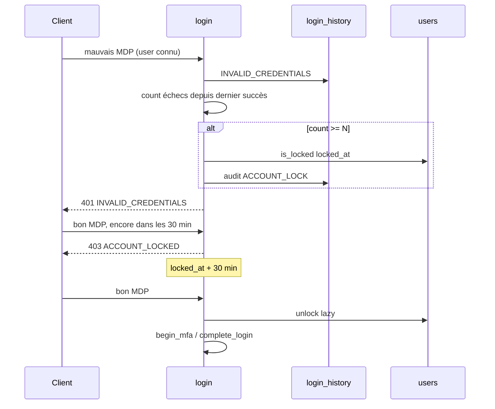

# AUTH-I — Sécurité compte & historique (AUTH-61 … 66)

**Produit :** YAS Connect uniquement (pas le SIRH).  
**Préalable :** Phase 0 + **AUTH-A** (`login_history`, `is_locked`) + **AUTH-D** (verify inscription) + **AUTH-E** (nouveau device).  
**Attributs :** [IAM](../../catalogues/IAM-catalogue-tables.md) · [CONFIG](../../catalogues/CONFIG-catalogue-tables.md) · [INDEX](../../catalogues/INDEX-catalogue.md).  
**Models :** [code/iam_models.py](../code/iam_models.py).

**Backlog produit « Sécurité compte & historique ».** AUTH-H = sessions → cet incrément = **AUTH-I** (IDs 61–66).

**Périmètre :** consulter l’historique de connexion, alerte (nouveau pays / device), verrouillage auto après N échecs, unlock admin, vérification email (création **et** changement), renvoi rate-limité.

---


## Cartographie


| ID | Statut | Comportement | Écritures |
|----|--------|--------------|-----------|
| **AUTH-61** | **Gardé (précisé)** | AUTH-07 **écrit** déjà. Ici : `GET` historique (date, IP, geo, device, succès) + enrichissement geo | lecture ; geo async |
| **AUTH-62** | **Gardé (adapté)** | Suspect = **nouveau device** (AUTH-29) **ou nouveau pays** vs dernier succès géolocalisé. Pas de MFA extra | `suspicious` + audit + stub notif |
| **AUTH-63** | **Gardé** | N échecs MDP **connus** (fenêtre) → `is_locked=true` + `locked_at`. AUTH-A ne faisait que le rate-limit | `users` |
| **AUTH-64** | **Gardé** | Admin unlock + audit. Auto-unlock après TTL (lazy au login **et** job) | `is_locked` / `locked_at` |
| **AUTH-65** | **Gardé** | Verify email : inscription (AUTH-D04) **et** changement d’email connecté. Token hashé, TTL 48 h | `email_verifications` ; `users.email` si change |
| **AUTH-66** | **Gardé** | Renvoi du mail : même service D04 / change. Rate-limit identifiant **et** IP | nouveau token ; `revoked_at` ancien |


**Hors incrément :** MaxMind licence prod (geo NULL OK si pas de DB), unlock self-service par SMS, captcha, lock de l’AD (seulement `users.is_locked`). Alerte nouvel appareil = NOTIF-15 (pas d’e-mail). SMTP = A→Z §4.3.

---


## Décisions figées


| Sujet | Choix |
|-------|--------|
| AUTH-61 | Pas de 2e table. `GET /me/security/logins` (owner) + admin |
| Geo | Async après INSERT history. NULL tant que pas enrichi. 1er geo **n’alerte pas** (pas d’ancien pays) |
| AUTH-62 vs AUTH-29 | Device = déjà AUTH-E. Pays = AUTH-I. Les deux posent `suspicious=true` + audit (`DEVICE_NEW` / `LOGIN_NEW_COUNTRY`) |
| Suspect ≠ blocage | Login **réussit** quand même (MFA déjà AUTH-C) |
| AUTH-63 | Compte **connu** seulement. Compte `INVALID_CREDENTIALS` depuis le dernier **succès** (ou unlock). N=**5**. Pas les `MFA_INVALID` (le MDP était bon) |
| Rate-limit AUTH-06 | **Inchangé** (anti-énumération). Le lock est un 2e filet sur le compte |
| LDAP | Même `is_locked` YAS. Échec bind connu = comme mauvais MDP app. **Pas** de lock du compte AD |
| Sessions au lock | **Non** révoquées (session déjà ouverte continue). Unlock ≠ logout-all |
| Auto-unlock | `locked_at` + **1800 s** (30 min). Lazy après MDP/bind OK, avant 403 ; job `account_unlock_reaper` |
| Email LDAP | `ldap_dn` présent → **400** `EMAIL_CHANGE_FORBIDDEN` (UPN AD, pas un alias libre) |
| Change email | `users.email` **inchangé** tant que le token n’est pas vérifié. 409 si l’adresse est déjà prise |
| Mail | Stub `notify_email_verification` (lien). Pas de SMS |
| Portes AUTH-F | Historique + change email = réglages → **après** CGU/wizard. Verify token = **public**. Unlock = admin |


---


## Contrat HTTP

### `GET /api/v1/me/security/logins` (AUTH-61, JWT)

`required_permission = iam.login.read` ([AUTH-R](AUTH-R-roles-permissions.md)).

Query : `limit` (défaut 50, max 100), `before` (cursor `created_at` ISO).

```json
{
  "success": true,
  "data": {
    "logins": [
      {
        "id": "<uuid>",
        "created_at": "2026-08-27T08:00:00Z",
        "success": true,
        "suspicious": true,
        "ip_address": "196.x",
        "country": "TG",
        "city": "Lomé",
        "device_id": "<uuid>",
        "device_name": "iPhone de Jean",
        "platform": "IOS",
        "browser": "Safari",
        "login_method": "PASSWORD",
        "failure_reason": null
      }
    ]
  }
}
```

Owner only. Échecs inclus (les siens, `user_id` = lui).  
Admin : `GET /api/v1/admin/users/{id}/logins` — `HasPermission` `iam.user.security.read`.

### Alerte AUTH-62 (pas d’endpoint dédié)

Au `complete_login` (succès, après geo si déjà connu **ou** au job geo) :

- device créé → déjà AUTH-29 ;
- `country` du succès ≠ dernier succès avec `country` non NULL → `suspicious=true`, audit `LOGIN_NEW_COUNTRY`, stub notif.

### Verrouillage (AUTH-63) — pas d’endpoint user

Après `_history(..., success=False, reason=INVALID_CREDENTIALS)` sur user connu : si ≥ N échecs depuis dernier succès / unlock → `is_locked=true`, `locked_at=now()`, audit `ACCOUNT_LOCK`.  
Login suivant : MDP/bind **faux** → 401 générique ; **bon** → **403** `ACCOUNT_LOCKED` (AUTH-04).

### `POST /api/v1/admin/users/{id}/unlock` (AUTH-64)

Admin : `HasPermission` `iam.user.unlock` ([AUTH-R](AUTH-R-roles-permissions.md) R05/R10). Body optionnel `{ "reason": "…" }`.  
`is_locked=false`, `locked_at=NULL`. Audit `ACCOUNT_UNLOCK` (`old_values` / `new_values` + `metadata.reason`). **200** idempotent si déjà unlocked.

### `POST /api/v1/me/email` (AUTH-65, JWT)

`required_permission = iam.email.change`.

```json
{ "email": "jean.dupont2@yas.tg" }
```

**202** — mail stub vers la **nouvelle** adresse. `users.email` pas encore changé.  
**400** `EMAIL_CHANGE_FORBIDDEN` si `ldap_dn`. **409** si email pris. **400** si égal à l’actuel.

### `POST /api/v1/auth/email/verify` (AUTH-65, public)

Pas de JWT → pas de `HasPermission`.

```json
{ "token": "<opaque>" }
```

Hash OK + non expiré + unused → `verified_at=now()`.  
`purpose=EMAIL_CHANGE` → `users.email` = l’adresse du token (lower).  
`purpose=REGISTER` → comme AUTH-D04 (`is_active` **inchangé**).  
**400** `INVALID_TOKEN`. 2e appel **200** déjà vérifié.

`POST /auth/register/verify-email` AUTH-D : **alias** du même handler.

### `POST /api/v1/me/email/resend` (AUTH-66, JWT)

`required_permission = iam.email.change`.

Renvoie le dernier `EMAIL_CHANGE` unused. Rate-limit **429** `EMAIL_RESEND_RATE_LIMITED`.

### `POST /api/v1/auth/register/resend-verification` (AUTH-66 / D04, public)

Inchangé fonctionnellement : **toujours 200** (anti-énumération). Rate-limit = pas d’envoi + audit.

---


## Flux lock



---


## 0. Champs (delta)

### `users`

| Attribut | Type | Défaut | Sens |
|----------|------|--------|------|
| `locked_at` | timestamptz | NULL | Quand le verrou a été posé (auto ou admin). Unlock → NULL |

`is_locked` déjà AUTH-04.

### `email_verifications`

| Attribut | Type | Sens |
|----------|------|------|
| `purpose` | varchar(16) | `REGISTER` \| `EMAIL_CHANGE` |
| `token_hash` | UK | SHA-256 du lien |
| `expires_at` | timestamptz | TTL 48 h |
| `revoked_at` | timestamptz | nouveau send / resend |

### `login_history`

Inchangé. `suspicious` aussi si nouveau **pays**. Geo toujours nullable.

---


## 1. Settings / seed

```env
LOCK_AFTER_FAILURES=5
LOCK_DURATION_SECONDS=1800
EMAIL_VERIFY_TTL_SECONDS=172800
EMAIL_RESEND_RATE_LIMIT=3
EMAIL_RESEND_WINDOW_SECONDS=900
```

`system_settings` `security.lock_after_failures`, `security.lock_duration_seconds`.

Job : `account_unlock_reaper` cron `*/5 * * * *` — `is_locked` et `locked_at + duration <= now` → unlock (sans audit user, action `ACCOUNT_UNLOCK_AUTO`).

---


## 2. Fichiers

```
apps/iam/services/lock_service.py
apps/iam/services/email_verification_service.py   # D04 + change
apps/iam/services/geo_service.py                  # stub / MaxMind
apps/iam/views_security.py
apps/iam/jobs.py                                  # unlock_reaper + geo_enrich
```

```python
path("me/security/logins", LoginHistoryMeView.as_view()),
path("me/email", EmailChangeView.as_view()),
path("me/email/resend", EmailResendView.as_view()),
path("auth/email/verify", EmailVerifyView.as_view()),
path("admin/users/<uuid:pk>/unlock", AdminUnlockView.as_view()),
path("admin/users/<uuid:pk>/logins", AdminLoginHistoryView.as_view()),
```

---


## 3. Services (extrait)

```python
def maybe_lock_after_failure(*, user) -> None:
    if user is None:
        return
    last_ok = (
        LoginHistory.objects.filter(user=user, success=True)
        .order_by("-created_at").values_list("created_at", flat=True).first()
    )
    qs = LoginHistory.objects.filter(
        user=user, success=False, failure_reason="INVALID_CREDENTIALS",
    )
    if last_ok:
        qs = qs.filter(created_at__gt=last_ok)
    if user.locked_at:
        qs = qs.filter(created_at__gt=user.locked_at)
    if qs.count() >= get_lock_n():
        user.is_locked = True
        user.locked_at = timezone.now()
        user.save(update_fields=["is_locked", "locked_at", "updated_at"])
        audit(action="ACCOUNT_LOCK", user=user, severity="WARNING")


def lazy_unlock(*, user) -> None:
    if not user.is_locked or user.locked_at is None:
        return
    if user.locked_at + timedelta(seconds=get_lock_duration()) > timezone.now():
        return
    user.is_locked = False
    user.locked_at = None
    user.save(update_fields=["is_locked", "locked_at", "updated_at"])


def mark_suspicious(*, history, user, device_created: bool, country: str | None) -> None:
    reasons = []
    if device_created:
        reasons.append("NEW_DEVICE")
    prev = (
        LoginHistory.objects.filter(user=user, success=True, country__isnull=False)
        .exclude(pk=history.pk).order_by("-created_at").values_list("country", flat=True).first()
    )
    if country and prev and prev != country:
        reasons.append("NEW_COUNTRY")
    if not reasons:
        return
    history.suspicious = True
    history.save(update_fields=["suspicious"])
    audit(action="LOGIN_NEW_COUNTRY" if "NEW_COUNTRY" in reasons else "DEVICE_NEW",
          metadata={"reasons": reasons, "country": country})
    notify_suspicious_login(user=user, reasons=reasons)  # stub
```

Delta AUTH-A / AUTH-B : après MDP/bind OK, `lazy_unlock` **avant** le 403 `ACCOUNT_LOCKED`. Après échec `INVALID_CREDENTIALS` user connu : `maybe_lock_after_failure`.

---


## 4. Tests (acceptation)


| ID | Cas | Attendu |
|----|-----|---------|
| 61 | GET mes logins | 200 ; succès **et** échecs ; pas de hash |
| 61 | geo pas encore | `country` NULL OK |
| 62 | 1er uuid | `suspicious` (AUTH-29) |
| 62 | même device, pays TG puis FR | 2e succès `suspicious=true` ; login **200** |
| 62 | 1er succès avec geo | **pas** d’alerte pays |
| 63 | 5e mauvais MDP user connu | `is_locked` ; 5e réponse encore **401** |
| 63 | 6e **bon** MDP dans les 30 min | **403** `ACCOUNT_LOCKED` |
| 63 | 5 `MFA_INVALID` | **pas** de lock |
| 63 | email inconnu × 20 | jamais `is_locked` (pas de user) |
| 64 | admin unlock | `is_locked=false` ; audit |
| 64 | TTL 30 min + bon MDP | lazy unlock ; MFA / JWT |
| 65 | change email | 202 ; `users.email` ancien jusqu’au verify |
| 65 | verify change | email mis à jour ; login avec le nouveau |
| 65 | user `ldap_dn` | 400 `EMAIL_CHANGE_FORBIDDEN` |
| 66 | 4e resend JWT / 900 s | **429** |
| 66 | resend register email inconnu | **200** ; 0 mail |
| — | LDAP bind KO × 5 | `is_locked` YAS ; AD non touché |


---


## Critères d’acceptation

- [ ] Historique consultable (me + admin) : date, IP, geo nullable, device, succès / motif
- [ ] Suspect : nouveau device **ou** nouveau pays ; pas de blocage login
- [ ] Lock auto N=5 échecs MDP/bind connus ; 403 seulement si secret OK
- [ ] Unlock admin audité ; auto 30 min
- [ ] Verify email unique service (register + change) ; LDAP sans change email
- [ ] Resend rate-limité
- [ ] `/me/security/logins` = `iam.login.read` ; `/me/email*` = `iam.email.change` (AUTH-R)
- [ ] Spec seulement

---


## Écarts documents liés

- **AUTH-A** : lock auto **plus** hors incrément. Colonne `locked_at`. Geo plus « toujours NULL » : async AUTH-I.
- **AUTH-B** : mêmes hooks lock / lazy unlock sur `/login/ldap`.
- **AUTH-D04** : handler = AUTH-65/66.
- **AUTH-E-29** : device seulement ; pays = AUTH-62.
- **AUTH-G** : lock ≠ reset MDP (forgot toujours no-op si locked).
- **PROF-A** : change email = ce plan ; PATCH `/me` n’accepte pas `email`.
- **AUTH-R** : unlock / logins admin = `HasPermission` admin ; `/me/security/logins` = `iam.login.read` ; `/me/email*` = `iam.email.change`. Verify public sans RBAC.
- **Tome 2** RG-03 5 échecs / 15 min / lock 30 min : **repris** (N=5, TTL 30 min).
