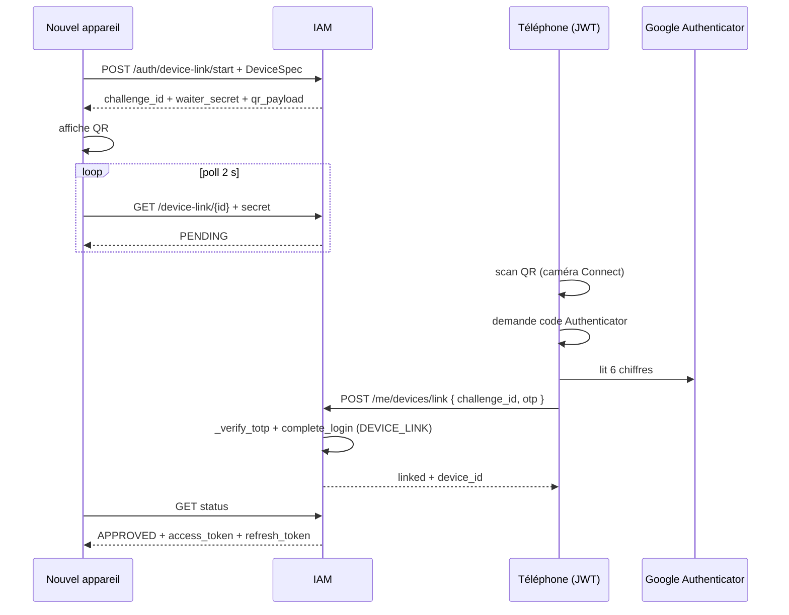

# AUTH-J — Lier un 2ᵉ appareil par QR (AUTH-67 … 69)

**Statut :** clos (2026-09-09) — lab [00-jour-6-auth-j.md](../00-jour-6-auth-j.md).  
**Produit :** YAS Connect uniquement (pas le SIRH).  
**Préalable :** Phase 0 + **AUTH-A** (`complete_login`, `DeviceSpec`) + **AUTH-C** (`_verify_totp`) + **AUTH-E** (upsert / AUTH-29) — jours 1–5 **clos**.  
**Attributs / index :** [IAM](../../catalogues/IAM-catalogue-tables.md) · [CONFIG](../../catalogues/CONFIG-catalogue-tables.md).  
**Models :** [code/iam_models.py](../code/iam_models.py) (`LoginMethod.DEVICE_LINK`). Pas de table SQL : challenge = cache (Redis / LocMem), comme `mfa_token`.

**Périmètre :** un écran **déjà ouvert** (téléphone) autorise un **nouvel** écran (ordi / tablette) en scannant un QR, **puis** en tapant un code **Google Authenticator**. Pas de mot de passe sur le nouvel appareil.

Ce n’est **pas** le QR `otpauth://` d’enroll AUTH-C.

---


## Cartographie


| ID | Statut | Comportement | Écritures |
|----|--------|--------------|-----------|
| **AUTH-67** | **Nouveau** | Nouvel appareil : `POST /auth/device-link/start` → challenge + payload QR. TTL court, usage unique | cache Redis |
| **AUTH-68** | **Nouveau** | Nouvel appareil poll `GET /auth/device-link/{id}` + secret. Tant que pending : pas de JWT. Une fois approuvé : **mêmes tokens** que `complete_login` | lecture cache ; consommation |
| **AUTH-69** | **Nouveau** | Téléphone (JWT déjà MFA) : après scan, `POST /me/devices/link` `{ challenge_id, otp }`. **TOTP obligatoire**. Backup **refusé**. Puis `complete_login` pour le device en attente | `devices`, `sessions`, `login_history` (`DEVICE_LINK`), AUTH-29 |


**Hors incrément :** WebSocket « QR approuvé » (le poll suffit), attestation Play Integrity, lier sans téléphone (MDP + OTP sur l’ordi reste AUTH-A/C), QR magique multi-sessions type WhatsApp « rester connecté 14 j » distinct du TTL session AUTH-H.

---


## Décisions figées


| Sujet | Choix |
|-------|--------|
| Qui affiche le QR | Le **nouvel** appareil (WEB / DESKTOP). Le téléphone **scanne** (caméra in-app). |
| Après le scan | Écran « code Google Authenticator » **avant** toute session sur le nouvel écran. Scan seul ≠ connexion. |
| Quel TOTP | Celui du **compte déjà enrollé** (AUTH-C). Pas un nouvel enroll, pas d’`otpauth_uri`. |
| Codes de secours | **Interdits** ici. L’user a son téléphone + Authenticator. Perte de téléphone = login MDP + backup (AUTH-C-22), pas ce flux. |
| Tokens | Remis **uniquement** au waiter (GET status). Le téléphone reçoit `{ "linked": true, "device_id" }` — **pas** les JWT de l’ordi. |
| TTL | **120 s** (`security.device_link_ttl_seconds`). Une fois consommé ou expiré : 410. |
| `trusted` | **Non lu.** N’épargne pas le TOTP (AUTH-C-26 inchangé). |
| AUTH-29 | **Oui** si 1re vue `(user, device_uuid)` : `suspicious` + notif `DEVICE_NEW`. |
| CRYPTO-A | Après tokens, le nouvel appareil **PUT** son identité Signal (`session.device_id`). Sans ça : 409 `CRYPTO_KEYS_MISSING` en 1-to-1. |
| Step-up | Seule exception à « pas de re-OTP déjà connecté » (AUTH-C). Les autres actions JWT ne redemandent pas d’OTP. |

Deux QR distincts :

| QR | Où | App qui scanne | Effet |
|----|-----|----------------|-------|
| `otpauth://totp/…` | 1er login, `enroll=true` | **Google Authenticator** | Enregistre le secret TOTP |
| `yasconnect://device-link/v1?cid=…` | Écran « lier un appareil » | **YAS Connect** (caméra) | Propose de lier ; JWT seulement après AUTH-69 |

---


## Contrat HTTP

Préfixe `/api/v1`.

### `POST /api/v1/auth/device-link/start` (public)

`AllowAny`. Body = le `device` du **waiter** (même `DeviceSpecSerializer` qu’AUTH-A).

```json
{
  "device": {
    "device_uuid": "web-office-8f3a",
    "device_name": "Chrome bureau",
    "platform": "WEB"
  }
}
```

**200** :

```json
{
  "success": true,
  "data": {
    "challenge_id": "<uuid>",
    "waiter_secret": "<opaque, une fois>",
    "expires_in": 120,
    "qr_payload": "yasconnect://device-link/v1?cid=<uuid>"
  }
}
```

Le client **affiche** `qr_payload` en QR. `waiter_secret` **jamais** dans le QR (reste en mémoire du waiter pour le poll).

**429** rate-limit IP (défaut 10 / min).  
`jailbreak` / `push_token` acceptés dans le spec ; appliqués au `complete_login` (AUTH-E-32/33).

### `GET /api/v1/auth/device-link/{challenge_id}` (public)

`AllowAny`. Header **obligatoire** `X-Device-Link-Secret: <waiter_secret>`.

| État | HTTP | Body |
|------|------|------|
| pending | 200 | `{ "status": "PENDING", "expires_in": 12 }` |
| approuvé, 1re lecture | 200 | `{ "status": "APPROVED", …tokens complete_login… }` puis cache **supprimé** |
| secret faux | 403 | `DEVICE_LINK_FORBIDDEN` |
| inconnu / déjà consommé / TTL | 410 | `DEVICE_LINK_EXPIRED` |

Poll recommandé : 2 s. Pas de WS dans cet incrément.

### `POST /api/v1/me/devices/link` (JWT)

`YasJWTAuthentication` + `HasPermission` `iam.device.update`. Portes AUTH-F **après** (CGU / wizard déjà faits sur le téléphone).

```json
{
  "challenge_id": "<uuid>",
  "otp": "123456"
}
```

Exactement `otp` (6 chiffres). **Pas** de `backup_code`. **Pas** de confirm sans `otp`.

**200** : `{ "linked": true, "device_id": "<uuid>" }` — **sans** tokens.

**401** OTP faux — même `INVALID_CREDENTIALS` / AUTH-05 qu’AUTH-C (pas de leak).  
**400** `MFA_BACKUP_NOT_ALLOWED` si un client envoie un backup.  
**400** `DEVICE_LINK_SELF` si `device_uuid` du challenge = appareil de la session téléphone.  
**403** `DEVICE_COMPROMISED` / `DEVICE_JAILBROKEN` via `complete_login`.  
**403** `MFA_NOT_ENROLLED` si pas d’`otp_secrets` vérifié (ne devrait pas arriver sur une session JWT).  
**404** challenge inconnu (ne pas révéler pending vs expiré au téléphone : **410** `DEVICE_LINK_EXPIRED` dans les deux cas).  
**409** `DEVICE_UUID_TAKEN` si ce `device_uuid` appartient déjà à **un autre** user.

Le TOTP est celui de **l’user JWT** (téléphone), pas un secret du waiter.

---


## Flux



---


## 0. Apps et fichiers

```
apps/iam/
  services/device_link_service.py   # start, poll, confirm
  serializers.py                    # DeviceLinkStartSerializer, DeviceLinkConfirmSerializer
  views.py                          # DeviceLinkStartView, DeviceLinkStatusView, DeviceLinkConfirmView
  urls.py
```

`LoginMethod.DEVICE_LINK` dans [iam_models.py](../code/iam_models.py).  
Réutiliser `DeviceSpecSerializer`, `complete_login`, `_verify_totp` (AUTH-C). **Ne pas** passer par `begin_mfa` (pas de `mfa_token` : l’user téléphone est déjà MFA).

```python
urlpatterns = [
    path("device-link/start", DeviceLinkStartView.as_view(), name="device-link-start"),
    path("device-link/<uuid:challenge_id>", DeviceLinkStatusView.as_view(), name="device-link-status"),
]
# /me/devices/link → DeviceLinkConfirmView
```

---


## 1. Cache challenge (AUTH-67)

Même famille que `mfa:challenge:` (AUTH-C). Redis down → LocMem (dev) ; en prod Redis **requis** si plusieurs workers.

```python
LINK_PREFIX = "device-link:"
TTL = 120  # settings / system_settings security.device_link_ttl_seconds


def start_device_link(*, device_spec: dict, ip: str) -> dict:
    challenge_id = uuid.uuid4()
    waiter_secret = secrets.token_urlsafe(32)
    cache.set(
        f"{LINK_PREFIX}{challenge_id}",
        {
            "status": "PENDING",
            "device_spec": device_spec,
            "waiter_secret_hash": hash_mfa_token(waiter_secret),
            "ip": ip,
            "user_id": None,
            "tokens": None,
        },
        timeout=TTL,
    )
    return {
        "challenge_id": str(challenge_id),
        "waiter_secret": waiter_secret,
        "expires_in": TTL,
        "qr_payload": f"yasconnect://device-link/v1?cid={challenge_id}",
    }
```

`waiter_secret` et TOTP **jamais** dans `login_history` / logs.

---


## 2. Poll (AUTH-68)

```python
def poll_device_link(*, challenge_id, waiter_secret: str) -> dict:
    key = f"{LINK_PREFIX}{challenge_id}"
    payload = cache.get(key)
    if payload is None:
        raise AuthAPIError(410, "DEVICE_LINK_EXPIRED", "QR expiré. Réessayez.")
    if not hmac.compare_digest(payload["waiter_secret_hash"], hash_mfa_token(waiter_secret)):
        raise AuthAPIError(403, "DEVICE_LINK_FORBIDDEN", "Lien appareil refusé.")
    if payload["status"] == "PENDING":
        return {"status": "PENDING", "expires_in": _ttl_remaining(key)}
    tokens = payload["tokens"]
    cache.delete(key)  # one-shot
    return {"status": "APPROVED", **tokens}
```

---


## 3. Confirm + TOTP (AUTH-69)

```python
def confirm_device_link(*, user, challenge_id, otp: str, phone_device, ip, user_agent) -> dict:
    if not _mfa_ready(user):
        raise AuthAPIError(403, "MFA_NOT_ENROLLED", "MFA non configuré.")
    key = f"{LINK_PREFIX}{challenge_id}"
    payload = cache.get(key)
    if payload is None or payload["status"] != "PENDING":
        raise AuthAPIError(410, "DEVICE_LINK_EXPIRED", "QR expiré. Réessayez.")
    spec = payload["device_spec"]
    if spec.get("device_uuid") == phone_device.device_uuid:
        raise AuthAPIError(400, "DEVICE_LINK_SELF", "Scannez depuis un autre appareil.")
    other = Device.objects.filter(device_uuid=spec["device_uuid"]).exclude(user=user).exists()
    if other:
        raise AuthAPIError(409, "DEVICE_UUID_TAKEN", "Cet appareil est déjà lié à un autre compte.")
    if not _verify_totp(user, otp):
        # même throttle AUTH-C (5 essais) ; pas AUTH-63 (MDP)
        raise AuthAPIError(401, "INVALID_CREDENTIALS", MSG_INVALID)

    tokens = complete_login(
        user=user, ip=ip, user_agent=user_agent, device_spec=spec,
        ident_key=user.email, login_method=LoginMethod.DEVICE_LINK,
    )
    device = Device.objects.get(user=user, device_uuid=spec["device_uuid"])
    payload["status"] = "APPROVED"
    payload["user_id"] = str(user.id)
    payload["tokens"] = tokens
    cache.set(key, payload, timeout=TTL)
    AuditLog.objects.create(
        trace_id=uuid.uuid4(), module="IAM", action="DEVICE_LINK",
        entity_type="devices", entity_id=device.id,
        severity="INFO", success=True, user=user, ip_address=ip,
        metadata={"challenge_id": str(challenge_id), "platform": spec.get("platform")},
    )
    return {"linked": True, "device_id": str(device.id)}
```

`complete_login` : upsert, AUTH-29 / 32 / 33, session, refresh, history. `login_method=DEVICE_LINK` sur `sessions` **et** `login_history`.

Audit `DEVICE_LINK` : `entity_id` = id de la ligne `devices` liée (corriger le stub ci-dessus : récupérer `device.id` **après** `complete_login`). Ne **pas** coller les tokens dans l’audit.

Throttle OTP : réutiliser le compteur AUTH-C par `user_id` (fenêtre courte). 6e faux → 401 + history `RATE_LIMITED` si le plan AUTH-C l’écrit déjà ; **pas** de lock compte (AUTH-63 = échecs MDP seulement).

---


## 4. Seed / config

| category | setting_key | défaut | Rôle |
|----------|-------------|--------|------|
| `security` | `device_link_ttl_seconds` | `120` | TTL challenge |

Pas de nouvelle permission : confirm = `iam.device.update` (AUTH-R). Start / poll = `AllowAny`.

---


## 5. Tests


| ID | Cas | Attendu |
|----|-----|---------|
| 67 | start | 200 challenge + `qr_payload` ; secret **absent** du QR |
| 67 | poll sans secret / secret faux | 403 |
| 68 | poll avant confirm | `PENDING`, pas de JWT |
| 69 | confirm **sans** `otp` | 400 |
| 69 | confirm `backup_code` | 400 `MFA_BACKUP_NOT_ALLOWED` |
| 69 | TOTP faux | 401 AUTH-05 ; waiter toujours `PENDING` |
| 69 | TOTP OK | téléphone `linked` ; 1re poll waiter = tokens ; 2e poll = 410 |
| 69 | TTL 121 s | 410 des deux côtés |
| 69 | même `device_uuid` que le téléphone | 400 `DEVICE_LINK_SELF` |
| 69 | uuid déjà chez un autre user | 409 |
| 29 | 1er uuid via QR | `suspicious=true` + `DEVICE_NEW` |
| 26 | `trusted=true` sur le téléphone | TOTP **quand même** exigé |
| — | `login_method` session | `DEVICE_LINK` |
| — | enroll AUTH-C | `otpauth://` **inchangé** ; pas d’appel device-link |

---


## 6. Acceptation AUTH-J

- [x] Nouvel écran : QR affiché ; **aucun** JWT tant que AUTH-69 n’a pas validé un TOTP
- [x] Après scan, l’UI téléphone **demande** Google Authenticator (pas un skip)
- [x] Les deux QR (Authenticator vs 2ᵉ appareil) ne se confondent pas
- [x] Tokens uniquement au waiter, une fois
- [x] AUTH-29 / jailbreak / compromis : même pipeline que `complete_login`
- [ ] CRYPTO-A : le nouvel `device_id` publie ses clés après le lien (hors AUTH-J)
- [x] SIRH non modifié

---


## 7. Vérif manuelle

```powershell
# Waiter (ordi)
curl -s -X POST http://127.0.0.1:8000/api/v1/auth/device-link/start -H "Content-Type: application/json" -d "{\"device\":{\"device_uuid\":\"web-2\",\"platform\":\"WEB\",\"device_name\":\"PC test\"}}"

# Poll (secret du start)
curl -s http://127.0.0.1:8000/api/v1/auth/device-link/<challenge_id> -H "X-Device-Link-Secret: <waiter_secret>"

# Téléphone déjà connecté (JWT) + code Authenticator
curl -s -X POST http://127.0.0.1:8000/api/v1/me/devices/link -H "Authorization: Bearer <jwt>" -H "Content-Type: application/json" -d "{\"challenge_id\":\"<uuid>\",\"otp\":\"<6 chiffres>\"}"
```

---


## 8. Hooks

| Source | Action |
|--------|--------|
| AUTH-C | `_verify_totp` réutilisé ; enroll QR **séparé** |
| AUTH-E | `complete_login` → AUTH-29 / 32 / 33 |
| AUTH-H | session + refresh identiques à un login MFA |
| [CRYPTO-A](../crypto_plans/CRYPTO-A-cles.md) | PUT identity sur le **nouveau** `device_id` |
| NOTIF-15 | `DEVICE_NEW` si 1re vue uuid |
