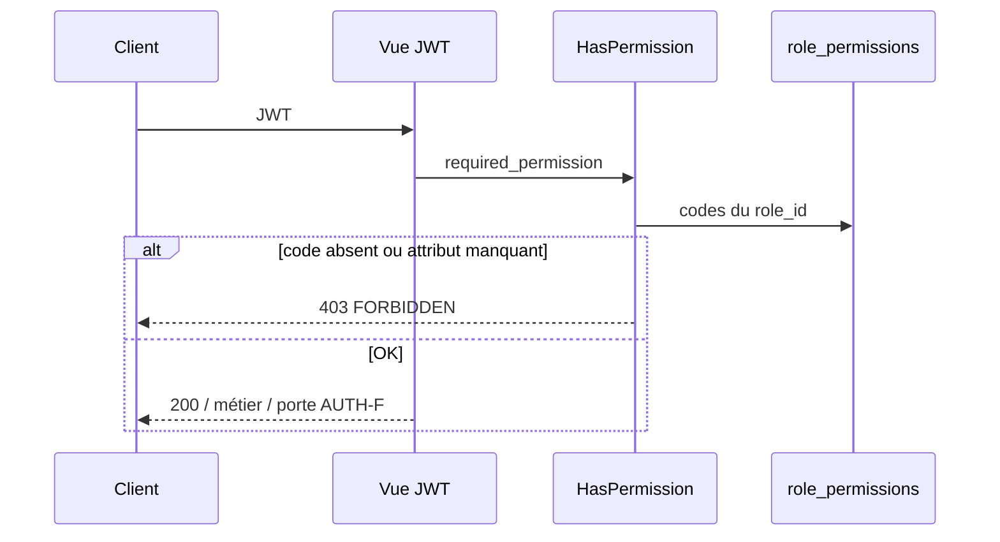

# AUTH-R — Rôles & permissions (AUTH-R01 … R10)

**Statut :** à faire — lab [00-jour-11-auth-r.md](../00-jour-11-auth-r.md).  
**Produit :** YAS Connect uniquement (pas le SIRH).  
**Préalable :** Phase 0 + **AUTH-A** (`users.role_id` unique, pas de `user_roles`) + tickets déjà décrits (C/D/E/F/G/H/I, PROF-A).  
**Attributs :** [IAM](../../catalogues/IAM-catalogue-tables.md).  
**Models :** [code/iam_models.py](../code/iam_models.py).

**Backlog RBAC.** Un user = **un** rôle. Les droits ne sont **pas** dans le JWT (hors incrément) : check SQL (cache rôle optionnel).

**Périmètre :** convention des codes, seed USER/ADMIN + permissions + matrice, `HasPermission` DRF sur **toute** vue JWT, CRUD admin, branchements (admin **et** self-service F/G/H/E/I/C/PROF/ANNUAIRE-D).

---


## Cartographie


| ID | Statut | Comportement | Écritures |
|----|--------|--------------|-----------|
| **AUTH-R01** | **Gardé** | `permissions.code` = `{module}.{resource}.{action}` minuscule ; `roles.code` = `SCREAMING_SNAKE` | contrat |
| **AUTH-R02** | **Gardé** | Seed `USER` (level 0), `ADMIN` (level 100) ; `is_system=true`. Pas d’autre métier obligatoire | `roles` |
| **AUTH-R03** | **Gardé** | Seed permissions (self + admin) ; `is_system=true` | `permissions` |
| **AUTH-R04** | **Gardé** | USER : toutes les perms **self**. ADMIN : **toutes** les `is_system` | `role_permissions` |
| **AUTH-R05** | **Gardé** | DRF `HasPermission` : `required_permission` obligatoire sur chaque vue JWT → 403 `FORBIDDEN` | lecture (+ cache optionnel) |
| **AUTH-R06** | **Gardé** | **CRUD rôles** admin : list / get / create / patch / delete. Gardes `is_system` et rôle encore assigné | `roles` ; audit |
| **AUTH-R07** | **Gardé** | Liste permissions. Create **custom** (`is_system=false`) si `iam.permission.manage`. Pas DELETE `is_system` | `permissions` |
| **AUTH-R08** | **Gardé** | Matrice : **ajouter** / **retirer** des permissions ; PUT remplace le set. Audit | `role_permissions` |
| **AUTH-R09** | **Gardé** | `PATCH /admin/users/{id}/role` `{ "role_code": "ADMIN" }`. Interdit 0 ADMIN restant | `users.role_id` ; audit |
| **AUTH-R10** | **Gardé** | **Toutes** les vues JWT (F/G/H/PROF/E/I/C/D/R/ADMIN-A/`GET /users`) : `HasPermission`. Plus d’exception « authentifié suffit » | — |


**Hors incrément :** multi-rôles, mapping groupe AD → rôle (AUTH-15 abandonné), liste de permissions dans le JWT, UI front, rôles métier (NOC, RH) au-delà du seed. Cycle de vie compte / audit / CRUD `region` = [ADMIN-A](ADMIN-A-lifecycle-audit.md). Annuaire = [annuaire_plans](../annuaire_plans/ANNUAIRE-A-recherche-referentiels.md). CRUD rôles **déjà ici** (R06–R08).

---


## Décisions figées


| Sujet | Choix |
|-------|--------|
| Cardinalité | 1 rôle / user (`users.role_id`) |
| JWT | Claim `role` = **code** (affichage). **Pas** le tableau des permissions |
| Check | **Chaque** requête JWT : `HasPermission` via `role_permissions` (cache Redis `rbac:role:{id}` TTL 60 s, invalidé R08) |
| Fail-closed | Vue JWT **sans** `required_permission` → **403** `FORBIDDEN` (pas de fallback `IsAuthenticated`) |
| Self vs admin | Colonne seed `audience` : `self` (USER+ADMIN) ou `admin` (ADMIN seulement) |
| USER | Seed = **toutes** les `audience=self` (profil, CGU, MDP, sessions, devices, email, MFA backup, …) |
| ADMIN | Toutes les `is_system` (self **et** admin) |
| `/me` | **Plus** d’exception. AUTH-F/G/H/PROF/E/I : même `HasPermission` que l’admin |
| Public | **Seul** cas sans RBAC : `AllowAny` **sans JWT** (pas de `role_id`). Liste close ci-dessous |
| Infra | `GET /health`, OpenAPI `/api/docs/` : hors métier, `AllowAny` |
| `is_system` rôle | USER, ADMIN : pas de DELETE, `code` / `level` / `is_system` non patchables. `level` 100 réservé au seed ADMIN ; POST custom = 0–99 |
| CRUD rôles | R06 = list/get/create/patch/delete. Assigner un rôle à un user = **R09**. Perms d’un rôle = **R08** (add / remove / replace) |
| Dernier ADMIN | R09 refuse de rétrograder le dernier user `role.code=ADMIN` → **409** `LAST_ADMIN` |
| Permission custom | `is_system=false` ; `code` doit matcher `^[a-z][a-z0-9_]*\.[a-z][a-z0-9_]*\.[a-z][a-z0-9_]*$` |
| Colonne `resource` | Ajout catalogue (le couple `module`+`action` ne suffit plus) |
| 403 | `FORBIDDEN` ; body `permission` = le code manquant |
| Seed jean.dupont | Reste **USER** (donc perms self). Seed **optionnel** `admin@yas.tg` rôle ADMIN |


### Routes publiques (pas de `HasPermission`)

Pas de user authentifié → pas de rôle à consulter. **Pas** un trou ACL métier : ce sont des portes d’identité.

| Route | Plan |
|-------|------|
| `POST /auth/login`, `/auth/login/ldap` | AUTH-A / B |
| `POST /auth/refresh` | AUTH-A / H |
| `POST /auth/mfa/verify` | AUTH-C |
| `POST /auth/register`, `/register/ad`, `/register/check-ad` | AUTH-D |
| `POST /auth/register/verify-email`, `/register/resend-verification` | AUTH-D / I |
| `POST /auth/email/verify` | AUTH-I |
| `POST /auth/password/forgot`, `/password/reset/verify`, `/password/reset` | AUTH-G |
| `GET /directory/regions`, `/directory/segment-types`, `/directory/segments` | [ANNUAIRE-A](../annuaire_plans/ANNUAIRE-A-recherche-referentiels.md) (dropdown inscription) |

Toute autre route HTTP métier = JWT + `required_permission`.

---


## AUTH-R01 — Convention

| Entité | Forme | Exemple | Interdit |
|--------|--------|---------|----------|
| `roles.code` | `SCREAMING_SNAKE`, 2–32, `[A-Z][A-Z0-9_]*` | `USER`, `ADMIN`, `SEC_ADMIN` | `user`, `Admin` |
| `permissions.code` | `{module}.{resource}.{action}` tout minuscule | `iam.user.approve` | `iam.approve`, `IAM.User.Approve` |
| `module` | 1er segment | `iam`, `media`, `annuaire` | |
| `resource` | 2e | `user`, `device`, `role`, `profile` | |
| `action` | 3e | `read`, `manage`, `approve`, `unlock` | |

`code` **dérivé** : toujours `f"{module}.{resource}.{action}"` (jamais un code décorrélé).

---


## AUTH-R03 — Catalogue seed (`is_system=true`)

### Self (`audience=self` → USER + ADMIN)

| code | name | Routes |
|------|------|--------|
| `iam.profile.read` | Lire son profil | `GET /me` (AUTH-F / PROF-01) |
| `iam.profile.update` | Éditer son profil | `PATCH /me` (PROF-05/07/10/15) |
| `iam.profile.read_other` | Lire un collègue | `GET /users/{id}` (PROF-02) |
| `iam.prefs.read` | Lire ses préférences | `GET /me/preferences` (PROF-B) |
| `iam.prefs.update` | Modifier ses préférences | `PATCH /me/preferences` (PROF-16…21) |
| `iam.privacy.read` | Lire sa confidentialité | `GET /me/privacy` (PROF-C) |
| `iam.privacy.update` | Modifier sa confidentialité | `PATCH /me/privacy` (PROF-23…30) |
| `iam.presence.update` | Message ; clear sticky | `PATCH /me/presence` (PRES-A) |
| `iam.presence.heartbeat` | Ping présence REST | `POST /me/presence/heartbeat` (PRES-03) |
| `iam.tos.manage` | CGU | `GET /me/tos`, `POST /me/tos/accept` (AUTH-F) |
| `iam.onboarding.manage` | Wizard | `GET/PATCH /me/onboarding`, `POST complete` (AUTH-F / PROF-22) |
| `iam.password.change` | Changer le MDP connecté | `POST /me/password` (AUTH-G-43) |
| `iam.session.read` | Lister ses sessions | `GET /me/sessions` (AUTH-H-56) |
| `iam.session.logout` | Déconnexion | `POST /auth/logout`, `/logout-all`, `/me/sessions/{id}/logout`, `/me/devices/{id}/logout` (AUTH-H) |
| `iam.session.heartbeat` | Heartbeat session | `POST /me/sessions/current/heartbeat` (AUTH-H-60) |
| `iam.device.read` | Lister ses appareils | `GET /me/devices` (AUTH-E) |
| `iam.device.update` | Patch appareil (soi) | `PATCH /me/devices/current`, `PATCH /me/devices/{id}` (AUTH-E) ; `POST /me/devices/link` (AUTH-J) |
| `iam.device.revoke` | Révoquer un appareil (soi) | `POST /me/devices/{id}/revoke` (AUTH-E-34) |
| `iam.device.compromise` | Signaler compromis (soi) | `POST /me/devices/{id}/compromise` (AUTH-E-33 owner) |
| `iam.login.read` | Historique de **ses** connexions | `GET /me/security/logins` (AUTH-I-61) |
| `iam.email.change` | Changer / renvoyer e-mail | `POST /me/email`, `POST /me/email/resend` (AUTH-I) |
| `iam.mfa.regenerate` | Régénérer codes secours | `POST /auth/mfa/backup-codes/regenerate` (AUTH-C-23) |
| `media.avatar.manage` | Avatar | `POST/DELETE /me/avatar` (PROF-03/04) |
| `annuaire.skill.read` | Lire ses compétences | `GET /me/skills` (ANNUAIRE-D) |
| `annuaire.skill.manage` | Gérer ses compétences | `POST/PATCH/DELETE /me/skills` (ANNUAIRE-D) |
| `annuaire.certification.read` | Lire ses certifications | `GET /me/certifications` (ANNUAIRE-D) |
| `annuaire.certification.manage` | Gérer ses certifications | `POST/PATCH/DELETE /me/certifications` (ANNUAIRE-D) |

### Admin (`audience=admin` → ADMIN seulement)

| code | name | Branchement |
|------|------|-------------|
| `iam.user.approve` | Approuver un compte | AUTH-D05 |
| `iam.user.reject` | Rejeter un compte | AUTH-D05 |
| `iam.user.unlock` | Déverrouiller | AUTH-I-64 |
| `iam.user.security.read` | Historique connexions **d’un autre** | AUTH-I-61 admin |
| `iam.user.role.assign` | Changer le rôle d’un user | R09 |
| `iam.device.manage` | Appareils admin (compromis / clear) | AUTH-E admin |
| `iam.mfa.reset` | Reset TOTP admin | AUTH-C-24 |
| `iam.role.read` | Lister / voir rôles | R06 GET |
| `iam.role.manage` | Créer / patcher un rôle | R06 write |
| `iam.permission.read` | Lister permissions | R07 GET |
| `iam.permission.manage` | Créer permission custom | R07 POST |
| `iam.role.grant` | Ajouter / retirer / remplacer les perms d’un rôle | R08 |
| `iam.user.read` | Liste / fiche admin users | ADMIN-A ADM-01 ; D05 GET pending |
| `iam.user.create` | Créer un compte RH | ADMIN-A ADM-02 |
| `iam.user.disable` | Désactiver (hors AD) | ADMIN-A ADM-03 |
| `iam.user.enable` | Réactiver (hors AD) | ADMIN-A ADM-04 |
| `iam.user.reset_password` | Reset MDP app (admin) | ADMIN-A ADM-05 |
| `iam.session.revoke_other` | Kick toutes les sessions d’un user | ADMIN-A ADM-06 |
| `iam.audit.read` | Lire `audit_logs` | ADMIN-A ADM-07 |
| `iam.region.read` | Lister / voir régions (admin) | ADMIN-A ADM-08 GET |
| `iam.region.manage` | Créer / patcher / supprimer une région | ADMIN-A ADM-08 write |
| `annuaire.segment_type.read` | Lister / voir types d’unité | ANNUAIRE-B |
| `annuaire.segment_type.manage` | CRUD types d’unité | ANNUAIRE-B |
| `annuaire.segment.read` | Lister / voir / arbre segments | ANNUAIRE-B |
| `annuaire.segment.manage` | CRUD segments | ANNUAIRE-B |
| `annuaire.user_segment.read` | Historique d’affectations | ANNUAIRE-C |
| `annuaire.user_segment.manage` | Affecter / muter / clôturer | ANNUAIRE-C |
| `annuaire.user_skill.read` | Skills d’un autre user | ANNUAIRE-D admin |
| `annuaire.user_skill.manage` | CRUD skills d’un autre user | ANNUAIRE-D admin |
| `annuaire.user_certification.read` | Certifs d’un autre user | ANNUAIRE-D admin |
| `annuaire.user_certification.manage` | CRUD certifs d’un autre user | ANNUAIRE-D admin |

Modules futurs (`messaging.*`) : **pas** seedés ici ; même règle — **chaque** vue JWT pose un `required_permission`, seedé avant le merge du module.  
Seed **58** `is_system` = **27** self + **31** admin.

---


## Contrat HTTP (admin, JWT + R05)

Préfixe `/api/v1/admin/`. Toutes ces vues : `required_permission` ci-dessous.

### AUTH-R06 — CRUD rôles

Préfixe `/api/v1`. JWT + `HasPermission`. **Pas** d’endpoint user (`/me/roles`). Matrice permissions = **R08** (pas dans POST/PATCH rôle).

| Méthode | Chemin | Perm | Sens |
|---------|--------|------|------|
| GET | `/admin/roles` | `iam.role.read` | Liste |
| GET | `/admin/roles/{id}` | `iam.role.read` | Détail + codes permissions |
| POST | `/admin/roles` | `iam.role.manage` | Créer (`is_system=false`) |
| PATCH | `/admin/roles/{id}` | `iam.role.manage` | MAJ partielle |
| DELETE | `/admin/roles/{id}` | `iam.role.manage` | Supprimer (custom, 0 user) |

Pas de **PUT** sur le rôle (remplacement entier). Matrice = **R08** (`POST` add, `DELETE` remove, `PUT` replace).

#### Liste — `GET /admin/roles`

Query :

| Param | Défaut | Règle |
|-------|--------|--------|
| `q` | — | `ILIKE` sur `code` **ou** `name` (trigram / `%q%`) |
| `is_system` | — | `true` / `false` ; absent = tous |
| `limit` | 50 | 1–100 |
| `offset` | 0 | ≥ 0 |

Tri : `level` DESC, `code` ASC.

```json
{
  "success": true,
  "data": {
    "count": 2,
    "roles": [
      {
        "id": "<uuid>",
        "code": "ADMIN",
        "name": "Administrateur",
        "description": "Super-set plateforme",
        "level": 100,
        "is_system": true,
        "users_count": 1,
        "permissions_count": 35,
        "created_at": "2026-08-27T08:00:00Z",
        "updated_at": "2026-08-27T08:00:00Z"
      }
    ]
  }
}
```

Liste : **pas** le tableau `permission_codes` (détail seulement).

#### Détail — `GET /admin/roles/{id}`

**404** `ROLE_NOT_FOUND`.

```json
{
  "success": true,
  "data": {
    "id": "<uuid>",
    "code": "NOC_LEAD",
    "name": "Chef NOC",
    "description": "…",
    "level": 20,
    "is_system": false,
    "users_count": 3,
    "permissions_count": 4,
    "permission_codes": ["iam.device.read", "iam.device.update", "iam.login.read", "iam.profile.read"],
    "created_at": "…",
    "updated_at": "…"
  }
}
```

`permission_codes` triés. Écriture = **R08** (POST add / DELETE remove / PUT replace), pas PATCH rôle.

#### Créer — `POST /admin/roles`

```json
{
  "code": "NOC_LEAD",
  "name": "Chef NOC",
  "description": "Supervision terrain",
  "level": 20
}
```

| Champ | Obligatoire | Règle |
|-------|-------------|--------|
| `code` | oui | 2–32, `^[A-Z][A-Z0-9_]*$` (AUTH-R01) |
| `name` | oui | 1–128, trim |
| `description` | non | défaut `""` |
| `level` | non | smallint **0–99** (100 réservé ADMIN seed) ; défaut `10` |
| `is_system` | **interdit** | si envoyé → **400** `FIELD_FORBIDDEN` ; toujours `false` |

**201** — même JSON que GET détail ; `permission_codes`: `[]` ; `users_count`: 0.  
**409** `ROLE_CODE_TAKEN` si `code` déjà pris.  
**400** `INVALID_ROLE_CODE` si pas SCREAMING_SNAKE.  
Audit `ROLE_CREATE` (`new_values` = snapshot).

Créer un rôle **ne** copie **pas** les perms USER : set vide jusqu’à R08.

#### Modifier — `PATCH /admin/roles/{id}`

Body partiel (au moins 1 champ métier).

| Champ | Rôle custom | Rôle `is_system` |
|-------|-------------|------------------|
| `name` | oui | oui |
| `description` | oui | oui |
| `level` | oui (0–99) | **400** `ROLE_SYSTEM_FROZEN` |
| `code` | **400** `CODE_IMMUTABLE` | idem |
| `is_system` | **400** `FIELD_FORBIDDEN` | idem |

**200** — JSON détail à jour. **404** si id inconnu.  
Audit `ROLE_PATCH` (`old_values` / `new_values`).

#### Supprimer — `DELETE /admin/roles/{id}`

| Garde | HTTP | Code |
|-------|------|------|
| `is_system=true` (USER, ADMIN) | **409** | `ROLE_SYSTEM` |
| `users` encore liés (`role_id`) | **409** | `ROLE_IN_USE` (`data.users_count`) |
| OK | **204** | — |

`role_permissions` : CASCADE (matrice disparaît avec le rôle).  
**Pas** de soft-delete.  
Audit `ROLE_DELETE` **avant** le DELETE (`old_values` = snapshot + `permission_codes`).  
Invalider cache `rbac:role:{id}`.

Réassigner les users **avant** (R09) : pas de « delete + migrate » dans le même appel.

### Permissions (R07) — `iam.permission.read` / `manage`

GET `/admin/permissions` (filtre `?module=iam`).  
POST custom `{ "module", "resource", "action", "name", "description" }` → serveur pose `code`. **409** si code déjà pris.  
DELETE custom only ; system → **409** `PERMISSION_SYSTEM`.

### AUTH-R08 — Matrice rôle ↔ permissions (`iam.role.grant`)

Les permissions d’un rôle se gèrent **ici**, pas dans POST/PATCH R06. `{id}` = `roles.id`. **404** `ROLE_NOT_FOUND`.

| Méthode | Chemin | Sens |
|---------|--------|------|
| GET | `/admin/roles/{id}/permissions` | Liste (même `permission_codes` que GET rôle) — perm **`iam.role.read`** |
| POST | `/admin/roles/{id}/permissions` | **Ajouter** (union) |
| DELETE | `/admin/roles/{id}/permissions` | **Retirer** (soustraction) |
| PUT | `/admin/roles/{id}/permissions` | **Remplacer** le set entier |

POST / DELETE / PUT : `iam.role.grant`. `assigned_by` = acteur. Transaction : **tout ou rien** (un code inconnu → aucune écriture).  
Invalider `rbac:role:{id}` après succès.

Body commun (POST, DELETE, PUT) :

```json
{ "permission_codes": ["iam.user.unlock", "iam.device.read"] }
```

| Règle | HTTP | Code |
|-------|------|------|
| Tableau vide ou absent | **400** | `PERMISSIONS_REQUIRED` |
| Code inconnu | **404** | `PERMISSION_NOT_FOUND` (`data.code`) |
| Doublons dans le body | ignorés (set) | — |
| Rôle `ADMIN` : retirer une perm `is_system` (DELETE **ou** PUT qui l’omet) | **409** | `ADMIN_PERMS_FROZEN` |

Réponse succès **200** : même JSON que `GET /admin/roles/{id}` (détail + `permission_codes` à jour).

#### Ajouter — `POST /admin/roles/{id}/permissions`

Union. Codes déjà liés : **no-op** (idempotent), toujours 200.  
INSERT `role_permissions` pour les nouveaux.  
Audit `ROLE_PERM_ADD` (`new_values.added` = codes réellement insérés ; vide si déjà tous présents).

#### Retirer — `DELETE /admin/roles/{id}/permissions`

Soustraction. Codes absents du rôle : **no-op** (idempotent), 200.  
DELETE des lignes `role_permissions` concernées.  
Rôle `USER` : retirer une perm self **autorisé** (durcit le rôle).  
Audit `ROLE_PERM_REMOVE` (`old_values.removed` = codes réellement retirés).

Retrait **d’une** permission : body à 1 code (évite `{code}` dans l’URL : les codes contiennent des `.`).

#### Remplacer — `PUT /admin/roles/{id}/permissions`

Set final = exactement `permission_codes` (peut être utilisé par une UI « tout cocher »).  
Équivalent : add des manquants + remove des surnuméraires, **une** transaction.  
`[]` = vider le rôle (interdit sur ADMIN à cause de `ADMIN_PERMS_FROZEN`).  
Audit `ROLE_PERMS_SET` (`old_values` / `new_values` = listes complètes).

Pas de PATCH sur cette collection (POST/DELETE portent add/remove).

### User rôle (R09) — `iam.user.role.assign`

PATCH `/admin/users/{id}/role` `{ "role_code": "ADMIN" }`  
**409** `LAST_ADMIN` si on enlève le dernier ADMIN.  
**404** rôle inconnu. Audit `USER_ROLE_CHANGE`.

---


## AUTH-R05 — `HasPermission`

```python
class HasPermission(BasePermission):
    """La vue JWT définit required_permission = 'iam.profile.read'."""

    def has_permission(self, request, view):
        if not request.user.is_authenticated:
            return False
        code = getattr(view, "required_permission", None)
        if not code:
            raise AuthAPIError(403, "FORBIDDEN", "Accès refusé.", extra={"permission": None})
        if not user_has_permission(request.user, code):
            raise AuthAPIError(403, "FORBIDDEN", "Accès refusé.", extra={"permission": code})
        return True


def user_has_permission(user, code: str) -> bool:
    codes = load_role_perm_codes(user.role_id)  # cache optionnel
    return code in codes
```

Pas de fallback `if user.role.code == "ADMIN"`. Pas de fallback « JWT suffit ».  
Le seed R04 **fait** qu’ADMIN a tout et que USER a le self-service.

---


## AUTH-R10 — Branchements (matrice JWT complète)

| Vue | `required_permission` |
|-----|------------------------|
| **AUTH-F** `GET /me` | `iam.profile.read` |
| **AUTH-F** `GET/POST /me/tos*` | `iam.tos.manage` |
| **AUTH-F** `GET/PATCH/POST /me/onboarding*` | `iam.onboarding.manage` |
| **PROF-B** `GET /me/preferences` | `iam.prefs.read` |
| **PROF-B** `PATCH /me/preferences` | `iam.prefs.update` |
| **PROF-C** `GET /me/privacy` | `iam.privacy.read` |
| **PROF-C** `PATCH /me/privacy` | `iam.privacy.update` |
| **PRES-A** `PATCH /me/presence` | `iam.presence.update` |
| **PRES-A** `POST /me/presence/heartbeat` | `iam.presence.heartbeat` |
| **AUTH-G** `POST /me/password` | `iam.password.change` |
| **AUTH-H** `GET /me/sessions` | `iam.session.read` |
| **AUTH-H** logout / logout-all / session\|device logout | `iam.session.logout` |
| **AUTH-H** heartbeat | `iam.session.heartbeat` |
| **AUTH-E** `GET /me/devices` | `iam.device.read` |
| **AUTH-E** `PATCH /me/devices*` | `iam.device.update` |
| **AUTH-J** `POST /me/devices/link` | `iam.device.update` |
| **AUTH-E** `POST …/revoke` | `iam.device.revoke` |
| **AUTH-E** `POST …/compromise` (owner) | `iam.device.compromise` |
| **AUTH-E** admin compromise / clear | `iam.device.manage` |
| **AUTH-I** `GET /me/security/logins` | `iam.login.read` |
| **AUTH-I** `POST /me/email*` | `iam.email.change` |
| **AUTH-I** unlock admin | `iam.user.unlock` |
| **AUTH-I** admin logins | `iam.user.security.read` |
| **AUTH-C** backup regen | `iam.mfa.regenerate` |
| **AUTH-C** MFA reset admin | `iam.mfa.reset` |
| **PROF-A** `PATCH /me` | `iam.profile.update` |
| **PROF-A** `GET /users/{id}` | `iam.profile.read_other` |
| **PROF-A** avatar | `media.avatar.manage` |
| D05 approve / reject | `iam.user.approve` / `iam.user.reject` |
| D05 / ADM-01 liste users | `iam.user.read` |
| **ADMIN-A** create / disable / enable / reset MDP | `iam.user.create` / `disable` / `enable` / `reset_password` |
| **ADMIN-A** revoke-all sessions | `iam.session.revoke_other` |
| **ADMIN-A** audit | `iam.audit.read` |
| **ADMIN-A** régions | `iam.region.read` / `iam.region.manage` |
| **ANNUAIRE-A** `GET /users` | `iam.profile.read_other` |
| **ANNUAIRE-B** types / segments | `annuaire.segment_type.read` / `manage` ; `annuaire.segment.read` / `manage` |
| **ANNUAIRE-C** affectations | `annuaire.user_segment.read` / `manage` |
| **ANNUAIRE-D** `/me/skills*` | `annuaire.skill.read` / `manage` |
| **ANNUAIRE-D** `/me/certifications*` | `annuaire.certification.read` / `manage` |
| **ANNUAIRE-D** admin skills / certifs | `annuaire.user_skill.*` / `annuaire.user_certification.*` |
| R06–R09 | table admin ci-dessus |

Les portes AUTH-F (403 `TOS_REQUIRED` / `ONBOARDING_REQUIRED`) s’appliquent **après** `HasPermission` : pas de perm → `FORBIDDEN` ; perm OK mais CGU KO → `TOS_REQUIRED`.

---


## Flux check



---


## 0. Delta modèle `permissions`

| Attribut | Type | Sens |
|----------|------|------|
| `resource` | varchar(64) NOT NULL | 2e segment du code |
| `code` | varchar(96) UK | `{module}.{resource}.{action}` |
| UK | `(module, resource, action)` | remplace `(module, action)` |

`audience` n’est **pas** une colonne SQL : constante de seed (`SELF_PERMISSION_CODES` / admin = le reste `is_system`).

---


## 1. Seed (`seed_iam` étendu)

1. `USER` / `ADMIN` `is_system=true` (USER déjà AUTH-A : poser `is_system` si false).  
2. Upsert **toutes** les permissions R03 (self + admin).  
3. USER ← codes `audience=self` ; ADMIN ← toutes `is_system`.  
4. Option tests : user `admin@yas.tg` / `admin` / rôle ADMIN, portes AUTH-F fermées.

---


## 2. Fichiers

Chemins **lab** (arbo actuelle `views/` / `middlewares/` / `serializers/`) — pas les stubs plats ci-dessous.

```
apps/iam/middlewares/permissions.py   # HasPermission (+ IsAdminRole inutilisé sur l’API)
apps/iam/services/rbac_service.py
apps/iam/views/admin_rbac.py
apps/iam/serializers/rbac.py
apps/iam/urls/admin.py                # étendre
apps/iam/management/commands/seed_iam.py
```

Invalider cache `rbac:role:{id}` après R08 / delete permission.

---


## 3. Tests


| ID | Cas | Attendu |
|----|-----|---------|
| R01 | seed codes | regex convention |
| R02 | DELETE rôle USER | 409 `ROLE_SYSTEM` |
| R03 | 58 permissions system (27 self + 31 admin) | présentes |
| R04 | jean.dupont `GET /me` | 200 (`iam.profile.read`) |
| R04 | jean.dupont approve pending | 403 `FORBIDDEN` |
| R04 | retirer `iam.profile.read` à USER | jean `GET /me` → 403 |
| R04 | admin approve | 200 (si D05) |
| R05 | vue JWT sans `required_permission` | 403 |
| R05 | sans JWT | 401 |
| R06 | GET `/admin/roles` USER jean | 403 `FORBIDDEN` |
| R06 | GET liste admin | 200 ; USER + ADMIN ; `users_count` |
| R06 | GET `{id}` | `permission_codes` présents (ADMIN = 58) |
| R06 | POST `noc_lead` | 400 `INVALID_ROLE_CODE` |
| R06 | POST `NOC_LEAD` | 201 `is_system=false` ; perms `[]` |
| R06 | POST `NOC_LEAD` 2e fois | 409 `ROLE_CODE_TAKEN` |
| R06 | POST `{ "is_system": true }` | 400 `FIELD_FORBIDDEN` |
| R06 | PATCH ADMIN `code` / `level` / `is_system` | 400 |
| R06 | PATCH ADMIN `name` | 200 |
| R06 | PATCH NOC_LEAD `level: 25` | 200 |
| R06 | DELETE USER / ADMIN | 409 `ROLE_SYSTEM` |
| R06 | DELETE NOC_LEAD avec 1 user | 409 `ROLE_IN_USE` |
| R06 | DELETE NOC_LEAD 0 user | 204 ; GET → 404 |
| R07 | POST `iam.user.approve` | 409 déjà system |
| R08 | POST add `iam.user.unlock` à NOC_LEAD | 200 ; code dans `permission_codes` ; user NOC_LEAD unlock OK |
| R08 | POST add déjà présent | 200 ; `added` vide (idempotent) |
| R08 | POST code inconnu | 404 `PERMISSION_NOT_FOUND` ; set inchangé |
| R08 | DELETE remove `iam.user.unlock` | 200 ; user NOC_LEAD unlock → 403 |
| R08 | DELETE code absent du rôle | 200 idempotent |
| R08 | DELETE `iam.mfa.reset` sur ADMIN | 409 `ADMIN_PERMS_FROZEN` |
| R08 | PUT set `[iam.device.read]` sur NOC_LEAD | 200 ; uniquement ce code |
| R08 | PUT `[]` sur ADMIN | 409 `ADMIN_PERMS_FROZEN` |
| R09 | dernier ADMIN → USER | 409 `LAST_ADMIN` |
| R09 | jean → ADMIN | 200 ; audit |
| R10 | `POST /me/password` sans `iam.password.change` | 403 |
| R10 | `GET /me/sessions` USER seed | 200 |
| R10 | E compromise admin sans `iam.device.manage` | 403 |


---


## Critères d’acceptation

**Lab [00-jour-11-auth-r.md](../00-jour-11-auth-r.md) :** vues JWT **existantes** + R06–R09. PROF / PRES / ADMIN-A métier / ANNUAIRE write = **seed des codes seulement** (branchement HTTP = jours 12+).

- [ ] Convention codes respectée ; colonne `resource`
- [ ] Seed USER (self) / ADMIN (tout) + matrice
- [ ] `HasPermission` sur **toute** vue JWT ; attribut manquant = 403
- [ ] AUTH-F, G (`/me/password`), H, E `/me`, I `/me`, C regen branchés (PROF-A : jour 13)
- [ ] CRUD rôles R06 : list/get/create/patch/delete + gardes system / in-use + audit
- [ ] R08 : **ajouter** (POST) / **retirer** (DELETE) / remplacer (PUT) ; `ADMIN_PERMS_FROZEN` ; audit
- [ ] Changement rôle user + garde dernier ADMIN
- [ ] D05, E admin, I unlock/logins, C24 branchés ; **ADMIN-A** lifecycle = jour 12
- [ ] Seed 58 `is_system` (27 self + 31 admin)
- [ ] Spec seulement

---


## Écarts documents liés

- **AUTH-A** : seed USER `is_system=true` ; JWT `role` inchangé (code seul). Login / refresh restent publics.
- **AUTH-B-15** : toujours abandonné (pas de groupe AD → rôle).
- **AUTH-C/D/E/F/G/H/I / PROF-A / PROF-B / PROF-C / PRES-A / ADMIN-A / ANNUAIRE-A…D** : chaque vue JWT a un code ; plus « JWT suffit » ni « ou ADMIN ».
- **ADMIN-A** : lifecycle / audit / `region`. CRUD rôles reste R06–R08.
- **ANNUAIRE-A** : `GET /directory/*` public (liste close ci-dessus). Write = B/C/D.
- **PROF-11** : lecture libellé ; **écriture** rôle = R09 (admin), pas PATCH `/me`.
- **Tome 2** `user_roles` N–N : **non repris** (rôle unique).
