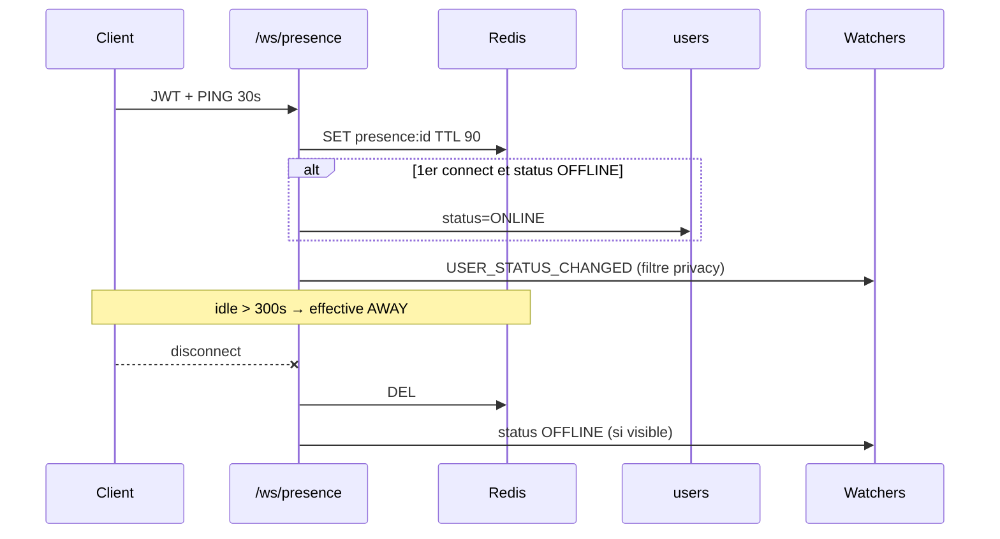

# PRES-A — Présence temps réel (PRES-01 … 16)

**Produit :** YAS Connect uniquement (pas le SIRH).  
**Préalable :** Phase 0 + **AUTH-H** (session `last_activity`, **pas** la pastille) + **PROF-A/C** (`last_seen`, `online_status_visibility`) + **AUTH-R**.  
**Attributs :** [IAM](../../catalogues/IAM-catalogue-tables.md) · [CONFIG](../../catalogues/CONFIG-catalogue-tables.md) · [INDEX](../../catalogues/INDEX-catalogue.md).  
**Models :** [code/iam_models.py](../code/iam_models.py).

**Backlog produit « Présence ».** Login ≠ pastille (AUTH-A/H inchangés). Cet incrément = **PRES-A** (IDs 01–16) : Redis + WS + enum + message.

**Périmètre :** passage online/offline/away, heartbeat ~30 s, réunion (hook), last_seen vs `last_login`, statut texte, diffusion `USER_STATUS_CHANGED`, respect PROF-25, badge API.

---


## Cartographie


| ID | Statut | Comportement | Écritures |
|----|--------|--------------|-----------|
| **PRES-01** | **Gardé** | Online = **WS connect** (JWT + portes), pas le `POST /login`. Redis + disponibilité | Redis ; `users.status` si OFFLINE/AWAY |
| **PRES-02** | **Gardé** | Offline = WS disconnect (plus aucun device) **ou** TTL Redis | Redis del ; effective OFFLINE |
| **PRES-03** | **Gardé** | Ping ~30 s → Redis `presence:{user_id}`. Touche `sessions.last_activity` seulement via debounce AUTH-H | Redis ; éventuellement session |
| **PRES-04** | **Gardé** | Connecté mais ping trop vieux → effective **AWAY** (seuil settings) | Redis (flag) ; pas PG à chaque tick |
| **PRES-05** | **Abandonné** | Pas de statut `BUSY`. Message perso = `status_message` | — |
| **PRES-06** | **Abandonné** | Pas de statut `DND`. Pas de settings `dnd_*`. Politique push = module notif | — |
| **PRES-07** | **Gardé (hook)** | `IN_MEETING` à `CALL_STARTED`, clear à `CALL_ENDED`. Appels pas encore livrés : service prêt | `users.status` |
| **PRES-08** | **Abandonné** | Pas de statut « en intervention » (`IN_FIELD`). Pas de sync WO | — |
| **PRES-09** | **Gardé** | `last_seen` = `max(presence.at, sessions.last_activity)` ; sinon `last_login` | lecture (PROF-A aligné) |
| **PRES-10** | **Gardé** | `users.last_login` **inchangé** (AUTH-A). Distinct de PRES-09. Exposé sur `GET /me` seulement | lecture |
| **PRES-11** | **Gardé** | `users.status_message` varchar | `users` |
| **PRES-12** | **Abandonné** | Pas de `status_until`. Pas d’échéance. Clear message = PATCH `""` | — |
| **PRES-13** | **Abandonné** | Pas de job `presence_until_reaper`. `IN_MEETING` = hook appels seulement | — |
| **PRES-14** | **Gardé** | WS `USER_STATUS_CHANGED` vers les **watchers** (filtre privacy) | — |
| **PRES-15** | **Gardé** | `online_status_visibility=NOBODY` → pas de statut / pas de badge ; CONTACTS = même `segment_id` | — |
| **PRES-16** | **Gardé** | Champ API `badge` (couleur). Front n’invente pas la palette | — |


**Hors incrément :** SFU / `CALL_STARTED` réel, sync Work Order SIRH, liste d’amis WS, push FCM, typing WS (messagerie), présence dans un canal chat (fan-out conv).

---


## Décisions figées


| Sujet | Choix |
|-------|--------|
| Login vs pastille | `complete_login` / AUTH-H **ne** posent **pas** ONLINE (inchangé). Online = WS (ou heartbeat REST de secours) |
| Deux couches | **Liveness** (Redis) ≠ **disponibilité** (`users.status` sticky : `IN_MEETING` seulement) |
| Effective | Voir algo ci-dessous. C’est la valeur `status` renvoyée aux **autres** |
| Enum PG | `ONLINE` \| `AWAY` \| `IN_MEETING` \| `OFFLINE`. `varchar(32)` |
| Sticky | `IN_MEETING` survit un dropout Redis : les **autres** voient OFFLINE ; **soi** voit encore la réunion |
| Heartbeat session | AUTH-60 **reste** (idle 7 j). PRES-03 = Redis 30 s. Un ping PRES **peut** appeler `touch_last_activity` (debounce 60 s) |
| Away | `presence.away_after_seconds` défaut **300**. Clé Redis encore là mais `at` trop vieux |
| Offline | Clé absente. Pas de write PG massif : **lazy** à la lecture + disconnect WS |
| Réunion | `presence_service.on_call_started/ended` public interne. Pas d’endpoint appel |
| Message | 0–140 caractères, trim, `''` = clear |
| Privacy | Même matrice PROF-A/C. Event WS omis ou `status=null` + `badge=null` (comme GET). Pas de 403 qui confirme |
| Watch WS | Client `{ "watch": ["<uuid>", …] }` max **100**. Redis set `presence:watch:{target}` |
| Channels | `apps.realtime` (ASGI). Redis channel layer (déjà Redis AUTH-H blacklist) |
| Portes AUTH-F | WS présence **après** CGU + wizard |
| RBAC | `iam.presence.update` (PATCH) ; `iam.presence.heartbeat` (REST fallback). Lecture = `iam.profile.read` / `read_other` |


### Algo `effective_status(user)` (autres)

```
live = Redis presence:{id} existe
age = now - redis.at
if not live:
    return OFFLINE
if user.status == IN_MEETING:
    return user.status
if age > away_after_seconds:
    return AWAY
return ONLINE
```

`GET /me` : `connection` = ONLINE \| AWAY \| OFFLINE (liveness) + `availability` = `users.status` (sticky) + `status` = effective pour **soi** (si live : max(sticky, connection) ; si pas live : OFFLINE mais `availability` encore `IN_MEETING`).

---


## Badge (PRES-16)


| `status` effective | `badge` |
|--------------------|---------|
| `ONLINE` | `green` |
| `AWAY` | `orange` |
| `IN_MEETING` | `purple` |
| `OFFLINE` | `grey` |
| masqué (privacy) | `null` |

---


## Redis

| Clé | TTL | Valeur |
|-----|-----|--------|
| `presence:{user_id}` | `presence.redis_ttl_seconds` (défaut **90**) | `{ "at": unix, "device_id": "<uuid>" }` |
| `presence:watch:{target_id}` | sliding | set de watcher user_ids |

TTL ≥ 3 × heartbeat (30 s). Refresh à chaque ping.

---


## Contrat HTTP / WS

JWT + `HasPermission`. Portes après perm.

### Delta `GET /api/v1/me` (PRES-09/10/11/16)

Toujours visible pour soi (PROF-C). En plus / à la place du seul `status` :

```json
{
  "status": "IN_MEETING",
  "connection": "ONLINE",
  "availability": "IN_MEETING",
  "badge": "purple",
  "status_message": "Comité direction",
  "last_seen": "2026-08-28T08:10:00Z",
  "last_login": "2026-08-28T07:55:00Z"
}
```

`last_login` : **soi uniquement** (PRES-10). Pas sur `GET /users/{id}`.

### Delta `GET /api/v1/users/{id}` (PRES-15/16)

`status` = effective **ou** `null` (privacy). `badge` idem. `status_message` : visible **seulement** si `status` non null (sinon fuite : « il a un message donc il est online »).  
Pas de `connection` / `availability` / `last_login`.

### `PATCH /api/v1/me/presence` (PRES-11 ; clear sticky)

`required_permission = iam.presence.update`.

```json
{
  "status": "ONLINE",
  "status_message": "Terrain Lomé"
}
```

| `status` | Sens |
|----------|------|
| `ONLINE` | Clear sticky (disponible). Message optionnel clear si omis |
| `AWAY` | **400** `STATUS_NOT_SETTABLE` (AWAY = auto PRES-04) |
| `OFFLINE` | **400** (offline = disconnect) |
| `IN_MEETING` | **400** `STATUS_RESERVED` (hook appels seulement) |
| `BUSY` / `DND` | **400** `STATUS_UNKNOWN` (PRES-05/06 abandonnés) |
| `IN_FIELD` | **400** `STATUS_UNKNOWN` (PRES-08 abandonné) |

Body partiel. `{ "status_message": "" }` clear le texte. Champ `status_until` **interdit** (PRES-12) → **400** `FIELD_UNKNOWN`.  
**200** — même forme présence que GET `/me`. Audit `PRESENCE_SET`.  
Puis `USER_STATUS_CHANGED` (PRES-14).

### `POST /api/v1/me/presence/heartbeat` (PRES-03, secours sans WS)

`required_permission = iam.presence.heartbeat`. Body vide. Refresh Redis. `touch_last_activity` si debounce AUTH-H OK. **200** `{ "at": "…" }`.  
Le client **préféré** : ping WS (ci-dessous), pas ce POST.

### WebSocket `/ws/v1/presence` (PRES-01/02/03/14)

Query ou 1er message : JWT. 4401 si invalide. 4403 portes / perm `iam.profile.read`.

| Direction | Type | Body |
|-----------|------|------|
| C→S | `PING` | `{}` — PRES-03 (30 s) |
| S→C | `PONG` | `{ "at": "…" }` |
| C→S | `WATCH` | `{ "user_ids": ["…"] }` max 100 |
| C→S | `UNWATCH` | `{ "user_ids": ["…"] }` |
| S→C | `USER_STATUS_CHANGED` | `{ "user_id", "status", "badge", "status_message" }` |

Connect → PRES-01 (Redis + si availability OFFLINE → ONLINE).  
Disconnect (last socket) → PRES-02 (del Redis).  
`status` dans l’event déjà filtré PRES-15 (`null` si le watcher ne doit pas voir).

---


## Settings (`system_settings` category `presence`)


| setting_key | Défaut | Sens |
|-------------|--------|------|
| `heartbeat_seconds` | `30` | Intervalle client |
| `redis_ttl_seconds` | `90` | TTL clé |
| `away_after_seconds` | `300` | PRES-04 |

Pas de job présence (PRES-13 abandonné).

---


## Flux



---


## 0. Delta modèle `users`

| Attribut | Type | Sens |
|----------|------|------|
| `status` | varchar(32) | enum (ci-dessus), défaut `OFFLINE` |
| `status_message` | varchar(140) | défaut `''` |

Index : `status` déjà btree. Pas de `status_until`.

---


## 1. Fichiers

```
apps/realtime/consumers.py         # PresenceConsumer
apps/realtime/routing.py
apps/iam/services/presence_service.py
apps/iam/views_presence.py         # PATCH + heartbeat REST
```

`config.asgi.application` : ProtocolTypeRouter HTTP + WS.  
`complete_login` : **toujours** sans write `users.status`.

---


## 2. Tests (acceptation)


| ID | Cas | Attendu |
|----|-----|---------|
| 01 | login sans WS | `status` PG OFFLINE ; GET collègue OFFLINE/grey |
| 01 | WS connect | Redis ; effective ONLINE ; event |
| 02 | last WS close | Redis del ; effective OFFLINE |
| 03 | PING 30 s | TTL refresh ; 2e PING < 60 s : 0 ou 1 write session (debounce H) |
| 03 | AUTH-60 | `users.status` toujours pas écrit par AUTH-H |
| 04 | ping arrêté 6 min, clé encore là | effective AWAY / orange |
| 05 | PATCH `BUSY` | 400 `STATUS_UNKNOWN` |
| 05 | PATCH AWAY | 400 |
| 06 | PATCH `DND` | 400 `STATUS_UNKNOWN` |
| 07 | `on_call_started` | IN_MEETING ; ended → ONLINE (si live) |
| 07 | PATCH IN_MEETING | 400 |
| 08 | PATCH `IN_FIELD` | 400 `STATUS_UNKNOWN` |
| 09 | last_seen | max redis.at / session |
| 10 | GET /me `last_login` | AUTH-A ; GET collègue **sans** le champ |
| 11 | message 141 car. | 400 |
| 12 | PATCH `status_until` | 400 `FIELD_UNKNOWN` |
| 13 | seed `scheduled_jobs` | pas de `presence_until_reaper` |
| 14 | watcher reçoit event | payload badge + status |
| 15 | cible NOBODY | watcher `status=null`, `badge=null` ; pas de fuite message |
| 15 | CONTACTS autre segment | idem null |
| 16 | mapping couleurs | table ci-dessus |
| — | sans `iam.presence.update` | 403 |


---


## Critères d’acceptation

- [ ] Login ≠ online ; WS / ping = liveness Redis
- [ ] Enum 4 valeurs + message ; pas d’until / reaper
- [ ] AWAY auto ; IN_MEETING hook ; pas de BUSY/DND/IN_FIELD
- [ ] last_seen ≠ last_login
- [ ] WS event + privacy PROF-25
- [ ] `badge` API ; AUTH-H heartbeat session distinct
- [ ] Perms self seed ; spec seulement

---


## Écarts documents liés

- **AUTH-H-60** : toujours pas de pastille. PRES-03 peut *toucher* `last_activity`.
- **PROF-A** : `status` = **effective** (+ `badge`, message). `last_seen` = PRES-09.
- **PROF-C-25** : filtre GET **et** WS.
- **AUTH-A** : `last_login` uniquement PRES-10.
- **AUTH-R** : + `iam.presence.update` / `iam.presence.heartbeat`.
- **Notif / appels** : consommeront `IN_MEETING`. Politique push hors PRES-A.
