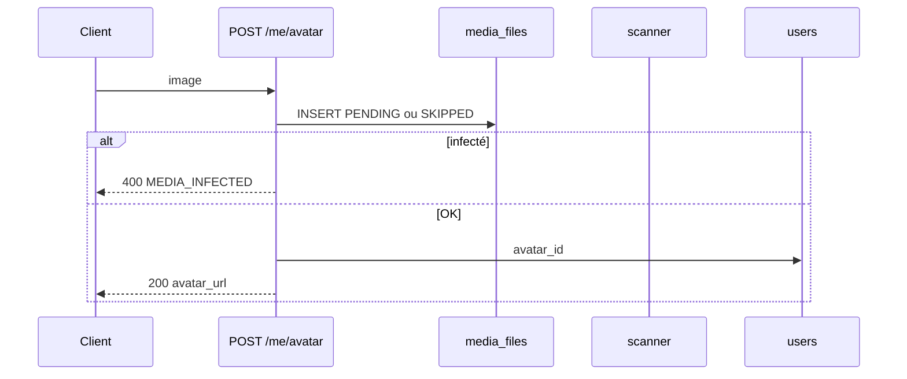

# PROF-A — Identité & affichage (PROF-01 … 14)

**Produit :** YAS Connect uniquement (pas le SIRH).  
**Préalable :** Phase 0 + **AUTH-A…I** (JWT, portes AUTH-F, change email AUTH-65). Tables Annuaire / Médias **déjà créées** (souvent 0 ligne).  
**Attributs :** [IAM](../../catalogues/IAM-catalogue-tables.md) · [Annuaire](../../catalogues/ANNUAIRE-catalogue-tables.md) · [Médias](../../catalogues/MEDIA-catalogue-tables.md).  
**Models :** [code/iam_models.py](../code/iam_models.py) · [code/annuaire_models.py](../code/annuaire_models.py) · [code/media_models.py](../code/media_models.py).

**Backlog produit « Identité & affichage ».** Plus de tickets AUTH-* : incrément **PROF-A** (IDs 01–14).

**Périmètre :** voir / éditer le profil (champs autorisés), profil collègue filtré par `privacy_settings`, avatar (`media_files`), org **résolue** (libellés Annuaire, pas de `manager_id` IAM).

---


## Cartographie


| ID | Statut | Comportement | Écritures |
|----|--------|--------------|-----------|
| **PROF-01** | **Gardé** | `GET /me` : users + rôle libellé + org résolue (segment / chaîne) | lecture |
| **PROF-02** | **Gardé** | `GET /users/{id}` : même carte, **masquée** selon privacy du cible | lecture |
| **PROF-03** | **Gardé** | Upload image → `media_files` (`IMAGE`, scan) → `users.avatar_id` | médias + `avatar_id` |
| **PROF-04** | **Gardé** | Remplacer = nouvel upload. Supprimer = `avatar_id=NULL` (fichier **conservé**) | `avatar_id` |
| **PROF-05** | **Gardé** | `display_name` = `first_name` + `last_name` (jamais stocké). PATCH prénom/nom **soi** | `users` |
| **PROF-06** | **Gardé** | `matricule` : visible ; **PATCH interdit** (RH seulement, hors incrément) | — |
| **PROF-07** | **Gardé** | `username` public (mentions). PATCH soi : unique, normalisation | `users.username` |
| **PROF-08** | **Précisé PROF-B** | `job_title` : lecture. PATCH soi **interdit** tant que `profile.job_title_self_edit=false` (défaut) | — (politique PROF-B) |
| **PROF-09** | **Gardé** | Email : lecture. Changement = **AUTH-I** `POST /me/email` (re-vérif) | — (délégué) |
| **PROF-10** | **Gardé** | `phone` E.164. PATCH **soi** (pas de flag de politique) | `users.phone` |
| **PROF-11** | **Gardé** | Rôle : `code` + `name`. Lecture. Change = **AUTH-R09** (admin) | — (délégué) |
| **PROF-12** | **Gardé** | Segment courant + type (`DIRECTION` / `DEPARTEMENT` / …) | lecture Annuaire |
| **PROF-13** | **Gardé** | Manager = `segments.responsable_id` (unité courante, sinon parent). Pas de colonne IAM | lecture |
| **PROF-14** | **Gardé** | « Localisation » = **chemin d’unités** (noms), pas un champ GPS. `region` IAM en plus si posé | lecture |


**Hors incrément :** CRUD RH ([ANNUAIRE-B](../annuaire_plans/ANNUAIRE-B-arbre-segments.md) / [C](../annuaire_plans/ANNUAIRE-C-affectations.md)), graphe contacts « amis », MinIO prod + antivirus réel, PATCH matricule / segment par le user. Recherche liste = [ANNUAIRE-A](../annuaire_plans/ANNUAIRE-A-recherche-referentiels.md). Prefs = [PROF-B](PROF-B-edition-preferences.md). Pastille WS = [PRES-A](PRES-A-presence.md) (privacy déjà lue ici).

---


## Décisions figées


| Sujet | Choix |
|-------|--------|
| Une fiche | Pas de 2e table profil. `GET /me` AUTH-F **enrichi** (plus un `user: { }` vide) |
| Org | Jointure `users.segment_id` → `segments` + parents. 0 ligne Annuaire → `org` null |
| Manager | `responsable_id` du segment courant ; si NULL, premier parent qui en a un |
| CONTACTS | Pas de graphe d’amis. **Même `segment_id`** non NULL = « collègues ». Sinon = `NOBODY` pour photo / last seen / online |
| Champs toujours visibles (collègue actif) | `display_name`, `username`, `job_title`, `role.name`, `org`, `matricule` |
| Masqués par privacy | **Avatar**, **last_seen**, **status** (ONLINE) |
| last_seen | PRES-09 : `max(presence Redis at, sessions.last_activity)` ; sinon `users.last_login` |
| Email / téléphone collègue | **Visibles** (annuaire interne) |
| LDAP | Email inchangé (AUTH-65). Téléphone / nom : éditables (AD non copié AUTH-B) |
| Avatar infecté / PENDING | Pas de pose `avatar_id`. Dev : `scan_status=SKIPPED` si pas de scanner |
| Fichier orphelin | DELETE avatar **ne** supprime **pas** `media_files` (rétention plus tard) |
| Portes AUTH-F | Profil / upload **après** CGU + wizard |
| RBAC | Chaque vue JWT : `HasPermission` ([AUTH-R](AUTH-R-roles-permissions.md)) |
| Inactive / pending | `GET /users/{id}` → **404** (pas de 403 qui confirme l’existence) |


---


## Contrat HTTP

### `GET /api/v1/me` (PROF-01, JWT) — étend AUTH-F

`required_permission = iam.profile.read`.

```json
{
  "success": true,
  "data": {
    "gates": { },
    "user": {
      "id": "<uuid>",
      "display_name": "Jean Dupont",
      "first_name": "Jean",
      "last_name": "Dupont",
      "username": "jdupont",
      "email": "jean.dupont@yas.tg",
      "email_pending": null,
      "phone": "+22890123456",
      "matricule": "TG2026015",
      "job_title": "Ingénieur NOC",
      "avatar_url": "https://…/media/<uuid>",
      "role": { "code": "USER", "name": "Collaborateur" },
      "region": { "id": "<uuid>", "code": "MARITIME", "name": "Maritime" },
      "org": {
        "segment": { "id": "<uuid>", "code": "NOC-LOME", "name": "NOC Lomé", "type": { "code": "SERVICE", "name": "Service" } },
        "department": { "id": "…", "name": "…" },
        "direction": { "id": "…", "name": "…" },
        "path": [ { "name": "NOC Lomé", "type": "SERVICE" }, { "name": "DSI", "type": "DIRECTION" } ],
        "manager": { "id": "<uuid>", "display_name": "Marie Koevi", "username": "mkoevi" }
      },
      "status": "OFFLINE",
      "last_seen": "2026-08-27T10:15:00Z"
    }
  }
}
```

`email_pending` : adresse `EMAIL_CHANGE` unused si une demande AUTH-65 est en cours, sinon `null`.  
`org` / `region` / `manager` : `null` si pas de FK.  
**Jamais** : hash, `ldap_dn`, `is_locked`, tokens.

### `PATCH /api/v1/me` (PROF-05/07/10)

`required_permission = iam.profile.update`.

```json
{
  "first_name": "Jean",
  "last_name": "Dupont",
  "username": "jdupont",
  "phone": "+22890123456"
}
```

Champs **ignorés / 400** si envoyés : `matricule`, `job_title` (sauf politique PROF-B), `role_id`, `segment_id`, `email` (utiliser `/me/email`), `avatar_id`, champs `user_preferences`.

`username` : 3–64, `[a-z0-9._]`, unique, ≠ email d’un autre.  
`phone` : E.164 ou `null`. Toujours éditable par le titulaire.

### `GET /api/v1/users/{id}` (PROF-02)

`required_permission = iam.profile.read_other`.

JWT. 404 si absent / inactif / pending.  
Réponse **sans** `gates`, **sans** `email_pending`.  
Si `profile_photo_visibility` masque : `avatar_url=null`.  
Si last seen masqué : `last_seen=null`.  
Si online masqué : `status=null` (ne pas inventer OFFLINE).

Self `{id}=me` → **400** : utiliser `GET /me`.

### `POST /api/v1/me/avatar` (PROF-03)

`required_permission = media.avatar.manage`.

`multipart` champ `file`. MIME `image/jpeg` \| `png` \| `webp`. Max **2 Mo**.  
INSERT `media_files` (`media_type=IMAGE`, `owner=me`). Si scan OK/SKIPPED → `users.avatar_id`.  
**400** `INVALID_MEDIA` / `AVATAR_TOO_LARGE` / `MEDIA_INFECTED`.

### `DELETE /api/v1/me/avatar` (PROF-04)

`required_permission = media.avatar.manage`.

`avatar_id=NULL`. **200**. Remplacer = nouveau `POST` (l’ancien `avatar_id` est écrasé).

### Email (PROF-09)

Pas d’endpoint nouveau : [AUTH-I](AUTH-I-securite.md) `POST /me/email` + verify.

---


## Résolution org (PROF-12…14)

```
s = Segment.objects.filter(id=user.segment_id, is_active=True).select_related("segment_type", "responsable").first()
path = []  # s puis parent_segment_id… (max 16, cycle-safe)
department = premier nœud dont type.code in (DEPARTEMENT, DEPT, SERVICE)
direction  = premier nœud dont type.code == DIRECTION
manager    = s.responsable ou premier ancestor.responsable
localisation affichée = " / ".join(n.name for n in path)   # PROF-14
```

Pas de nouvelle colonne. `users.region_id` = région **géographique** IAM (Maritime…), distincte du chemin org.

---


## Privacy (PROF-02)

| Visibilité cible | Avatar | last_seen | status |
|------------------|--------|-----------|--------|
| `EVERYONE` | oui | oui | oui |
| `CONTACTS` | si même `segment_id` | idem | idem |
| `NOBODY` | non | non | non |

Viewer = cible → tout visible (`GET /me`).  
Écriture des réglages : [PROF-C](PROF-C-confidentialite.md).  
`allow_mentions` : **pas** masqué ici (moteur chat plus tard).

---


## Flux avatar



---


## 0. Tables

Pas de nouvelle table IAM. Premier **INSERT** `media_files` hors seed.

| Lecture | Source |
|---------|--------|
| Rôle | `roles` |
| Org | `segments` + `segment_types` + `responsable` → mini-user |
| Photo | `media_files` si `scan_status` ∈ {`CLEAN`,`SKIPPED`} |
| Privacy | `privacy_settings` du **cible** |

---


## 1. Settings

```env
AVATAR_MAX_BYTES=2097152
MEDIA_AVATAR_SCAN_SKIP=true
```

---


## 2. Fichiers

```
apps/iam/serializers_profile.py
apps/iam/views_profile.py          # GET/PATCH /me enrichi ; GET /users/{id}
apps/iam/services/org_resolver.py
apps/media/services/avatar_service.py
apps/media/views_avatar.py
```

`GET /me` AUTH-F : **même** vue, payload `user` = PROF-01.

---


## 3. Tests (acceptation)


| ID | Cas | Attendu |
|----|-----|---------|
| 01 | GET /me seed jean | `display_name`, `role.name`, `org` null si pas de segment |
| 02 | collègue photo NOBODY | `avatar_url` null ; nom visible |
| 02 | CONTACTS, autre segment | photo masquée |
| 02 | user pending | 404 |
| 03 | JPEG 100 Ko | `avatar_id` posé ; `media_files` 1 ligne |
| 03 | 3 Mo | 400 |
| 04 | DELETE | `avatar_id` null ; GET /me sans photo |
| 05 | PATCH nom | `display_name` à jour |
| 06 | PATCH matricule | 400 |
| 07 | username pris | 409 |
| 08 | PATCH job_title (flag défaut false) | 400 `FIELD_FORBIDDEN` (PROF-B) |
| 09 | PATCH email body /me | 400 (pointer AUTH-I) |
| 10 | PATCH phone E.164 / null | 200 |
| 11 | rôle dans GET | `USER` + libellé |
| 12–14 | segment + parents seed | `path`, manager = responsable |
| — | LDAP PATCH phone | 200 |


---


## Critères d’acceptation

- [ ] `/me` : identité + rôle + org résolue ; pas de secrets ; `iam.profile.read`
- [ ] Collègue : privacy photo / last seen / online ; 404 si inactif ; `iam.profile.read_other`
- [ ] Avatar upload / replace / clear ; MIME + taille
- [ ] Nom / username / phone éditables ; matricule / job (défaut) / rôle / segment / email en PATCH `/me` refusés
- [ ] Prefs langue / tz / toggles = [PROF-B](PROF-B-edition-preferences.md)
- [ ] Email change = AUTH-I
- [ ] Manager / dir / dept **via Annuaire**, pas `users.manager_id`
- [ ] Spec seulement

---


## Écarts documents liés

- **AUTH-F** : `data.user` n’est plus un objet vide.
- **AUTH-I** : seul chemin pour changer l’email.
- **AUTH-R** : seul chemin pour changer le rôle (`PATCH /admin/users/{id}/role`). Vues PROF = `HasPermission` self (plus « JWT suffit »).
- **PROF-B** : prefs + whitelist `job_title` gated ; `GET /me` gagne `editable`.
- **PROF-C** : écriture `privacy_settings` ; 23–25 déjà lus ici.
- **PRES-A** : `status` API = **effective** + `badge` ; `last_login` sur `/me` seulement.
- **Annuaire** : lecture fiche + [ANNUAIRE-A](../annuaire_plans/ANNUAIRE-A-recherche-referentiels.md) recherche. Écriture = [B](../annuaire_plans/ANNUAIRE-B-arbre-segments.md) / [C](../annuaire_plans/ANNUAIRE-C-affectations.md) / [D](../annuaire_plans/ANNUAIRE-D-competences-certifications.md). Pas de `manager_id` IAM (`segments.responsable_id`).
- **Médias** : 1er write = avatar (pas le chat).
