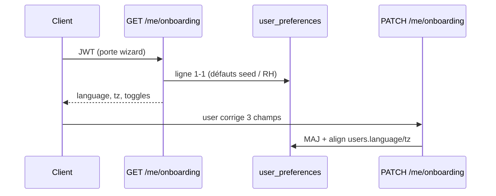

# PROF-B — Édition & préférences (PROF-15 … 22)

**Statut :** clos (2026-09-11) — lab [00-jour-14-prof-b.md](../00-jour-14-prof-b.md).
**Produit :** YAS Connect uniquement (pas le SIRH).  
**Préalable :** Phase 0 + **PROF-A** (`PATCH /me` identité) + **AUTH-F** (wizard) + **AUTH-R** (`HasPermission`).  
**Attributs :** [IAM](../../catalogues/IAM-catalogue-tables.md) (`users`, `user_preferences`) · [CONFIG](../../catalogues/CONFIG-catalogue-tables.md).  
**Models :** [code/iam_models.py](../code/iam_models.py).

**Backlog produit « Édition & préférences ».** PROF-A = carte identité / collègue / avatar → cet incrément = **PROF-B** (IDs 15–22).

**Périmètre :** whitelist d’édition profil (dont `job_title` **si** politique RH), CRUD `user_preferences` (langue, fuseau, son, DL médias, accusés, typing), préremplissage du wizard AUTH-F.

---


## Cartographie


| ID | Statut | Comportement | Écritures |
|----|--------|--------------|-----------|
| **PROF-15** | **Gardé (précisé)** | `PATCH /me` : whitelist figée. `phone` **toujours**. `job_title` **seulement** si `profile.job_title_self_edit=true` | `users` |
| **PROF-16** | **Gardé** | Langue UI = `user_preferences.language` (`fr` \| `en`) | prefs (+ `users.language`) |
| **PROF-17** | **Gardé** | Fuseau = `user_preferences.timezone` (IANA) | prefs (+ `users.timezone`) |
| **PROF-18** | **Gardé** | `notification_sound` | prefs |
| **PROF-19** | **Gardé** | `auto_download_media` (défaut `false`, data terrain) | prefs |
| **PROF-20** | **Gardé** | `read_receipts` = **souhait** (≠ `privacy_settings.read_receipts_enabled`) | prefs |
| **PROF-21** | **Gardé** | `typing_indicator` = **souhait** (≠ `privacy_settings.typing_indicator_enabled`) | prefs |
| **PROF-22** | **Gardé** | Wizard AUTH-F : `GET /me/onboarding` **préremplit** depuis la ligne prefs (jamais un formulaire vide) | lecture |


**Hors incrément :** écran **privacy** = [PROF-C](PROF-C-confidentialite.md), i18n fichiers front, liste exhaustive IANA dans l’UI (l’API valide), PATCH prefs d’un **autre** user, thème dark.

---


## Décisions figées


| Sujet | Choix |
|-------|--------|
| Identité vs prefs | `PATCH /me` = identité (PROF-A + 15). Prefs = `GET/PATCH /me/preferences` |
| Whitelist `/me` | Toujours : `first_name`, `last_name`, `username`, `phone`. Conditionnel : `job_title`. **Jamais** : `matricule`, `email`, `role_id`, `segment_id`, `avatar_id`, champs prefs |
| `job_title` | Politique **globale** `system_settings` `profile.job_title_self_edit` (bool, défaut **`false`**). Pas de flag par user. RH / admin config = « autorise » |
| Téléphone | Inchangé PROF-10 : toujours éditable (pas de `profile_phone_editable`) |
| Source de vérité UI | **`user_preferences`** pour langue / tz / toggles. `users.language` / `users.timezone` **alignés** à chaque PATCH prefs / wizard (comme AUTH-F) |
| Souhait ≠ privacy | PROF-20/21 n’écrivent **pas** `privacy_settings`. Le chat lira les deux plus tard |
| Ligne prefs | Déjà 1-1 à la création compte. GET ne **crée** pas (get_or_create seulement si orphelin — ne devrait pas arriver) |
| Langues | `fr` \| `en` seulement. Autre → **400** `INVALID_LANGUAGE` |
| Timezone | IANA (`zoneinfo`). Inconnu → **400** `INVALID_TIMEZONE` |
| Wizard | AUTH-38 **écrit** encore language / timezone / `notification_sound` seulement. 19–21 restent aux défauts jusqu’à l’écran réglages |
| Préremplissage | Même sérialiseur que GET `/me/preferences`. Valeurs = ligne actuelle (seed / RH / D02 / wizard partiel) |
| Portes AUTH-F | `GET /me/onboarding` autorisé si wizard KO. `GET/PATCH /me/preferences` **après** CGU + wizard |
| RBAC | JWT + `HasPermission` ([AUTH-R](AUTH-R-roles-permissions.md)) |
| GET `/me` | Ajoute `editable` (quelles clés le client peut envoyer) : **`phone`** toujours true, **`matricule`** toujours false, `job_title` gated |


---


## Contrat HTTP

Toutes ces vues : `YasJWTAuthentication` + `HasPermission`. Portes **après** le check perm.

### Delta `GET /api/v1/me` (PROF-15)

`required_permission = iam.profile.read`.

En plus du payload PROF-A :

```json
{
  "editable": {
    "first_name": true,
    "last_name": true,
    "username": true,
    "phone": true,
    "matricule": false,
    "job_title": false
  }
}
```

`phone` toujours `true` (PROF-10). `matricule` toujours `false` (RH, PROF-06) — clé **présente** pour que le client masque le champ.  
`job_title` suit `profile.job_title_self_edit`. Le client masque le champ si `false`.  
**Pas** de bloc `preferences` ici (écran réglages = endpoint dédié).

### Delta `PATCH /api/v1/me` (PROF-15)

`required_permission = iam.profile.update`.

Body inchangé PROF-A **plus**, si autorisé :

```json
{ "job_title": "Ingénieur NOC" }
```

| Champ envoyé | Flag / règle | Résultat |
|--------------|--------------|----------|
| `phone` | toujours | E.164 ou `null` → 200 (PROF-10) |
| `job_title` | `job_title_self_edit=false` | **400** `FIELD_FORBIDDEN` (`data.field=job_title`) |
| `job_title` | `true` | trim, max 128, `''` autorisé |
| `language` / toggles prefs | — | **400** `FIELD_FORBIDDEN` → `/me/preferences` |
| `matricule`, `email`, … | — | **400** comme PROF-A |

### `GET /api/v1/me/preferences` (PROF-16 … 21)

`required_permission = iam.prefs.read`.

```json
{
  "success": true,
  "data": {
    "language": "fr",
    "timezone": "Africa/Lome",
    "notification_sound": true,
    "auto_download_media": false,
    "read_receipts": true,
    "typing_indicator": true,
    "last_updated": "2026-08-27T10:15:00Z"
  }
}
```

### `PATCH /api/v1/me/preferences` (PROF-16 … 21)

`required_permission = iam.prefs.update`. Body **partiel** (au moins 1 clé).

```json
{
  "language": "en",
  "timezone": "Africa/Lome",
  "notification_sound": false,
  "auto_download_media": true,
  "read_receipts": false,
  "typing_indicator": true
}
```

**200** — même JSON que GET. Écrit `user_preferences` ; si `language` / `timezone` présents → aussi `users.language` / `users.timezone`. `last_updated=now()`.  
**400** langue / tz invalides. Champ inconnu → **400** `UNKNOWN_FIELD`.  
Pas d’audit obligatoire (réglages UI) ; optionnel `PREFS_PATCH`.

Collègue / `GET /users/{id}` : **pas** de prefs (vie privée).

### `GET /api/v1/me/onboarding` (PROF-22, AUTH-F)

`required_permission = iam.onboarding.manage`.

Même JSON que `GET /me/preferences` (préremplissage wizard).  
Autorisé tant que `onboarding_completed_at` est NULL (allow-list AUTH-F).  
`PATCH /me/onboarding` inchangé (AUTH-38) : ne pose que language / timezone / `notification_sound` — **même service** d’écriture prefs.

---


## Politique `job_title`

Seed CONFIG :

| category | setting_key | value | type |
|----------|-------------|-------|------|
| `profile` | `job_title_self_edit` | `false` | bool |

Lecture à chaque PATCH `/me` (pas de cache long ; TTL 60 s OK).  
Changer la clé = écran admin config (hors incrément) ou SQL seed tests.

---


## Flux wizard (PROF-22)



---


## 0. Tables

Aucune table nouvelle. `user_preferences` déjà 1-1.

---


## 1. Fichiers

Chemins **lab** (arbo `views/` / `serializers/`) — pas les stubs plats du backlog :

```
apps/iam/services/prefs_service.py     # nouveau
apps/iam/serializers/prefs.py          # nouveau
apps/iam/views/prefs.py                # nouveau
apps/iam/urls/me.py                    # path("preferences")
apps/iam/services/profile_service.py   # editable + job_title gated
apps/iam/views/compliance.py           # GET onboarding = serialize_preferences
apps/config/management/commands/seed_config.py  # profile.job_title_self_edit
apps/iam/tests/test_prof_b.py          # nouveau
```

Delta AUTH-F : `OnboardingView.get` → `serialize_preferences`.  
Delta PROF-A : `editable` + garde `job_title`.  
Delta AUTH-R : perms `iam.prefs.read` / `iam.prefs.update` **déjà** seedées (jour 11).

---


## 2. Tests (acceptation)


| ID | Cas | Attendu |
|----|-----|---------|
| 15 | PATCH `phone` | 200 (PROF-10) |
| 15 | PATCH `job_title` flag false | 400 `FIELD_FORBIDDEN` |
| 15 | flag true + `job_title` | 200 ; GET `/me` reflète |
| 15 | PATCH `language` sur `/me` | 400 → prefs |
| 15 | GET `/me` `editable` | `phone=true`, `matricule=false`, `job_title=false` par défaut |
| 16 | PATCH prefs `language=en` | 200 ; `users.language=en` |
| 16 | `language=de` | 400 `INVALID_LANGUAGE` |
| 17 | tz IANA OK | 200 ; `users.timezone` aligné |
| 17 | `timezone=Not/AZone` | 400 `INVALID_TIMEZONE` |
| 18 | `notification_sound=false` | 200 |
| 19 | `auto_download_media=true` | 200 |
| 20 | `read_receipts=false` | prefs OK ; **privacy** inchangée |
| 21 | `typing_indicator=false` | idem |
| 22 | GET onboarding user neuf | défauts seed (`fr`, `Africa/Lome`, son true, DL false, …) |
| 22 | RH a posé `users.language=en` à l’inscription + prefs alignées | GET onboarding `en` |
| 22 | GET `/me/preferences` avant wizard | 403 `ONBOARDING_REQUIRED` |
| — | GET prefs collègue | **pas** de route |
| — | sans `iam.prefs.update` | 403 `FORBIDDEN` |


---


## Critères d’acceptation

- [x] Whitelist `/me` + `editable` ; `job_title` gated par setting (défaut false)
- [x] GET/PATCH `/me/preferences` : 6 champs catalogue ; langue / tz alignés sur `users`
- [x] Souhait 20/21 ≠ colonnes privacy
- [x] Wizard : GET préremplit ; PATCH onboarding réutilise le service prefs
- [x] `HasPermission` `iam.prefs.read` / `iam.prefs.update` ; seed USER
- [x] Spec + lab [00-jour-14-prof-b.md](../00-jour-14-prof-b.md)

---


## Écarts documents liés

- **PROF-08** : plus un interdit absolu — **400** tant que le flag est false (défaut).
- **PROF-10** : phone inchangé (toujours).
- **AUTH-F-38** : ajout `GET /me/onboarding` ; écriture 3 champs inchangée.
- **AUTH-R** : +2 perms self (`iam.prefs.*`).
- **PROF-A lab :** `GET /me` **garde** `preferences` + `privacy` (déjà AUTH-F / jour 13). L’écran réglages **écrit** via `/me/preferences`.
- **Privacy** : [PROF-C](PROF-C-confidentialite.md) (`privacy_settings`).
