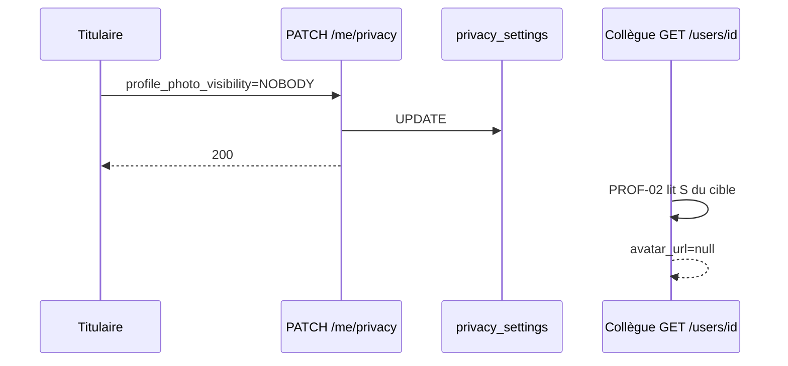

# PROF-C — Confidentialité / masquage (PROF-23 … 30)

**Statut :** à faire — lab [00-jour-15-prof-c.md](../00-jour-15-prof-c.md).
**Produit :** YAS Connect uniquement (pas le SIRH).  
**Préalable :** Phase 0 + **PROF-A** (lecture collègue déjà masquée) + **PROF-B** (souhait ≠ privacy) + **AUTH-R**.  
**Attributs :** [IAM](../../catalogues/IAM-catalogue-tables.md) (`privacy_settings`).  
**Models :** [code/iam_models.py](../code/iam_models.py) (`PrivacySetting`, `Visibility`).

**Backlog produit « Confidentialité (masquage) ».** PROF-B = prefs UI → cet incrément = **PROF-C** (IDs 23–30).

**Périmètre :** GET/PATCH de **sa** ligne `privacy_settings` (3 visibilités + 5 booléens). PROF-02 **applique** déjà 23–25 à la lecture collègue ; ici on **écrit** les réglages.

---


## Cartographie


| ID | Statut | Comportement | Écritures |
|----|--------|--------------|-----------|
| **PROF-23** | **Gardé** | `last_seen_visibility` : qui voit `last_seen` sur `GET /users/{id}` | `privacy_settings` |
| **PROF-24** | **Gardé** | `profile_photo_visibility` : qui voit `avatar_url` | idem |
| **PROF-25** | **Gardé** | `online_status_visibility` : qui voit `status` (ONLINE) | idem |
| **PROF-26** | **Gardé** | `read_receipts_enabled` : envoyer/afficher les accusés (côté **privacy**) | idem |
| **PROF-27** | **Gardé** | `typing_indicator_enabled` : envoyer l’indicateur de saisie | idem |
| **PROF-28** | **Gardé** | `allow_calls` : accepter les appels entrants | idem |
| **PROF-29** | **Gardé** | `allow_mentions` : autoriser @ | idem |
| **PROF-30** | **Gardé** | `allow_group_invites` : invitable en groupe | idem |


**Hors incrément :** moteur chat / appels / invitations (ils **liront** 26–30), graphe d’amis (CONTACTS = même `segment_id` comme PROF-A), PATCH privacy d’un **autre** user, admin override.

---


## Décisions figées


| Sujet | Choix |
|-------|--------|
| Endpoint | `GET/PATCH /api/v1/me/privacy` — **pas** dans `/me` ni `/me/preferences` |
| Enum visibilité | `EVERYONE` \| `CONTACTS` \| `NOBODY` uniquement. Autre → **400** `INVALID_VISIBILITY` |
| CONTACTS | Même règle PROF-A : `segment_id` non NULL **et égal**. Sinon = `NOBODY` pour 23–25 |
| Soi-même | `GET /me` : last_seen / photo / status **toujours** visibles (on ne se masque pas) |
| Collègue | `GET /users/{id}` déjà PROF-02 : `null` si masqué (pas de 403) |
| Souhait vs privacy | Prefs `read_receipts` / `typing_indicator` = souhait client. Privacy `*_enabled` = **envoi réel**. Chat futur : envoyer seulement si **les deux** true (cible + acteur selon spec messagerie) |
| 26–30 enforcement | **Stockage** ici. Rejet appel / drop mention / blocage invite = modules appels / messaging / groupes |
| Ligne | 1-1 déjà au seed. GET ne crée pas (get_or_create orphelin seulement) |
| PATCH | Partiel, ≥ 1 champ. Booléens JSON `true`/`false` (pas `"0"`) |
| Portes AUTH-F | Après CGU + wizard (comme prefs) |
| RBAC | `iam.privacy.read` / `iam.privacy.update` (`audience=self`) |
| Fuite | `GET /users/{id}` **ne** renvoie **pas** la fiche privacy du cible |


---


## Contrat HTTP

JWT + `HasPermission`. Portes **après** le check perm.

### `GET /api/v1/me/privacy` (PROF-23 … 30)

`required_permission = iam.privacy.read`.

```json
{
  "success": true,
  "data": {
    "last_seen_visibility": "EVERYONE",
    "profile_photo_visibility": "CONTACTS",
    "online_status_visibility": "NOBODY",
    "read_receipts_enabled": true,
    "typing_indicator_enabled": true,
    "allow_calls": true,
    "allow_mentions": true,
    "allow_group_invites": false,
    "updated_at": "2026-08-27T10:15:00Z"
  }
}
```

### `PATCH /api/v1/me/privacy` (PROF-23 … 30)

`required_permission = iam.privacy.update`.

```json
{
  "last_seen_visibility": "NOBODY",
  "profile_photo_visibility": "CONTACTS",
  "online_status_visibility": "EVERYONE",
  "read_receipts_enabled": false,
  "typing_indicator_enabled": false,
  "allow_calls": false,
  "allow_mentions": false,
  "allow_group_invites": false
}
```

**200** — même JSON que GET. `updated_at=now()`.  
**400** `INVALID_VISIBILITY` / `UNKNOWN_FIELD`.  
Champ prefs (`read_receipts` sans `_enabled`) → 400 : utiliser `/me/preferences`.

Effet **immédiat** 23–25 : un collègue `GET /users/{id}` voit déjà le masque PROF-A.

---


## Matrice lecture collègue (rappel PROF-A, 23–25)

| Valeur cible | Viewer « contact » (même segment) | Autre viewer |
|--------------|-----------------------------------|--------------|
| `EVERYONE` | visible | visible |
| `CONTACTS` | visible | `null` |
| `NOBODY` | `null` | `null` |

Champs concernés : `last_seen`, `avatar_url`, `status`.  
`status` masqué → `null` (ne pas forcer `OFFLINE`).

---


## Flux



---


## 0. Tables

Aucune table nouvelle. `privacy_settings` déjà 1-1.

---


## 1. Fichiers

Chemins **lab** (arbo `views/` / `serializers/`) — pas les stubs plats du backlog :

```
apps/iam/services/privacy_service.py   # nouveau — serialize / PATCH
apps/iam/serializers/privacy.py        # nouveau
apps/iam/views/privacy.py              # nouveau
apps/iam/urls/me.py                    # path("privacy")
apps/iam/tests/test_prof_c.py          # nouveau
```

PROF-02 (masque collègue) : **déjà** dans `profile_service.serialize_colleague` — **ne pas** recoder.  
Delta AUTH-R : perms `iam.privacy.read` / `iam.privacy.update` **déjà** seedées (jour 11).

---


## 2. Tests (acceptation)


| ID | Cas | Attendu |
|----|-----|---------|
| 23 | PATCH `last_seen_visibility=NOBODY` | collègue `last_seen=null` ; `GET /me` encore renseigné |
| 23 | `CONTACTS`, même `segment_id` | collègue voit last_seen |
| 23 | `CONTACTS`, autre segment | `last_seen=null` |
| 24 | `profile_photo_visibility=NOBODY` | collègue `avatar_url=null` |
| 25 | `online_status_visibility=NOBODY` | collègue `status=null` |
| 23 | `EVERYONE` (typo `everyone`) | 400 `INVALID_VISIBILITY` |
| 26 | `read_receipts_enabled=false` | privacy OK ; **prefs** `read_receipts` inchangé |
| 27 | `typing_indicator_enabled=false` | idem typing |
| 28 | `allow_calls=false` | persisté (pas d’endpoint appel ici) |
| 29 | `allow_mentions=false` | persisté |
| 30 | `allow_group_invites=false` | persisté |
| — | GET `/me/privacy` avant wizard | 403 `ONBOARDING_REQUIRED` |
| — | GET privacy d’un autre | **pas** de route |
| — | sans `iam.privacy.update` | 403 `FORBIDDEN` |
| — | PATCH `read_receipts` (clé prefs) | 400 |


---


## Critères d’acceptation

- [ ] GET/PATCH `/me/privacy` : 8 champs catalogue
- [ ] 23–25 : effet immédiat sur `GET /users/{id}` ; soi non masqué
- [ ] 26–27 distincts des souhaits PROF-B
- [ ] 28–30 persistés ; enforcement hors incrément
- [ ] `HasPermission` `iam.privacy.read` / `.update` ; seed USER
- [ ] Spec + lab [00-jour-15-prof-c.md](../00-jour-15-prof-c.md)

---


## Écarts documents liés

- **PROF-A-02** : lecture masquée **déjà** spécifiée ; cet incrément = **écriture**.
- **PROF-B-20/21** : souhait prefs ; ici `*_enabled`.
- **AUTH-R** : +2 perms self (`iam.privacy.*`).
- **PROF-B lab :** `GET /me` **garde** le bloc `privacy` (lecture). L’écran confidentialité **écrit** via `/me/privacy`.
- **Messaging / appels / groupes** : consommeront 26–30.
- **PRES-A** : `online_status_visibility` filtre GET **et** WS `USER_STATUS_CHANGED`.
